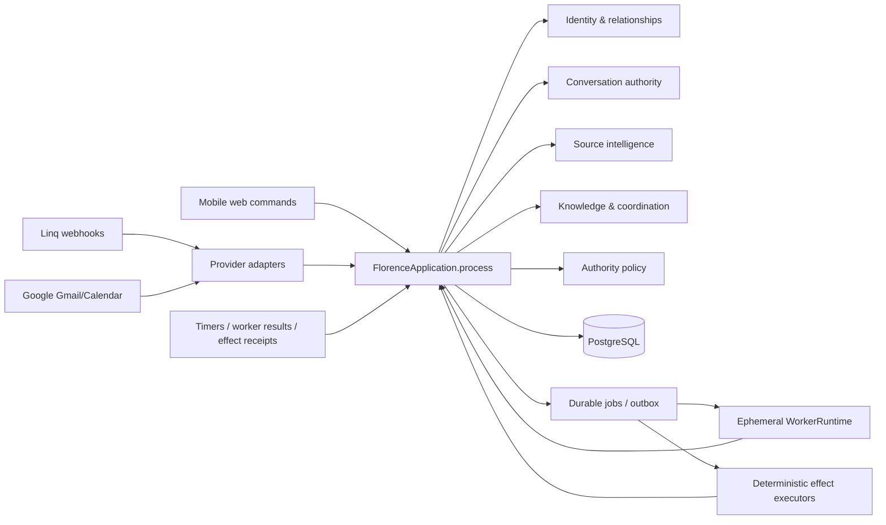

# Florence — Canonical Product Contract and Build Plan

Status: active build-and-learn contract

Date: 2026-08-06

Canonical repository: `/Users/harianbarasu/Projects/florence` and `harianbarasu/florence`

Production target: Railway, served from `https://harianbarasu.com`

This document supersedes every earlier Florence plan, prototype assumption, and stale product
invariant. The existing implementation is evidence and a source of proven mechanics; it is not an
architecture to preserve. There will be no compatibility layer around the old adult-owned,
two-person-household, snapshot-centered model.

The full research transfer and evidence classification are in
[`docs/research/florence-architecture-transfer-from-session-019fcdde-2026-08-05.md`](docs/research/florence-architecture-transfer-from-session-019fcdde-2026-08-05.md).
That audit accounts for every branch in Codex task `019fcdde-cef2-7833-8f30-b6b9420dbec9` and
separates primary-source facts, prior-task synthesis, Florence-specific inference, weak evidence,
and non-transferable enterprise assumptions.

## Core User Flows

These three flows are the product spine. Reversible details are implementation defaults and are
changed from real usage; privacy, audience, authority, and the meaning of a safely closed loop remain
hard product decisions.

### Flow 1 — A parent privately activates Florence and connects Google

- **Trigger:** a parent sends any natural first private iMessage to Florence, or an existing parent
  without a connected source sends their next private message.
- **User steps:** Florence establishes private consent and identity, creates or resolves the
  household, then sends a single-use mobile-web handoff for the parent's primary personal Google
  account. Gmail and Calendar begin syncing immediately. While that work runs, Florence learns or
  confirms children, aliases, schools, activities, and routines and allows the parent to invite an
  equal co-parent.
- **Visible states:** private connection confirmation; “reviewing recent email and calendar”; recent
  sources reconciled; older history continuing in the background; exact reconnect action if a
  capability fails. Detailed account, calendar, stage, and error state lives on `/sources`.
- **Partial and error behavior:** declining Google does not block Florence and does not create generic
  nagging. Florence offers it again only when it directly enables requested help. Mail and Calendar
  capabilities fail independently. A work account defaults to Calendar-only unless the person
  explicitly grants mail.
- **Success:** recent mail and Calendar reach a known high-water mark without exposing either source
  to a household, and the parent understands that Florence is actively monitoring.
- **Recovery:** OAuth cancellation changes nothing; an expired handoff is replaced from the private
  DM; reauthorization resumes the same person-owned integration under a new control epoch.
- **Existing code reused:** private Linq registration, `PostgresWebAuth`, Google OAuth,
  `PostgresSourceIntelligence`, `GoogleSyncService`, staged jobs/cursors, and the `/sources` account
  cards. The true gaps are prompt timing, private milestone delivery, and an explicit recent-source
  reconciliation gate.

### Flow 2 — Florence is cold-added to any group

- **Trigger:** somebody adds Florence to an existing iMessage group, including a household,
  caregiver, school, sports, or parent-community chat.
- **User steps:** none are required in the group. Florence silently captures new messages from the
  exact participant epoch beginning when she is added. Every currently registered Florence user in
  that exact chat receives an independent private source view; unregistered participants receive no
  product access or unsolicited enrollment message merely by being observed. If a sender
  deterministically invokes Florence with a leading “Florence” address, or replies to a
  Florence-owned message proven by a local receipt, Florence continues privately with that exact
  sender. A registered parent may use that invocation to propose one exact current participant as a
  co-parent, family member, or caregiver. Florence asks only that proposed person to confirm their
  own identity and relationship privately.
- **Visible states:** the group itself sees no Florence message, reaction, typing indicator,
  enrollment copy, error, or administrative announcement while observe-only. Registered users can
  inspect the source privately. When every current participant is a registered active member of one
  common household and their policies permit writing, Florence automatically treats the exact group
  as a family coordination group. Accepted household membership is standing consent; there is no
  second per-chat approval ceremony.
- **Partial and error behavior:** ambiguous mentions do nothing. Failure to open the exact sender's
  private DM creates no group output. Participant changes create a new epoch and immediately revoke
  prior write approval; ingestion continues for the new observe-only epoch while Florence
  re-evaluates private access.
- **Success:** Florence learns useful context from the ambient family firehose without writing in
  community groups or widening raw chat content beyond exact, individually authorized access, while
  an all-household group becomes interactive immediately after the final relationship is confirmed.
- **Recovery:** STOP or disabled mode halts new content retention for the requester or exact chat as
  applicable. Deletion and revocation fence all later retrieval and effects.
- **Existing code reused:** provider-chat reconciliation, immutable participant epochs, encrypted
  source revisions, participant policies, exact group rules, outbox audience checks, and Linq direct
  chat creation. The true gaps are observe-only admission independent of registration, per-person
  exact-chat source grants, and private deterministic invocation routing.

### Flow 3 — Florence turns evidence into an acknowledged coverage loop

- **Trigger:** a private source, authorized group source, explicit request, or routine implies a
  current family obligation whose coverage is genuinely uncertain.
- **User steps:** Florence first creates a silent candidate. She reconciles the newest Gmail thread,
  attachments, Calendar revisions, cancellations, and related evidence. With no standing rule, she
  privately offers the source owner the minimum current risk: “Want me to make sure it is covered?”
  One-time approval promotes only the minimum operational meaning into the smallest authorized
  household audience. A person explicitly accepts responsibility in natural language.
- **Visible states:** syncing/reconciling; private candidate; awaiting approval; open; awaiting
  response; covered; at risk; cancelled/superseded/dismissed; or expired uncovered. The web home
  shows only authorized active exceptions; normal coordination stays in iMessage.
- **Partial and error behavior:** incomplete or conflicting evidence remains a silent candidate or
  produces one narrow private question. Silence never means acceptance. A model or connector failure
  produces a recoverable private status rather than disappearing. New evidence that changes action
  updates the same loop and notifies only its reliance set.
- **Success:** a named person explicitly acknowledges coverage before the last responsible moment;
  Florence stops reminders. The first release does not claim to prove physical fulfillment.
- **Recovery:** a decline keeps coverage open without disclosing the person's reason. A contradiction
  reopens the same loop. If nobody responds, Florence escalates minimum necessary meaning to every
  parent steward before the deadline, neutrally and without blame.
- **Existing code reused:** `knowledge_candidates`, `PrivateSourceBridge`, typed bridge and
  conversation rules, `PostgresCoordination`, coverage timers, effects/outbox, and explicit reply
  reconciliation. The true gaps are source reconciliation before interruption, private proposal
  delivery/reply binding, approval-bound reliance escalation, and authorized household context in
  interpretation.

## Ownership And Reuse Map

| Product noun | Current owner and reused implementation | True gap | Owner alignment / migration gate |
|---|---|---|---|
| Person and identity | Identity module; `people`, `person_identities`, sessions, observed/claim flows | None | Do not add a separate parent account model |
| Household, role, authority | Relationship module; households, memberships, capabilities, invitations | None for the pilot | `steward` is the equal parent/customer role |
| Exact chat and write authority | Conversation authority module; conversations, immutable epochs, participant policies, exact rules and approvals | Observe-only ingestion and per-person access grants | Extend this owner; do not create parallel chat state |
| External source and revision | Source intelligence module; integrations, grants, cursors, encrypted objects/revisions/blobs/derivatives | A deep sync-health projection, not another source layer | No progress table until exact counts or resumable run identity require one |
| Child and family context | Relationship module; dependent `people`, membership, encrypted dependent profiles and aliases | Interpretation does not yet consume the authorized projection; rules lack stable child binding | Wire context first; add normalized subject links only when a rule must enforce “this child only” |
| Candidate | Person-scoped `knowledge_candidates` with `coverage_proposal` | Reconciliation/readiness metadata and private delivery binding | No candidate-loop table |
| Household coverage loop | Coordination module; coverage loops, transitions, participants, routines and occurrences | Cross-chat reliance and all-steward escalation | Core loop table remains canonical; a versioned approval-bound reliance record is justified |
| Standing behavior | Typed conversation rules, private bridge rules, and routine revisions | Plain-language projection and future-facing step-up | Do not add one generic rule-builder table |
| Delivery | Effects module; action intents, disclosure decisions, outbox and receipts | Reliance is not equivalent to receipt delivery | Persist reliance authority; never infer it from sent/read state |
| Web companion | `PostgresFlorenceQueries` read model and existing `/home`, `/people`, `/chats`, `/sources`, `/safety` routes | Purposeful handoff focus, named sync milestones, authorized loop meaning, clearer rule copy | Keep the current information architecture |

## Decision Log

1. **Build while learning.** Reversible operating details are defaults, not interview blockers. Ask
   Hari only when a choice changes privacy, safety, external authority, or the product thesis.
2. **Parents are the customers.** Parent stewards are co-equal. Caregivers and grandparents may use
   Florence and originate or accept loops, but receive only bounded relationship-local authority.
3. **One person, many relationships.** Claiming an observed identity joins it to the global person;
   it never creates separate accounts for every chat or family.
4. **Cold addition means ingestion intent, not write authority.** From the moment Florence is added,
   the exact chat becomes an observe-only source. Florence never writes there by default.
5. **Family writing follows explicit relationships.** Every current participant must be a registered
   active member of one common Florence household and every applicable participant policy must
   permit writing. Accepting household membership is standing consent for all-household groups;
   there is no second per-chat vote. Membership changes revoke current write authority and force a
   fresh eligibility decision for the new exact audience.
6. **Observe-only means visually absent.** No messages, reactions, typing indicators, enrollment
   announcements, or errors appear in the source group.
7. **Group invocation is deterministic.** Only a leading Florence address or a verified reply to
   Florence counts. It routes to the exact sender's private DM and never creates a group effect.
8. **Raw context remains exact.** Each registered participant in the source chat gets an independent
   private source view. Household use requires explicit promotion or a narrow standing bridge.
9. **Minimum meaning may bridge.** A loop can widen “Wednesday pickup needs coverage” without
   revealing that Jenny privately said she is unavailable.
10. **Google starts with the first parent.** Florence does not wait for the co-parent. The second
    parent reviews existing family context and adds only corrections or missing facts.
11. **Personal Google comes first.** It is the first mobile-web step after household resolution;
    work Calendar and additional accounts are optional later connections.
12. **Initial import does not speak from partial evidence.** Candidates remain silent until current
    sources are reconciled. Florence gives private milestone updates and detailed web progress.
13. **First value is one current coordination risk.** Do not manufacture an inbox digest or prompt
    merely to demonstrate activity.
14. **Corrections are action-change driven.** Update the same loop only when new evidence changes
    required behavior; notify the reliance set, not the whole household, and reveal no private source.
15. **Coverage requires acknowledgment.** Sending or pinging is not closure; silence never assigns
    responsibility. Physical fulfillment is deliberately a later capability.
16. **Parents are the final safety net.** Every unresolved household loop reaches all parent stewards
    before its decision deadline, using minimum necessary and blame-free language.
17. **Automation is learned explicitly.** One-time approval does not silently become broad standing
    authority. Florence asks once for future behavior, stores a narrow human-readable rule, and
    broadens it only with confirmation.
18. **Typed rule owners remain separate.** A chat rule authorizes writing, a bridge rule authorizes
    private-source disclosure, and a routine authorizes recurring coordination.
19. **One visible Florence, ephemeral specialists.** The app-owned Chief of Staff orchestrates
    bounded ephemeral workers and governed skills behind provider-neutral seams.
20. **The product metric is loops safely closed.** Messages, tasks, model calls, and pings are input
    metrics, not the outcome.

## Implementation Plan

### Operating cadence — phone evidence before more product debate

- Ship one phoneable end-to-end behavior at a time, normally within one working day.
- Ask Hari only about choices that alter privacy, who can act, who can see something, or the core
  customer promise. Make reversible copy, UI, infrastructure, and implementation decisions directly.
- Keep the test suite lean. Use the smallest automated gate that protects a state or privacy
  invariant, then test the actual behavior through iMessage and the production web companion.
- Collect confusion, silence, wrong timing, unwanted interruption, and failed completion as one
  evidence batch after each phone session. That batch chooses the next slice; speculative questions
  do not block the current one.
- A slice is not shipped because code exists. It is shipped only when the production behavior is
  observable from a parent's phone and has a clear expected result.

### Iteration 0 — Prove the group-native activation wedge

- Register one parent naturally by private DM, add Florence cold to an ordinary group, and keep that
  group completely silent.
- Let that parent explicitly introduce the sole unknown participant as a co-parent or caregiver.
  Florence privately asks that exact person to confirm. Their acceptance claims the observed
  identity, joins the existing family without repeating shared details, and activates only the exact
  all-household group with one replay-safe acknowledgment.
- Retain only post-addition evidence for the current exact membership. When the registered parent
  writes a leading “Florence…” request, privately answer from a bounded recent window of that exact
  group's messages and extracted attachments.
- Re-authorize the exact evidence, person control epoch, membership epoch, consent, retention, and
  private route after the ephemeral worker finishes and immediately before enqueueing the DM.
- **Done when:** a real group can state a changed pickup fact, Florence says nothing there, and a
  later explicit invocation produces one correct private answer; changing membership prevents the
  stale answer.

### Iteration 1 — Close one real coverage loop

- In an approved household group, turn “I can't pick Avery up Wednesday at 3:00” into one explicit
  coverage request and continue until another actual person accepts.
- Keep the language neutral, never assign by silence, and suppress later reminders after acceptance.
- **Done when:** one production-phone loop reaches `covered`, the parent can see its state, and every
  confusing step becomes evidence for the next copy/behavior pass.

### Iteration 2 — Make parent activation and Google syncing feel alive

- Offer personal Google immediately after household resolution; do not wait for a second parent.
- Show honest recent-mail/Calendar readiness privately and in mobile web while older history continues
  in the background. Support additional personal accounts and optional work Calendar accounts.
- Reconcile latest thread messages, event revisions, and extracted attachments before surfacing one
  highest-value current risk. Later evidence must update or suppress an obsolete candidate.
- **Done when:** a parent connects Google from the phone flow, sees real progress, and can move one
  current source-backed finding into coordination without a magic command.

### Iteration 3 — Learn routines and useful timing

- Learn school/activity routines conversationally, ask about uncertainty, and store narrow,
  human-readable behavior only after explicit future-facing approval.
- Recover omitted routine facts from authorized family context and interrupt before the useful
  window, according to each household's preference for routine reminders versus exceptions only.
- **Done when:** Florence opens the right loop before school/activity timing requires action and does
  not repeatedly ask about an approved stable routine.

### Iteration 4 — Make control and learning legible

- Use the mobile web companion for identities, connected sources, exact chats, private/shared memory,
  routines, rules, active loops, corrections, pause/revoke, export, and deletion.
- Instrument proposed/opened/acknowledged/reopened/expired loops, interruption quality, corrections,
  privacy denials, and time-to-coverage. Review failed traces as candidate skill/harness changes;
  workers never self-promote behavior.
- **Done when:** nontechnical parents can understand and correct what Florence knows and will do, and
  the team can choose the next slice from loop outcomes rather than message or model-call volume.

## 1. Product thesis

Florence is the group-chat-native family Chief of Staff that catches family obligations wherever
they arrive and makes sure coverage is explicitly owned before the useful window closes.

The consumer behavior is:

> **Add or forward it to Florence; she makes sure the family has it covered.**

Parents should not need to maintain another perfect task system. Information already arrives through
iMessage groups, private messages, Gmail, calendars, PDFs, screenshots, schools, sports, caregivers,
and other parents. Florence converts that firehose into a small number of reliable coordination
loops in the conversations where the family already operates.

The product is one visible Florence. Internally, a persistent application-owned orchestrator may
delegate bounded cognition to ephemeral workers. Users never manage a swarm of agents.

### The first complete promise

The first complete release does one job end to end:

```text
permitted source
→ relevant family need
→ exact uncertainty or proposed coverage
→ explicit acknowledgment by the person taking it
→ useful, neutral follow-through
→ covered, reopened, dismissed, cancelled, superseded, or expired-uncovered
```

It is a real, deployable product—not a scaffold—but deliberately proves the coverage-loop behavior
before expanding into shopping, budgeting, travel booking, health, or a general life dashboard.

### Product metric

The primary metric is **coverage loops safely closed**, not messages sent, tasks created, agents run,
or whether Florence merely pinged somebody.

A loop is safely covered when:

- the actual required outcome was identified from authorized evidence;
- a named person explicitly acknowledged coverage before the last responsible moment;
- that acknowledgment remained current or the loop was correctly reopened;
- Florence disclosed no information outside the effective audience; and
- Florence did not infer responsibility from silence, delivery, or model confidence.

Track separately:

- obligations caught versus later discovered;
- time from actionable evidence to acknowledged coverage;
- loops expired without coverage;
- consciously dismissed or cancelled loops;
- unnecessary interruptions and repeated reminders;
- corrections and reopened commitments; and
- privacy, authorization, duplicate-effect, and timing incidents.

## 2. People and product surfaces

### People

A `Person` is global. A person may participate in several households and conversations without
creating several Florence accounts. Phone numbers, emails, and provider handles are verified
identities attached to that one person.

Observed but unclaimed handles create provisional principals. Claiming an identity joins the
provisional history to the verified person only after an exact, private confirmation. Florence never
silently merges two people.

Household roles are relationship-local labels over explicit capabilities:

- **steward:** co-equal household governance;
- **caregiver:** may see and coordinate the exact family scope granted to them;
- **participant:** limited relationship or conversation participation;
- **dependent:** represented in family state but not an account holder in the first release.

Caregivers include babysitters, grandparents, relatives, and other trusted adults. One caregiver may
belong to several households without their contexts being joined.

Stewards are co-equal contributors. Adding a new co-equal steward requires every current steward and
the invitee. Any steward may immediately suspend a caregiver's household access. Removing a co-equal
steward is not unilateral. Any person may narrow their own source grants, stop their own DM, or leave
a relationship without another steward's permission.

### Everyday surfaces

1. **Private iMessage DM** — registration, personal integrations, private findings, source controls,
   sensitive corrections, approvals, general questions, and step-up authentication.
2. **iMessage groups** — the primary coordination and distribution surface once the exact current
   participant set is eligible.
3. **Mobile web companion** — onboarding, authority, inspectability, integrations, privacy, and
   exceptional items requiring review. It is not a second chat client or family planner.

Every admitted private DM turn receives a bounded conversational response, even when it does not
create or change a family coverage loop. This promise never widens group authority: observe-only
groups remain silent, and trusted groups still use their exact invocation and participation rules.
Coverage and other specialists may return no domain action, but they never decide whether Florence
answers. A reply-required job succeeds only after the application returns the exact durable outbox
effect; model failure selects a bounded response, while only passive content, STOP, or revoked
authority may complete silently.

Florence may answer non-parenting and general questions when explicitly asked. Such answers use
public knowledge and content supplied in the request by default. They do not silently retrieve
private sources, create durable family state, or begin proactive work. If a request becomes
family-operational, Florence explicitly promotes it into a family loop or project under the normal
authority rules.

## 3. Canonical product nouns

| Noun | Meaning | Authoritative owner |
|---|---|---|
| `Person` | One human across Florence | Identity module |
| `PersonIdentity` | Verified phone, email, or provider handle | Identity module |
| `Household` | A relationship space with local members and authority | Relationship module |
| `Membership` | Person, role label, and explicit capability grants in one household | Relationship module |
| `Conversation` | App-owned chat space independent of a provider ID | Conversation authority module |
| `ParticipantEpoch` | Immutable exact audience for one period of a conversation | Conversation authority module |
| `Integration` | One person-owned external account connection | Source intelligence module |
| `SourceRevision` | Immutable captured version of a message, thread, event, or attachment | Source vault |
| `EvidenceRef` | Stable provenance pointer without copying raw content | Source vault |
| `BridgeRule` | Narrow authority to derive a named minimum meaning into an exact destination | Authority module |
| `MemoryCandidate` | Proposed fact, preference, or routine with evidence and uncertainty | Knowledge module |
| `AcceptedMemory` | Versioned, scoped, inspectable accepted meaning | Knowledge module |
| `Routine` | Recurring family expectation and notification policy | Coordination module |
| `RoutineOccurrence` | One materialized occurrence that can open a loop | Coordination module |
| `CoverageLoop` | One family outcome requiring acknowledged coverage | Coordination module |
| `SkillVersion` | Governed procedure for producing typed proposals | Skills module |
| `WorkerAttempt` | Bounded execution of a pinned task, skill, harness, and runtime | Orchestration module |
| `ActionIntent` | Exact authorized external effect proposal | Effects module |
| `EffectReceipt` | Authenticated outcome of an attempted effect | Effects module |
| `AuditEvent` | Append-only explanation of a consequential decision or transition | Audit module |

Retrieval evidence and accepted operational truth are deliberately separate. A retrieved sentence is
not automatically current, authorized, agreed, or safe to share.

## 4. Conversation authority and the group-chat wedge

Every provider chat maps to an app-owned `Conversation`. Every authoritative participant change
ends the current `ParticipantEpoch` and starts a new immutable epoch.

### Conversation modes

| Mode | Condition | Ordinary content processing | Florence may write |
|---|---|---|---|
| `observe_only` | Florence is present but the current people are not all registered active members of one common household, or an applicable policy keeps the chat read-only | Encrypt new post-addition content in the exact chat epoch; registered exact-chat participants may receive independent private source views under their own policies | No |
| `registration_required` | A private DM participant has not completed registration and consent | Retain only enrollment, routing, dedupe, security, revocation, and opt-out metadata | Enrollment and safety responses only |
| `trusted_write_enabled` | A private DM is eligible, or every group participant is a registered active member of one common household and an exact-current-audience rule permits the operation | Allowed within the epoch and exact grants | Private replies, or only the operations derived for the current all-household audience |
| `paused` | STOP, deletion fence, policy conflict, or safety hold | No new ordinary processing | No |

Adding Florence designates the exact post-addition chat epoch as an observe-only source. It does not
authorize Florence to write, react, type, announce enrollment, expose raw content to another chat, or
make an unregistered participant a full Florence user. Each currently registered Florence user in
the exact chat receives an independent private source grant bounded by their own policy; nobody else
receives product access merely because their messages were observed.

A deterministic leading address such as “Florence, …” or a reply to a locally proven Florence-owned
message may route the exact sender into a private Florence DM. The source group remains completely
silent. Generic questions, fuzzy model inference, and name mentions in the middle of a sentence are
not invocations.

A natural affirmative reply to Florence's explicit private consent question is global Florence
consent; magic commands such as `START` are not required. New exact participant epochs project each
registered person's existing conservative policy; they never synthesize consent from observation.
Participant changes invalidate proactive rules and require a new exact-audience rule, but Florence
does not ask an already registered person to re-register for every chat.

An explicit household invitation may send one private enrollment message to the exact invitee. It
names the inviter, explains Florence plainly, sends at most once unless requested again, and supports
immediate STOP. Cold addition by itself does not enroll or message every observed participant.
Florence sends nothing in the group before exact write eligibility.

### Effective shared policy

For every retrieval and send:

```text
system safety policy
∩ exact live participant epoch
∩ every participant's applicable policy
∩ source visibility
∩ source-owner bridge grants
∩ conversation purpose and rule
∩ current retention and revocation state
```

Missing authority is a denial. A source or skill can only narrow this set; it cannot widen it.

Registration alone permits neither private-source disclosure nor group writing. In an observe-only
group, a deterministic invocation routes privately to the exact sender. Any group-local/public
answer or proactive message requires an applicable exact-current-audience rule for that operation.

Any participant can immediately make a conversation read-only, pause Florence, shorten retention,
or STOP. That does not let them disable another person's private DM, personal integrations, or other
conversations. Widening a shared conversation's retention or proactive behavior requires every
affected current participant.

Earlier-epoch content is never automatically disclosed to a newly added participant. Outbound sends
reauthorize against the provider's live participant list immediately before execution.

## 5. Identity, registration, and onboarding

### Passwordless identity

The private Linq DM is the root recovery channel for the first release.

1. A verified inbound private DM resolves or creates a provisional phone-bound person.
2. Florence issues a random 256-bit, single-purpose handoff and stores only its digest, person,
   exact private binding, authority epoch, expiry, state, and encrypted context.
3. The browser landing page is generic and non-consuming.
4. An explicit POST atomically consumes the handoff and revalidates the live private identity.
5. Florence creates a server-side person session in a Secure, HttpOnly, SameSite, `__Host-` cookie
   and redirects to a token-free URL.
6. Browser writes require CSRF protection plus Origin and Host validation.
7. Sessions revalidate person and relationship authority for every operation and are revoked by
   STOP, identity changes, deletion fencing, or explicit logout.
8. High-risk actions require a fresh challenge delivered to and confirmed from the same private DM.

Default browser sessions expire after 30 days of inactivity and 90 days absolutely. Users can view
and revoke active sessions.

Google identity is an integration identity, not Florence login. Connecting several work and personal
Google accounts never creates several Florence people.

### Progressive hybrid onboarding

Onboarding begins in iMessage and moves to mobile web when structured or sensitive choices are
clearer there. It is resumable and useful before every optional field is complete.

1. Register the global person and confirm name, timezone, quiet hours, consent, and recovery phone.
2. Create or join a household.
3. For a parent steward, connect the primary personal Google account immediately so recent Gmail and
   Calendar reconciliation can begin. Caregiver connections remain optional and contextual.
4. While sync runs, represent dependents, aliases, schools, activities, and important places without
   creating child accounts; capture the few routines that are not listed elsewhere.
5. Introduce co-stewards and caregivers from an exact observed group. Florence privately asks only
   that person to confirm their identity and relationship. An invited co-steward reviews existing
   household facts and supplies only corrections or additions rather than repeating intake.
6. Add optional personal accounts and work Calendars, and select each Calendar's private processing
   level. Declining an account never blocks ordinary Florence use.
7. Add Florence to one or more chats and privately inspect their source and write status.
8. As soon as every current participant is a registered active member of the same household and
   their policies permit it, derive the narrow exact-audience write rule automatically from standing
   household membership. Do not ask for a second per-chat approval.
9. Begin in exceptions-first learning mode; Florence proposes one future-facing rule after a
   successful example, then stops asking for matching situations once it is approved.

An open-ended private follow-up such as “what should we keep doing?” is a request for Chief-of-Staff
guidance, not a generic help prompt. Florence uses the person's current integration status and the
authorized household facts already known, acknowledges useful work underway, chooses one
highest-value missing or incomplete next step, explains how she can help, and provides the exact
private control needed to move it forward when structured input is required. She does not repeat
completed setup, invent missing family facts, or dump a feature checklist.

## 6. Web cockpit

The observed product pattern and Florence-specific transfer are documented in
[`docs/research/energy-parent-agent-product-reference-2026-08-06.md`](docs/research/energy-parent-agent-product-reference-2026-08-06.md).

The web app is the persistent visual home for the same Florence a family knows in iMessage. It is
not a separate admin product, a display of internal agents, or a raw archive of everything Florence
can access. It should minimize the time required to understand what matters, trust why Florence is
acting, and make the occasional structured choice that is awkward in a text thread.

For the first pilot, ordinary conversation and coordination stay in iMessage. The web “Ask
Florence” action returns to the person's exact private Florence thread rather than presenting a fake
or disconnected web chat. A later web conversation surface may become a second entry point only
when it shares the same person, household, memory, authority, work, and audit state as iMessage.

### Desktop information architecture

Use a stable three-zone workspace:

1. **Relationship rail** — the current household, one visible Florence, a real “Ask Florence”
   action, setup/source readiness, family spaces, and the signed-in person. This is the human and
   relationship context, not a list of ephemeral workers.
2. **Capability rail** — Today, family, conversations, routines/sources, memory, and safety in plain
   parent language. The current pilot may combine capabilities when they share one real route; it
   must not expose empty or pretend destinations to imitate a reference product.
3. **Focused canvas** — one decision, review surface, or understandable body of state at a time.
   Exceptions and next actions lead; implementation telemetry stays behind an explanation when it
   is useful.

On small screens, collapse both rails into a compact household header and bottom navigation. The
mobile view remains an excellent companion reached from iMessage, not a shrunken desktop control
panel.

### Home

Show onboarding progress when incomplete. Otherwise show only:

- uncovered or at-risk loops requiring this person's input;
- pending approvals or private-source reviews;
- integration/backfill failures;
- participant or privacy changes; and
- a plain status that Florence is connected and monitoring.

### Me & relationships

- verified identities and active sessions;
- households, memberships, roles, capability grants, and invitations;
- represented dependents and household basics;
- safe leave, role-change, and identity-claim flows.

### Chats

- provider chat, current exact participants, and current epoch start;
- each participant's registration/consent state;
- observe-only, disabled, interactive, or paused mode;
- effective retention, quiet-hours, and proactivity intersection;
- last participant change and why a write gate is closed;
- applicable bridge and conversation rules.

### Sources & privacy

- person-owned Google connections and sync health;
- Gmail import progress and pause/resume controls;
- calendars in `full_private`, `availability_only`, or `off` mode;
- accepted memories, profile facts, routines, source/as-of/scope, and review dates;
- pending candidates and private review items;
- standing bridge rules and recent “why Florence shared/interrupted” explanations;
- correct, forget, stop-sharing, disconnect, and revoke controls.

### Data & safety

- STOP/pause status and notification controls;
- exports;
- leave household, delete person, and delete household as distinct operations;
- deletion/revocation progress and receipts;
- active browser sessions.

Do not build a general task dashboard, calendar clone, raw Gmail browser, full iMessage archive,
agent builder, skill administration page, or free-form relationship graph editor.

### High-risk step-up

Require a new exact private-DM challenge for:

- adding, removing, or merging a verified identity;
- accepting/leaving a household or widening a role/capability;
- adding a co-equal steward;
- activating trusted ambient behavior or widening epoch retention/proactivity;
- creating a standing private-source bridge to a new audience;
- connecting, replacing, or disconnecting an integration;
- export, account deletion, household deletion, or destructive chat-history removal; and
- any external write added in a later release.

Narrowing, pausing, STOP, correcting, and forgetting take effect immediately.

## 7. Coverage loops

### State machine

```text
provisional
  → open
  → awaiting_response
  → covered

covered → at_risk → awaiting_response | covered

any live state → cancelled | superseded | dismissed | expired_uncovered
```

- `provisional`: credible need, but one consequential fact is unresolved.
- `open`: the required family outcome is clear and lacks acknowledged coverage.
- `awaiting_response`: Florence has asked an exact person or eligible group for coverage.
- `covered`: a named person explicitly acknowledged the commitment.
- `at_risk`: credible new evidence contradicts or withdraws the current coverage.
- `dismissed`: an authorized person consciously says the loop is unnecessary.
- `expired_uncovered`: the last responsible moment passed without current acknowledged coverage.

The first release closes the **coverage** loop. It does not pretend to prove that the child was
physically picked up. Later evidence may record fulfillment as `observed_done`, `observed_failed`, or
`unknown`, but absence of that evidence does not rewrite an honestly acknowledged coverage result.

### Authority and language

- Any authorized steward, caregiver, or participant may originate a loop within their scope.
- Connected sources and workers may propose a loop; they cannot establish intent or ownership.
- Only the proposed person may commit themselves.
- A private decline produces only “coverage is still open” in a shared destination. Florence may not
  disclose the person's unavailability or reason without their explicit approval.
- Silence, message delivery, read status, reactions, historical habits, and model confidence never
  establish ownership.
- Credible contradiction reopens a covered loop as `at_risk`.
- Group messages describe state and choices, never character, fault, neglect, or comparative effort.

Preferred reminder shape:

> Pickup coverage is still open for Wednesday at 3:00. Is it handled, or should we find someone?

Once a person has publicly accepted, Florence may neutrally state that recorded coverage. It should
not publicly name a nonresponsive nominee.

### Provisional uncertainty

- Group-local ambiguity is clarified in that group when the conversation may write.
- Private or cross-scope uncertainty is asked privately of the source owner.
- Urgent consequential uncertainty is asked now.
- Low-risk uncertainty batches into private review.
- Florence opens a cautious provisional loop rather than silently inventing an owner, time, or fact.

## 8. Routines, time, and notifications

Recurring hidden routines are first-class. A routine materializes dated occurrences so exceptions,
school breaks, vacations, one-off swaps, and source changes can affect one occurrence without
rewriting the standing routine.

The default notification mode is `exceptions_only`. A standing holder may make an occurrence
covered automatically only when that person explicitly created or approved the standing routine.

Every occurrence carries:

- event/deadline and timezone;
- preparation/travel duration when relevant;
- earliest useful time and last responsible moment;
- quiet-hours and escalation policy;
- destination and participant epoch;
- source/routine version; and
- current plan version.

Models interpret semantic time; deterministic code resolves exact instants, recurrence, timezone,
DST, quiet hours, and versioned timers. A timer is a request to reevaluate current state, sources,
audience, and rules—not permission to send a stale reminder.

### Notification policy

A proactive message must reveal a material change, uncovered obligation, conflict, blocking decision,
prepared approval, useful last-window reminder, or meaningful closure. Successful unchanged routine
execution is silent.

For one loop, Florence normally sends no more than:

1. the opening coverage request;
2. one reminder at a materially later useful/escalation boundary; and
3. a message for a real state change, closure, cancellation, or renewed risk.

Additional messages require new evidence or an explicit request. Low-urgency private findings batch
into one private review. A household brief is optional and is suppressed when it would only say “all
clear.”

Candidates created during initial import do not notify anyone until the newest available Gmail
thread, relevant attachments, Calendar revisions, and current sync high-water marks have been
reconciled. Florence reports import milestones privately, but never narrates speculative findings.

After a loop has been communicated, only evidence that changes the required action, time, place,
deadline, responsible person, or whether the loop still exists causes another message. The same loop
is updated; a duplicate loop is not opened. Corrections go to the reliance set—the people who saw,
accepted, or must act on the earlier state—and never automatically to the entire household. Private
source and reason remain undisclosed.

If a household loop remains unresolved, every current parent steward is the final safety net.
Florence escalates the minimum operational meaning privately before the last responsible moment,
even when initial coordination used a smaller approved audience. This widening must be backed by
versioned household authority and reliance provenance; urgency alone never invents that authority.

Onboarding asks for quiet hours. Until configured, use 9:00 PM–7:00 AM local for private messages and
the conservative union of every participant's quiet hours for a group. A quiet-hours override is
allowed only when waiting crosses the last responsible moment and every affected participant's
policy permits that category. Urgency never widens a private audience.

## 9. Source and integration contract

### Four separate permissions

Never collapse these into one “has access” flag:

1. **Ingestion** — may Florence receive and inspect this source?
2. **Retrieval/disclosure** — may the source or a derivative enter this exact task and audience?
3. **Acceptance** — who may promote the proposal into accepted personal/shared state?
4. **Destination/action** — may Florence send, schedule, write, or otherwise affect this target?

### Common pipeline

```text
verified provider event
→ deterministic person/epoch/grant admission
→ encrypted private or chat-local source revision
→ bounded ephemeral interpretation
→ private candidate, review, or interrupt
→ exact approval or applicable standing bridge
→ minimum destination-safe artifact
→ authoritative memory/routine/coverage transition
→ live audience reauthorization before send
```

An approval applies once unless it explicitly creates a narrow standing rule. When Florence sees a
likely repetition, it may ask once whether similar future items should follow the same rule. After
approval it should stop asking for matching items. A generic “yes” never becomes broad future
disclosure authority.

### Linq

- Verify webhook signatures over raw bytes before business parsing.
- Persist/deduplicate the provider event before acknowledgment and process asynchronously.
- Support messages, edits, replies, reactions, participant added/removed events, attachments, and
  outbound sent/failed receipts.
- Fetch the authoritative live chat for participant changes and immediately before every send.
- Never ingest pre-Florence or earlier-epoch group history. Post-addition observe-only content is
  exact-epoch encrypted context even when some participants are not registered; it grants no group
  write authority and no automatic household disclosure.
- Fetch attachments only after exact-epoch admission and keep their retrieval/use subject to the
  same source and audience grants as the parent message.
- Treat leading Florence address and locally proven reply-to-Florence as control signals before any
  ordinary-content suppression; route privately to the exact sender and emit nothing in the group.
- Periodically reconcile provider state after missed or out-of-order events.

### Gmail

Every Google connection belongs to one global person and is keyed by Google subject, not household.
One person may connect several personal and work accounts and grant narrow derivatives into several
relationships without re-OAuth.

The first release uses `gmail.readonly`. Gmail sending, drafting, deletion, labels, and account
mutation are not enabled.

Use the Gmail History API cursor as the authoritative incremental mechanism. The worker polls live
history frequently; optional Pub/Sub may later wake the same durable sync path but is not required
for correctness. Safety polling and full recovery handle delayed notifications and expired history.

Live capture starts before backfill. Keep separate live and historical cursors with this priority:

1. live changes;
2. newest 30 days;
3. days 31–90;
4. days 91–365;
5. older history, newest-first, low-priority, resumable, and explicitly enabled.

Hari has already opted into the older-history pass for the founding account. The general product
asks during onboarding and provides pause/cancel/progress controls.

“Process history” means metadata-first relevance filtering and body/attachment retrieval for likely
family material—not permanently mirroring or sending every email to a model. Spam and trash are
rejected deterministically. Promotions, newsletters, and social categories still receive cheap
metadata triage because schools and activities are often mislabeled.

Historical processing is silent. It may propose current routines and narrow source rules, or surface
a still-actionable item privately. It never floods a household with retroactive reminders.

### Attachments and PDFs

The first complete set supports PDF, common images, plain text/HTML, CSV, and ICS.

- Preserve provider message/thread/part identity, content hash, MIME, size, and source revision.
- Validate bytes rather than trusting filenames.
- Enforce bounded size/count limits and identify decorative inline assets.
- Store raw bytes encrypted and separate from metadata.
- Derive text/OCR/chunks/citations as rebuildable, source-scoped output.
- Analyze hostile content in a worker with no credentials, write tools, or policy access.
- Unsupported, encrypted, corrupt, or oversized relevant files produce a private recoverable notice.

### Google Calendar

The first release is read-only. Each person selects each calendar as:

- `full_private`: private event content may be interpreted;
- `availability_only`: Florence stores only busy windows and minimal event identity; or
- `off`.

A shared Google calendar is not automatically household-visible. Calendar scope and relationship
bridges remain separate.

Synchronize one year backward and eighteen months forward. Historical events may propose routines
silently; upcoming changes may open private provisional loops. Use per-calendar sync tokens,
frequent polling, and scoped full recovery on invalid tokens. Provider push may become an optional
wake-up optimization later.

Calendar creation/update/delete is deferred until the coverage product proves the approval and
effect boundary. Linq messages are the only customer-visible outbound effect in the first release.

## 10. Privacy, memory, retention, and deletion

### Memory promotion

```text
source or explicit statement
→ scoped candidate
→ authority, provenance, sensitivity, and time check
→ accepted personal/shared memory or typed operational state
→ purpose-aware use
→ correction, expiry, supersession, forgetting, or deletion
```

Explicit first-person low-risk preferences may be accepted directly. Third-party statements,
inferences, sensitive facts, conflicts, consequential commitments, and scope widening remain
candidates until the appropriate authority boundary is satisfied.

Every accepted record has owner/subject, scope, purpose, evidence receipt, valid time, review date,
sensitivity, revision, and deletion lineage. Corrections create atomic new revisions and invalidate
dependent context. Forgetting creates a revocation tombstone so stale source replay cannot recreate
the forgotten state silently.

The disappearance of a source does not automatically erase deliberately accepted state. Its
provenance becomes unavailable and the record can require reconfirmation.

### Retention

| Record class | Maximum/default retention |
|---|---|
| Observe-only group ordinary content and attachments | Encrypted in the exact participant epoch for 30 days maximum; each registered exact participant's independent view is bounded by their own shorter policy, and unregistered participants receive no product access |
| Registered private raw source | 30 days maximum under the person's policy |
| Raw attachment bytes | Same or shorter than parent source |
| OCR, chunks, embeddings, and rebuildable summaries | Never outlive source authorization or retention |
| Private review item | Seven days unless acted upon |
| Worker scratch | Seven days maximum |
| Accepted fact, rule, routine, loop, and outcome | Durable until corrected, expired, forgotten, revoked, or deleted |
| Minimal non-content source/authority receipt | Durable with the accepted record |
| Credentials, cursors, and provider IDs | Connection lifetime; credentials erased on revocation |

After Gmail raw expiry, Florence may refetch under the still-valid connection and purpose. Revocation
or deletion invalidates derivatives transitively.

### Data controls

- **Export me:** person-owned identities, sources, grants, memories, memberships, decisions, and
  audit explanations that person is authorized to receive.
- **Leave household:** revoke future relationship access without pretending already delivered group
  messages can be erased.
- **Delete my account:** immediately fence the person, erase credentials and personal content,
  revoke sessions, re-evaluate/redact dependent shared derivatives, and create a replay tombstone.
- **Delete household:** sole steward or unanimous current stewards fence and erase shared household
  state; personal integrations remain person-owned unless separately deleted.

Primary records are crypto-erased promptly. Backup aging is at most 30 days, with deletion
tombstones reapplied after any restore. The UI shows durable deletion receipts and explains data
Florence cannot remove from iMessage or Google.

## 11. Chief of Staff, workers, and governed skills

The persistent “agent” is the Florence application and its durable state—not a never-ending model
conversation. One authoritative application entry point reconciles every signal and commits every
consequential transition.

Workers are bounded and non-authoritative. They receive a purpose, exact evidence references,
small context packet, requested capabilities, budget, deadline, pinned skill, and typed output
contract. They return proposals and artifacts, then expire.

Workers may not:

- message a person or group;
- accept or change household truth;
- promote memory or a bridge rule;
- add/remove people or alter participant policy;
- hold refresh tokens or broad credentials;
- schedule future work or execute an external action; or
- widen or delegate their grants.

### Initial product skills

| Skill | Typed proposal |
|---|---|
| `coverage.need_interpret` | Ignore/private-review/propose disposition, changed fact, required outcome, evidence, sensitivity, time facts, uncertainties, and prior-loop link |
| `coverage.commitment_propose` | Proposed outcome, proposed person, semantic timing, consequential question, and follow-up shape |
| `coverage.minimum_disclosure` | Minimum group-safe meaning for one exact destination epoch and omitted-sensitive-category flags |
| `coverage.outcome_assess` | Acknowledged, corrected, contradicted, dismissed, superseded, missed, expired, or unknown proposal with evidence |

Authorization, dedupe, exact scheduling, state transitions, and effect execution remain deterministic
code, never skills.

Each immutable `SkillVersion` carries a stable ID/version, owner, purpose, input/output schemas,
requested capability profiles, tool ceiling, risk class, examples, evaluation release, status, and
rollback target. Only relevant skills enter context.

Every authoritative attempt pins:

```text
TaskVersion + SkillVersion + HarnessRelease + RuntimeRoute + EvaluationRelease + AttemptId + TraceId
```

Deep Agents, LangGraph, Hermes, Mastra, or a thin custom harness may implement `WorkerRuntime` if it
wins the same protected evaluations. None may own people, chats, permissions, coverage, memory,
approvals, or outcomes.

The first runtime should be a thin bounded structured-output adapter over the existing open-source
LangChain provider interfaces. The four coverage skills do not require a framework-owned workflow.
Deep Agents remains an optional adapter for later tool-heavy research, not required infrastructure.

## 12. Learning and evaluation

Florence has two different learning loops:

1. **Family learning:** accepted facts, routines, source bridges, notification preferences, and
   corrections scoped to the exact person/household/conversation.
2. **Product learning:** versioned skill, prompt, context-selection, classifier, or harness candidates
   evaluated before an operator promotes them.

Repeated matching items may propose one narrow standing rule. Once the source owner approves it,
future matching items use it without asking again. Florence may automatically narrow interruption
cadence or batch low-value items when that cannot discard a real obligation; it may never
automatically widen disclosure, retention, tools, or action authority.

### Trace-to-candidate loop

```text
pinned task/skill/harness/runtime
→ typed trace and receipts
→ reconciled family outcome
→ objective observation
→ failure cluster or severe incident
→ narrow inactive candidate
→ held-in replay
→ protected holdout
→ shadow comparison
→ explicit operator promotion
→ monitored release
→ automatic safety pause and manual resume/rollback
```

Product learning uses synthetic or minimized reproductions by default. Raw household traces never
become cross-customer training/evaluation data without separate explicit consent.

Automatic production promotion is forbidden. A hard privacy, authority, or duplicate-effect failure
automatically pauses the implicated release; resumption is explicit and audited. Hari is the initial
product-release operator. Household users may approve household routines, not product skills.

### Lean protected evaluation set

Keep verification deliberately small and risk-shaped. Do not pursue a test-count or coverage-percent
target.

Hard zero-failure cases:

- private data reaches the wrong person, household, chat, or epoch;
- unregistered content is processed;
- source scope widens without the exact owner rule;
- silence or delivery becomes ownership;
- a worker writes state, sends, or escalates capability;
- an outbound effect duplicates under retry/replay;
- stale participant/timer/source state authorizes a send;
- evidence is fabricated or a rolled-back skill produces an accepted result.

Coverage-quality cases:

- relevant obligation versus ordinary/noisy content;
- correct outcome, uncertainty, person, recurrence, timezone, and useful window;
- neutral no-blame coordination;
- explicit acknowledgment, private decline, contradiction/reopen, dismissal, cancellation, and
  expired-uncovered;
- source edit/deletion and provider recovery;
- minimal disclosure and user correction.

Use deterministic scorers for policy, state, timing, duplicates, and receipts. A pinned model grader
may score clarity or tone, but cannot override a hard gate.

## 13. Clean engineering architecture

Choose a normalized TypeScript/PostgreSQL modular monolith. Do not use framework checkpoints or an
event-sourced household snapshot as canonical state.



### Deep modules

| Module | Owns | Does not own |
|---|---|---|
| `IdentityRelationships` | People, verified identities, sessions, households, memberships, invitations, capabilities | Chat policy or source data |
| `ConversationAuthority` | Conversations, provider bindings, participant epochs/policies, mode, live send authorization | Household membership or message generation |
| `SourceIntelligence` | Integrations, sync cursors, encrypted sources/blobs, derivatives, provenance, invalidation | Acceptance or destination authority |
| `KnowledgeLedger` | Candidates, accepted memories, revisions, expiry, revocation | Raw provider credentials |
| `Coordination` | Routines, occurrences, coverage loops, transitions, semantic plans | Model execution or provider sends |
| `AuthorityPolicy` | Bridge rules, disclosure decisions, approvals, capability intersection | Content classification |
| `HouseholdTime` | Timezone, recurrence, quiet hours, useful windows, deterministic timers | Whether a message is authorized |
| `SkillsAndEvaluation` | Skill versions/releases, eval suites/results, candidates, rollback | Household permissions |
| `DurableWork` | Jobs, leases, retries, deadlines, outbox, dead letters | Business decisions |
| `WorkerRuntime` | Bounded proposal generation behind provider/harness adapters | Durable truth, credentials, or effects |
| `Effects` | Exact authorized sends/revocations and authenticated receipts | Approval or state transitions |
| `FlorenceQueries` | Scoped read models, exports, explanations, control-plane views | Mutation bypass |

### Public seams

```ts
interface FlorenceApplication {
  process(input: AppEnvelope): Promise<ProcessReceipt>;
}

interface FlorenceQueries {
  query(input: AppQuery): Promise<AppView>;
}

interface WorkerRuntime {
  run(job: WorkerJob, options?: RunOptions): Promise<WorkerResult>;
}

interface ModelGateway {
  complete(profile: ModelProfile, request: ModelRequest): Promise<ModelResult>;
}

interface EffectExecutor {
  execute(intent: EffectIntent): Promise<EffectReceipt>;
}
```

`FlorenceApplication.process` opens one transaction, resolves current person/epoch/authority, obtains
a pure domain decision, and atomically persists normalized changes, audit entries, jobs, timers, and
outbox intents. Worker results and effect receipts re-enter through the same seam and are revalidated
against current authority before acceptance.

### Processes and stack

- Node.js 24, TypeScript, pnpm, exact dependency versions.
- Fastify for webhooks, OAuth, API, health/readiness, and static delivery.
- A mobile-first React/Vite client served by the Fastify release.
- PostgreSQL as the only required durable service.
- One web process and one worker process from the same release/image.
- SQL migrations and explicit transactions; no ORM-generated hidden authorization.
- Encrypted sensitive text and blobs using an environment-held key with per-record nonces/version.
- Postgres `bytea` for bounded encrypted pilot attachments; introduce object storage only after
  measured size/throughput requires it.
- App-owned structured audit manifests; no hidden chain-of-thought or raw private telemetry.

Provider SDK and framework types stop at adapters. The domain stores app-owned IDs, contracts,
digests, receipts, and model/harness metadata only.

## 14. Minimum normalized schema

The first schema is relational and authoritative. Append-only journals explain decisions but are not
the only way to reconstruct state.

### Identity and relationships

- `people`
- `person_identities`
- `person_sessions`
- `auth_handoffs`
- `households`
- `household_memberships`
- `membership_capabilities`
- `invitations`

### Conversations

- `conversations`
- `conversation_channels`
- `participant_epochs`
- `epoch_participants`
- `participant_policies`
- `conversation_rules`
- `channel_suppressions`

### Integrations and evidence

- `integrations`
- `integration_grants`
- `oauth_attempts`
- `sync_cursors`
- `provider_events`
- `source_objects`
- `source_revisions`
- `source_blobs`
- `source_derivatives`
- `provenance_edges`

### Knowledge and coordination

- `knowledge_candidates`
- `memory_records`
- `memory_revisions`
- `routines`
- `routine_revisions`
- `routine_occurrences`
- `coverage_loops`
- `coverage_transitions`
- `coverage_participants`

### Authority, work, and effects

- `bridge_rules`
- `bridge_rule_revisions`
- `disclosure_decisions`
- `skills`
- `skill_versions`
- `skill_release_events`
- `tasks`
- `worker_attempts`
- `worker_results`
- `trace_manifests`
- `evaluation_releases`
- `evaluation_runs`
- `jobs`
- `timers`
- `action_intents`
- `action_approvals`
- `outbox`
- `effect_receipts`
- `audit_events`
- `deletion_requests`
- `revocation_tombstones`

Hard constraints include:

- one active claimed owner for a verified identity;
- one active Google integration per Google subject/person pair;
- immutable participant epoch membership and unique participant-set digest;
- every source revision bound to an owner or exact chat epoch, never neither;
- every derivative no broader and no longer-lived than all parents;
- optimistic version checks on coverage, routines, rules, and accepted memory;
- one active skill release per skill/channel;
- unique inbound provider event and outbound idempotency keys;
- approvals bound to exact action/data/policy/target digests and expiry;
- no outbox row without a committed authorization decision;
- deletion/control epochs checked by every session, job, timer, and effect.

## 15. Action surface for the first release

Allowed automatically under current deterministic authority:

- create/update internal candidates, memories, routines, occurrences, coverage loops, plans, timers,
  and audit records;
- batch/suppress notifications according to approved attention rules;
- synchronize read-only Linq/Google sources;
- run proposal-only workers; and
- send Florence messages to an eligible exact private DM or trusted exact group epoch.

Blocked in the first release:

- email send/reply/draft;
- Calendar create/update/delete;
- school/caregiver/vendor messages outside an existing eligible Florence conversation;
- form submissions or RSVPs;
- booking, purchasing, payment, cancellation, account mutation, and grocery checkout.

The generic action-intent/approval/receipt boundary still exists so later capabilities do not require
redesign. No blocked action is exposed as if it works.

## 16. Completed rebuild foundation (historical sequence)

These layers describe how the current deployed foundation was produced. The active forward sequence
is the `Implementation Plan` near the beginning of this document.

### Layer 0 — Preserve evidence, then replace

- Commit the current research artifacts and frozen Gmail polling work as a recoverable pre-rebuild
  snapshot without secrets.
- Record the current Railway/GitHub/database topology and create a recoverable database backup.
- Rewrite `AGENTS.md` to this product contract.
- Remove obsolete source, migrations, tests, scripts, and documentation rather than wrapping them.
- Scaffold the clean TypeScript/Fastify/PostgreSQL/React release.

### Layer 1 — Identity, web sessions, and absolute chat gate

- Create the new schema and transaction/application seams.
- Implement verified private-DM registration and one-time web handoff.
- Implement people, households, memberships, invitations, sessions, and control-plane shell.
- Implement Linq raw verification, durable inbox, dedupe, STOP, conversations, participant epochs,
  registration status, and exact write-disabled modes.
- Deploy and exercise real private DM plus group membership changes.

### Layer 2 — Real coverage coordination

- Implement coverage-loop/routine/time state machines and normalized audit views.
- Implement exact acknowledgments, private decline, at-risk reopening, neutral reminders, quiet hours,
  timers, outbox sends, and provider receipts.
- Add the chat/source/privacy/data control pages.
- Exercise a real group loop from open through acknowledged coverage and participant-change pause.

### Layer 3 — Google source intelligence

- Implement multi-account Google OAuth/PKCE and encrypted person-owned credentials.
- Implement Gmail live polling, independent newest-first backfill, filtering, recovery, revocation,
  and import controls.
- Implement attachments/PDF/image/CSV/ICS extraction with source-scoped encrypted blobs.
- Implement Calendar catalog, per-calendar modes, sync/recovery, and upcoming-event interpretation.
- Implement private review, one-time promotion, standing bridge approval, and minimum disclosure.
- Exercise real personal/work accounts and prove no raw private content enters a group.

### Layer 4 — Orchestrator, skills, and learning

- Implement the four immutable product skills and context compiler.
- Implement a bounded provider-neutral worker runtime and pinned task/skill/harness/runtime traces.
- Reconcile all worker proposals through `FlorenceApplication.process`.
- Implement outcome observations, inactive improvement candidates, protected eval releases,
  operator promotion, safety pause, and rollback.
- Add only the lean hard-gate and coverage-quality checks defined above.

### Layer 5 — Production operations and domain

- Run fresh and repeated migrations, build the production image, and deploy web plus worker to Railway.
- Configure Linq webhook/event subscriptions and reconcile live chat state.
- Configure Google OAuth redirect/scopes/test users and verify token refresh/revocation.
- Bind `harianbarasu.com`, TLS, security headers, privacy/terms, and token-free browser redirects.
- Verify health/readiness, worker ownership, queues, backfills, retries, dead letters, exports,
  deletion, backup restore, and log redaction.
- Rotate the initially supplied secrets after the first validated deployment, as already agreed.

## 17. Lean release and live validation scorecard

Automated verification is necessary evidence, not the product itself. Keep it focused.

| Area | Automated evidence | Real production exercise | Pass condition |
|---|---|---|---|
| Build/schema | lint, typecheck, small test suite, build, fresh migration twice | health/readiness after deploy and restart | all green; no secret or stale process |
| Identity/auth | single-use handoff, CSRF, expiry, session revocation, step-up | register two adults and one caregiver from real DMs | one global person each; exact sessions/roles |
| Linq gate | signature-before-parse, dedupe, STOP, epoch mismatch, send idempotency | cold-added observe-only group, deterministic private introduction, exact invitee confirmation, then add/remove participant | post-addition context stays exact/private; zero observe-only group output; relationship-derived authority revokes on membership change; one logical send |
| Coverage | state/time/no-blame contracts | real pickup/activity loop, acknowledgment, change, and closure | no silence-as-owner; useful timing; correct reopen |
| Gmail | private admission, cursors, independent backfill, replay/recovery, revocation | connect personal/work accounts; send synthetic school mail and PDF | one private finding; resumable import; zero group leakage |
| Calendar | catalog/modes/sync-token recovery | sync two accounts; edit/delete an event | correct private/full/free-busy projections |
| Web controls | authz, scoped queries, correction/revoke/export/delete | inspect both people's different views and perform a step-up | no cross-person data; immediate narrowing; durable receipt |
| Workers/skills | proposal-only capability, budget, stale-result rejection, pinned release | one real source interpretation and minimum-disclosure proposal | worker cannot commit/send; Chief reconciles once |
| Recovery | crash points around inbox/commit/outbox/receipt and lease expiry | restart worker during sync and queued send; isolated backup restore | no lost/duplicate logical work; visible recovery |

Before declaring the product usable, perform the full real flow:

1. Hari registers by private iMessage and opens the mobile web companion.
2. A second adult registers independently and joins the household.
3. A caregiver registers and joins only the granted household/conversations.
4. A cold-added group containing an unregistered handle proves exact-epoch ingestion and zero group
   output; a deterministic Florence invocation continues only in the sender's private DM.
5. The parent explicitly introduces the exact unknown participant. That person's private
   confirmation joins the household and automatically activates the current all-household group;
   Florence may then answer and coordinate without exposing another source's raw content.
6. A Gmail/PDF or Calendar source produces a private candidate; irrelevant mail remains silent.
7. One exact approval promotes minimum family meaning; a narrow standing rule handles the next
   matching item without asking again.
8. Florence proactively opens a coverage loop in the authorized group.
9. The named person explicitly accepts; a private decline reveals only that coverage remains open.
10. A changed fact reopens the loop and stale timers do not fire.
11. Retry/restart produces no duplicate message or state transition.
12. Memory correction, stop-sharing, export, disconnect, session revocation, and deletion are
    exercised from the real control plane.

## 18. Railway production topology

- `florence-web`: Fastify API/webhooks/OAuth/static React app.
- `florence-worker`: durable inbox, Google sync/backfill, timers, workers, outbox, retention, deletion.
- Railway PostgreSQL: authoritative normalized state.
- Same immutable image and release version for web and worker.
- Migration command runs once per release before readiness becomes healthy.
- `/healthz` proves process liveness; `/readyz` proves database/schema/config readiness.
- Worker lease proves exactly one active owner per singleton maintenance job.

Canonical URLs:

- app and public pages: `https://harianbarasu.com`
- Google callback: `https://harianbarasu.com/oauth/google/callback`
- Linq webhook: `https://harianbarasu.com/webhooks/linq`
- Railway-generated domain remains a diagnostic fallback, not the customer URL.

Secrets remain only in ignored local configuration or Railway variables. Never print, commit,
fixture, snapshot, or include them in model/trace content.

## 19. Explicitly deferred

- Pricing and billing.
- Native iOS app or Messages extension.
- WhatsApp until an official group-capable transport is proven.
- Child accounts, custody/guardianship adjudication, or inferred sensitive relationships.
- Gmail sending and Calendar writes.
- Forms, bookings, purchases, payments, cancellations, and third-party communications.
- Full household planner/calendar/task dashboard.
- Budgets, health tracking, media/books/restaurants, meal/grocery automation, and the earlier broad
  Life OS modules.
- Durable general research/learning projects until the coverage wedge is reliable; bounded requested
  general answers remain allowed.
- Universal search/knowledge graph, custom vector database, or graph database without measured need.
- Public skill marketplace, user-authored workflows, or visible permanent subagents.
- Automatic production self-promotion, capability widening, or cross-household raw-trace learning.
- Custom model training, inference, sandbox fleet, or managed agent control plane.

These are product sequencing decisions, not compatibility promises. A deferred capability is added
only when it can reuse the same identity, authority, source, coordination, effect, and evaluation
contracts without weakening them.

## 20. Definition of done

Florence is complete for the first release only when all of the following are current, deployed, and
supported by direct evidence:

- the research transfer audit remains source-accounted and linked;
- the old architecture has been removed, with its useful mechanics preserved only through the clean
  interfaces above;
- real Linq private and arbitrary-adult group flows work with registration and participant epochs;
- multiple person-owned Gmail and Calendar accounts continuously ingest and recover;
- PDF/image/text/CSV/ICS sources can open private candidates and authorized coverage loops;
- the mobile web companion makes identity, chats, sources, memory, rules, and data controls legible;
- coverage loops open proactively, require explicit self-acknowledgment, remind before useful
  windows, remain neutral, and safely close/reopen;
- private facts never cross scope without an exact approval or standing bridge;
- workers are bounded, ephemeral, and proposal-only;
- skills and product learning are versioned, evaluated, promoted, and rolled back outside the model;
- retry, restart, provider duplication, cursor expiry, participant changes, revocation, export, and
  deletion have been exercised;
- Railway web/worker readiness is healthy on `harianbarasu.com`; and
- Hari can perform the full production validation flow above through real iMessage, Google, and web
  interfaces without operator-only database intervention.
