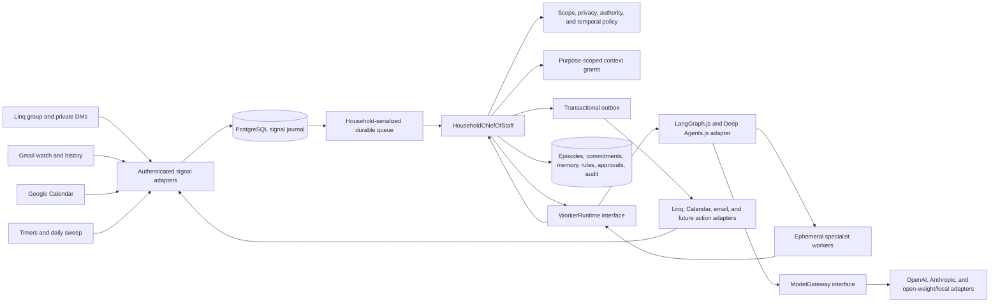

# Florence: Family Chief of Staff Product and Implementation Plan

Plan date: 2026-08-04
Status: accepted for full implementation on 2026-08-05
Product and assistant name: Florence
Canonical code identity: `harianbarasu/florence` at `/Users/harianbarasu/Projects/florence`
Initial users: one founding family consisting of two verified adults
Primary channel: one household iMessage group through Linq, with private DMs to the same assistant
Initial hosting: Railway web service, background worker, and PostgreSQL; Google Cloud Pub/Sub for Gmail change notifications
Model runtime: provider-neutral model gateway; initial credentials may use OpenAI, with Anthropic and open-weight/local adapters supported without domain changes; Codex remains a development tool, not the consumer runtime

## Executive decision

Build Florence, an iMessage-first Chief of Staff for parents.

The product's first promise is:

> Send the family group chat any school message, invitation, screenshot, email, or obligation. The assistant determines what must happen, gets an adult to own it, and follows through until it is handled.

This is not a shared calendar with an AI chat box, a family dashboard, or a general personal assistant. It is a shared responsibility system that closes family loops.

The everyday product is one group conversation containing the two verified adults and Florence as one consistent Chief-of-Staff identity. Each adult also has a private DM with Florence. Children, schools, activities, and caregivers may be represented in household records, but children are not participants or account holders in v1.

The sharp initial wedge is sourced family obligations. The same engine also supports request-led family research, planning, meal planning, and grocery-list creation. These broader capabilities demonstrate the long-term Chief-of-Staff and multi-agent vision without diluting the initial promise.

The product's deepest invariant is:

> **Persistent household intelligence, ephemeral cognition.** Models and workers may disappear; household commitments, policies, memories, evidence, approvals, actions, and outcomes may not.

## Product thesis

Parents do not primarily need another place to organize information. They need a reliable way to answer:

> Something entered family life. What does it mean, who owns the next step, when must it happen, and is it actually handled?

The durable product object is therefore not a message, calendar event, task, agent thread, or model trace. It is a proof-carrying **Family Episode**:

```text
source evidence
→ accepted family meaning
→ required outcome
→ owner and authority
→ temporal plan
→ actions and reminders
→ result or resolution
→ correction and approved learning
```

The first episode type is a family commitment. Research projects and meal plans use the same structure later: source, goal, plan, decision, action, outcome, and learning.

The architectural implication is equally important: product connectors such as Linq, Gmail, and Calendar; model providers such as OpenAI, Anthropic, and open-weight/local endpoints; and worker harnesses such as LangGraph and Deep Agents all sit at separate replaceable seams. The household's accepted state and learning remain ours.

## Product contract

### What Florence does

Florence, acting as the household Chief of Staff:

- monitors explicitly connected Gmail and calendars;
- listens in the household group without treating every message as a request;
- distinguishes ordinary conversation from a family obligation, decision, correction, or project;
- turns relevant sources into proposed Family Episodes;
- establishes the required outcome, owner, useful timing, and follow-up plan;
- detects conflicts, preparation needs, deadline risk, and source changes;
- keeps the household informed through neutral group reminders and a concise daily brief;
- delegates bounded research and planning to ephemeral specialists;
- learns household-specific relevance, privacy, timing, and preference rules;
- asks less as approved rules and demonstrated patterns accumulate;
- records what happened so later work can improve.

Florence does not:

- silently copy one adult's private email into the household;
- interpret silence as acceptance or completion;
- assign blame between adults;
- send external communications, submit forms, RSVP, purchase, pay, book, cancel, or change an external account without the required approval;
- become a general work or personal-productivity assistant;
- let a worker write household truth or broaden its own permissions;
- use conversation history, vector memory, a filesystem, or a framework checkpoint as canonical household state.

### Household-scope gate

A request is in scope when its outcome materially affects the household, dependents, shared resources, or family commitments.

In scope:

- children, school, activities, caregiving, and adult availability;
- household calendar, transportation, travel, and logistics;
- meals, groceries, home supplies, and recurring household work;
- shared purchases, subscriptions, finances, events, gifts, and social plans;
- research supporting a household decision;
- an adult's obligation when it changes household availability or responsibility.

Out of scope:

- work deliverables;
- solo professional research;
- general-purpose trivia;
- individual projects with no household effect;
- requests that merely happen to come from a parent.

For mixed requests, the assistant handles only the household consequence. A work trip may create pickup and meal-planning consequences; it does not authorize the assistant to prepare the adult's work presentation.

### Proactivity contract

The assistant is:

- **proactive** about detected responsibilities, deadlines, changes, conflicts, preparation needs, risks, and explicitly authorized recurring routines;
- **request-led** for optional planning such as meals, groceries, travel, gifts, purchases, and general family research.

Once an optional project is requested, the assistant may drive that episode to completion. It does not initiate a new discretionary project later unless the household creates a recurring rule.

### Action contract

After trust is established, the assistant may automatically:

- create or update internal family commitments, plans, reminders, and daily-brief items;
- update a household calendar when an approved source rule clearly authorizes that projection;
- reschedule its own reminders when source facts or family routines change;
- suppress repeatedly irrelevant inputs;
- execute other reversible, household-internal actions covered by an approved rule.

The assistant must obtain explicit approval before:

- sending or replying to email;
- messaging a school, caregiver, vendor, or other third party;
- submitting a form or RSVP;
- purchasing, paying, booking, canceling, or changing an account;
- exposing information outside its current personal or household scope;
- establishing a new category of external authority.

An approval binds the exact action, relevant data, approver, policy version, and expiry. Editing an action invalidates the old approval.

## Core user flows

### 1. Conversational household onboarding

Onboarding is conducted by the assistant in iMessage. There is no onboarding dashboard or product wizard.

1. The initiating adult texts the Linq number first, establishing inbound-first consent and control of the phone number.
2. The assistant explains the adult-only household model, privacy boundary, proactivity, and initial action limits.
3. The initiating adult invites the second adult. The invitee accepts from their own phone and first establishes a private DM with the assistant.
4. Each adult privately connects one or more of their own Gmail and calendar accounts. Every connection retains its owner, account label, grant, cursor, and privacy policy. The assistant sends secure browser links only for Google OAuth and required legal consent, then immediately continues the conversation in iMessage.
5. Each adult establishes private account labels, work/personal distinctions, obvious exclusions, and initial sharing rules.
6. After both adults are verified, they create or join one group containing both adults and the Linq number. The exact Linq group-creation path is confirmed in the vendor spike before implementation is generalized.
7. The assistant builds the shared family profile collaboratively in the group: children's names and grades, schools, activities, important caregivers, routines, pickup/drop-off patterns, recurring responsibilities, and preferred planning times.
8. Household time anchors are required: time zone, school start and departure, pickup, commute, recurring activities, work constraints, bedtime or preparation windows where relevant, and quiet hours.
9. The assistant summarizes what it believes, identifies private versus shared facts, and allows either adult to correct the shared profile.
10. The household begins in private learning mode before trusted automations activate.

Private DM owns personal integrations, private source rules, sensitive corrections, consent, disconnection, export, and deletion. The group owns shared family facts, routines, commitments, and household rules.

Acceptance criteria:

- Both adults are independently verified and consented.
- One adult cannot connect, expose, or revoke the other adult's mailbox.
- Gmail and calendar OAuth tokens never enter model context.
- The assistant cannot create the household group or begin proactive group messaging until both adults complete consent.
- The family profile is useful without asking for unnecessary child data.
- Browser handoffs are limited to secure operations that cannot safely occur in iMessage.

### 2. Gmail monitoring and private-to-household promotion

Each connected Gmail mailbox remains personal to its owner.

1. Gmail notifies the connector of mailbox changes.
2. The connector retrieves changed messages under that adult's grant and excludes spam, trash, obvious promotions, and unrelated work content.
3. Private triage classifies each relevant message as:
   - ignore;
   - retain as private context;
   - include in the ordinary private review;
   - interrupt the mailbox owner privately because it is urgent;
   - propose a current family episode.
4. Raw email is never pasted into the group automatically.
5. For a proposed family episode, the owner sees the minimum useful private prompt, source, interpretation, and proposed household wording.
6. The owner may share once, keep private, dismiss, correct, or create a durable rule such as “always share messages from this school.”
7. Once a rule is approved, matching messages follow it without repeated confirmation unless the new content materially exceeds the rule or enters a sensitive category.
8. The shared group receives only the minimum necessary family meaning and resulting commitment, not the private mailbox contents.

Sensitive medical, financial, employment, legal, and relationship information remains private unless explicitly promoted. A trusted sender is not a blanket waiver: a school domain may still send content that materially exceeds an existing sharing rule.

Ordinary findings are batched into one private daily review. High-confidence, time-sensitive findings interrupt privately when delay would make the result less useful.

Acceptance criteria:

- Zero personal-to-household leakage.
- Every shared item has a source owner and an applicable approval or rule version.
- The group summary reveals no unnecessary private content.
- A revoked rule affects future processing immediately.
- A source change updates or supersedes the existing episode rather than creating duplicates.

### 3. Group conversation to closed family commitment

1. A verified adult sends a message, screenshot, photo, PDF, link, or forwarded context to the group.
2. A lightweight turn-taking gate chooses `respond`, `react`, `ignore`, or `plan`. The assistant stays quiet during ordinary adult conversation.
3. If a family obligation exists, the assistant identifies the source, required outcome, timing, missing information, and proposed owner.
4. In v1, the proposed owner explicitly acknowledges responsibility. Group delivery or silence is never treated as acceptance because group iMessage does not provide read receipts.
5. The assistant creates the commitment, temporal plan, reminder plan, and evidence links.
6. Reminders may appear in the group. Their language describes the state, not the adult's character or failure.
7. If completion is uncertain, the assistant asks whether the obligation is handled or should be reassigned.
8. Completion, dismissal, supersession, or failure closes the episode with an outcome.

Good reminder:

> The field-trip form is still open and due tomorrow. Is it handled, or should we reassign it?

Bad reminder:

> Hari still has not completed the form.

Acceptance criteria:

- Duplicate Linq events create no duplicate commitments or replies.
- The assistant identifies the speaker and conversation scope correctly.
- A commitment cannot become assigned through silence.
- Neutral reminder language is evaluated and regression-tested.
- Closure records the outcome and cancels stale timers.

### 4. Deep temporal reasoning and the daily household brief

The assistant reasons about useful action windows, not only stated deadlines.

Every commitment may contain:

- event time;
- formal deadline;
- preparation duration;
- earliest useful action window;
- last responsible moment;
- departure or transition anchor;
- relevant availability and travel constraints;
- reminder cadence and escalation policy.

Example:

```text
“Pajama day is Tuesday”
→ surface Sunday while shopping remains possible
→ remind Monday during household preparation time
→ final reminder Tuesday before school departure
→ never send the first useful reminder after school starts
```

The model may extract semantic timing from sources. A deterministic time module resolves time zones, daylight-saving transitions, household anchors, conflicts, stale plans, and exact trigger instants. Every timer carries the episode and temporal-plan version and reevaluates current state before sending.

The group receives one concise daily brief at a household-chosen time containing:

- today's and near-term schedule;
- current preparation needs;
- open and at-risk commitments;
- meaningful changes or conflicts;
- decisions that genuinely need an adult.

Private source detail is excluded unless a sharing rule permits it.

Acceptance criteria:

- At least 90% of pilot reminders arrive inside a useful action window.
- Changed schedules invalidate old reminder plans.
- The brief does not repeat already resolved work.
- A missed window is surfaced honestly rather than disguised as a timely reminder.

### 5. Request-led family research and planning

An adult may ask the group or a private DM to handle a bounded household project:

> Find three summer camps that fit our calendar and compare cost, location, and cancellation policy.

1. The CoS applies the household-scope gate.
2. It defines the decision, evidence required, constraints, budget, and completion contract.
3. It creates an episode and delegates bounded work to ephemeral research, calendar, comparison, or verification workers.
4. Workers receive only purpose-scoped context and tools.
5. The CoS reconciles their results against current household state, resolves conflicts, and returns one decision-ready recommendation.
6. Any external communication, booking, or payment remains approval-gated.
7. The episode remains accessible through the CoS until resolved; internal workers disappear.

Acceptance criteria:

- Out-of-scope personal or work research is declined or narrowed.
- Sources and as-of dates remain attached to material claims.
- A worker cannot see unrelated private household data.
- A worker result cannot directly message the family or commit state.
- The answer is useful without exposing internal agent choreography.

### 6. Request-led meal plan to grocery list

Meal planning is supported but never initiated without a request or an explicitly approved recurring rule.

1. An adult asks for a meal plan and supplies or confirms the time horizon.
2. The CoS uses the week's household schedule, known preferences, dietary constraints, preparation time, leftovers, and explicitly provided pantry information.
3. It proposes a practical plan, asks only for consequential missing information, and incorporates feedback.
4. It creates one shared grocery list grouped for action.
5. Ordering or checkout is outside the first pilot and would require explicit approval later.
6. Low-risk preferences may become household memory; sensitive dietary or medical facts require confirmation.

Acceptance criteria:

- The assistant does not start a weekly meal-planning conversation unless asked.
- The plan reflects actual schedule constraints rather than generic recipes.
- Rejected meals and accepted substitutions improve later requested plans.
- No retailer order or payment occurs in v1.

### 7. Conversational inspection, correction, and control

There is no customer dashboard in v1. Adults manage the product through private DMs:

- “Which Gmail accounts are connected?”
- “Why did you share that?”
- “Show my automatic-sharing rules.”
- “Stop sharing messages from this sender.”
- “What do you know about our school schedule?”
- “Forget that.”
- “Disconnect my work email.”
- “Export my data.”
- “Delete my data.”

The assistant answers from authoritative records and performs validated commands. OAuth, legal consent, and later payment may use secure browser pages; ordinary control returns to iMessage.

Acceptance criteria:

- Every material decision is explainable from source, rule, and authority records.
- Corrections supersede rather than silently mutate history.
- Revocation and deletion commands are authenticated and auditable.
- A DM never reveals the other adult's private-source content.

### 8. Failure and recovery

The assistant behaves like a responsible Chief of Staff when work fails.

It reports:

- what remains unfinished;
- whether a deadline or useful window is at risk;
- the smallest decision, permission, or input needed;
- what safe work can continue;
- whether the system is retrying, reconciling, or has stopped.

It never marks an episode complete because a model said it was complete. Unknown external-action outcomes are reconciled before retrying to prevent duplicates.

## Privacy, memory, and learning

### Scope model

All durable information has one of three scopes:

- **job:** temporary context for one bounded worker; discarded after completion and retention expiry;
- **personal:** private to one verified adult;
- **household:** available to the household CoS and workers whose purpose requires it.

Derived data cannot have broader visibility or lower sensitivity than its sources unless an applicable adult approval or durable policy explicitly permits promotion.

### Memory model

Every durable memory records:

- scope;
- source and provenance;
- confidence;
- sensitivity;
- valid-from and optional expiration time;
- confirmation status;
- the rule or authority that permitted promotion;
- correction, revocation, and supersession history.

Promotion policy:

- explicit statements and confirmations become durable immediately;
- trusted sources covered by an approved rule may update matching household facts;
- low-risk preferences and routines may be learned automatically and corrected conversationally;
- sensitive facts and all new personal-to-household sharing require confirmation;
- workers return memory candidates but cannot promote them.

### Routing self-learning

Every inbox or message classification preserves the decision, confidence, applicable rules, and eventual household response.

Feedback includes:

- not relevant;
- this was urgent;
- share once;
- always share this source or class;
- keep these private;
- wrong owner;
- wrong time;
- handled, dismissed, superseded, or missed.

The learning boundary is asymmetric:

- the assistant may automatically become quieter and improve prioritization;
- expanding disclosure or action authority always requires one explicit approval;
- once approved, the assistant follows the rule without repeatedly asking;
- exceptions are triggered only when new content materially exceeds the rule.

### Harness self-improvement

Household feedback may generate candidate changes to prompts, classifiers, policies, context selection, time interpretation, or worker configurations. The improver may not modify its evaluator, permissions, approval thresholds, protected regression cases, or production release directly.

Product-wide improvement follows:

```text
episode and outcome evidence
→ failure pattern
→ bounded candidate change
→ replay against held-in and protected held-out scenarios
→ privacy, timing, quality, cost, and reliability report
→ explicit release promotion
```

Household-specific rules stay household-specific. Raw private household data is not pooled for cross-customer learning without separate, explicit consent.

## Gmail and calendar history

Onboarding uses tiered processing:

1. Process the most recent 90 days first for rapid usefulness.
2. Backfill at least one year of Gmail during onboarding, newest first.
3. Progressively analyze the remaining mailbox in the background.
4. Use full history privately to learn recurring relationships, annual patterns, senders, and relevant context.
5. Activate an old finding only when it is still currently actionable or the adult asks about it.
6. Use Gmail push notifications and incremental history synchronization after the initial sync.

Gmail remains the source of truth for raw email. The product retains encrypted source references, classifications, structured facts, episode evidence, and only the raw content necessary for current processing, retrieval, audit, or an explicit retention promise. Raw-body caches and attachment copies have defined expiration and deletion behavior.

All Gmail content and derived embeddings or summaries are treated as restricted user data. Public launch requires Google OAuth verification and any applicable security assessment before scaling beyond approved test users.

## System architecture



### Primary module interface

```ts
interface HouseholdChiefOfStaff {
  accept(input: HouseholdSignal): Promise<AcceptanceReceipt>;
}
```

Every Linq message, Gmail or Calendar cursor change, timer, worker result, connector change, correction, and approval becomes one authenticated, idempotent `HouseholdSignal`.

`accept` performs no long model call and no external action. It validates, deduplicates, appends the signal, assigns its per-household sequence, and queues durable processing atomically.

Administrative inspection and recovery use a separate read-only `HouseholdOperations` module. This exists for tests, operations, support, and DM answers; it is not a customer dashboard.

### Processing order

1. The source adapter verifies the webhook or authenticated adult and resolves its household binding.
2. The signal journal deduplicates and persists the normalized event.
3. The household queue serializes authoritative processing by household.
4. The scope and privacy gate runs before broad retrieval or delegation.
5. The CoS loads the current household projection and creates the minimum necessary context grant.
6. Deterministic policy chooses ignore, react, respond, update, plan, or delegate.
7. Ephemeral workers return typed proposals, evidence, artifacts, questions, and candidate memories.
8. The CoS revalidates state version, scope, provenance, timing, permissions, and approvals.
9. One transaction commits domain state, timers, audit entries, and outbox intents.
10. Effect adapters execute idempotently and return receipts as new signals.

### Concurrency and durability

- Each household has one authoritative commit stream.
- Read-only workers may run concurrently against a recorded household version.
- Worker results are stale until reconciled against current state and policy.
- PostgreSQL is the initial durable queue using leases and `FOR UPDATE SKIP LOCKED` semantics.
- Queue notification is an optimization; polling and lease recovery prevent lost work.
- Every external effect has a stable idempotency key and receipt.
- A timer is a request to reevaluate, not permission to send a stale reminder.
- Framework checkpoints are runtime progress only and may be rebuilt from the domain journal.

## Ownership and reuse map

| Module | Owns | Reuses or adapts | Explicitly does not own |
|---|---|---|---|
| `HouseholdChiefOfStaff` | Household ordering, episode transitions, single-writer commits, proposal reconciliation, authoritative communication | Policy, time, context, runtime, and effect modules | Provider webhooks, raw OAuth credentials, framework state |
| `SignalJournal` | Authentication result, deduplication, per-household sequence, durable inbox | PostgreSQL | Business interpretation or messaging |
| `FamilyEpisodes` | Commitments, projects, accepted meaning, owners, plans, actions, outcomes, state transitions | Source and evidence references | Raw email or model traces |
| `ScopeAndAuthority` | Household-impact gate, personal/household lattice, privacy promotion, approval rules, action digests | Verified identity and household policies | Content classification implementation |
| `HouseholdTime` | Time zones, routine anchors, useful windows, last responsible moment, conflicts, timer versions | Calendar projections and episode meaning | Cron as household truth; model-generated exact triggers |
| `ContextVault` | Encrypted content references, retention, purpose grants, minimum-necessary reads | Gmail/Linq attachments and object storage | Canonical family meaning |
| `HouseholdMemory` | Personal and shared durable memories, provenance, validity, correction, promotion status | Memory candidates and approved rules | Agent chat history as truth |
| `WorkerRuntime` | Bounded worker execution, isolated subagent lifecycle, structured results, budgets, and trace references | LangGraph.js and Deep Agents.js initially; possible future harness adapters | Household writes, approvals, connector credentials, durable family memory |
| `ModelGateway` | Capability-based model selection, provider configuration, normalized requests/results, and usage metadata | OpenAI, Anthropic, and open-weight/local model adapters | Household policy, worker orchestration, prompts, or provider-specific types outside the seam |
| `WorkerCatalog` | Versioned worker definitions, tool and context requirements, evaluation release | Triage, schedule, research, comparison, meal, and verification roles | Permanent user-facing agent identities |
| `ActionExecutor` | Idempotent provider calls, outcome reconciliation, receipts | Linq, Google Calendar, Gmail, future commerce adapters | Deciding whether an action is authorized |
| `PolicyLearner` | Feedback aggregation and candidate household-rule changes | Episode outcomes and routing decisions | Expanding disclosure automatically; approving itself |
| `Evaluation` | Scenario datasets, held-out tests, scorer versions, release reports | Deterministic tests and bounded model graders | Production truth or automatic release promotion |
| `HouseholdOperations` | Read-only inspection, repair commands, export/deletion orchestration | Authoritative domain records | Customer operational dashboard |

The deep module seam is deliberate. Provider or framework types do not appear in the `HouseholdChiefOfStaff` interface. Internal seams exist for testing and replacement without forcing every implementation detail into a public package.

## Agent and framework strategy

### Persistent CoS, ephemeral workers

The persistent CoS is durable identity, charter, policies, episodes, memory, and history. It is not an immortal prompt, process, or model conversation.

Initial bounded worker roles include:

- group turn-taking and intent triage;
- Gmail relevance, sensitivity, and urgency classification;
- obligation and commitment interpretation;
- calendar conflict and preparation analysis;
- family research and comparison;
- meal planning and grocery-list synthesis;
- result verification and source checking.

Workers receive an app-owned `WorkerJob` containing an objective, base household version, policy version, source references, short-lived context grant, `CapabilityGrant` identifiers, budget, deadline, and `OutputContractRef`. They return an app-owned `WorkerResult` containing evidence, proposed episode changes, messages, timers, actions, memory candidates, unresolved questions, confidence, and diagnostics.

Neither contract contains LangChain messages, Deep Agents state, provider content blocks, provider tool calls, framework thread/run IDs, or provider model identifiers. Provider tool-call IDs never become action IDs; capabilities, approvals, and effect digests use app-owned stable identities.

Workers cannot message the family, promote memories, create policies, execute actions, or write household state. The CoS is the only writer.

### Initial runtime choice

Use a custom TypeScript household control plane and PostgreSQL durable execution. Run the MIT-licensed LangGraph.js and Deep Agents.js packages inside our worker process, behind the internal `WorkerRuntime` seam, for bounded planning, tool use, and isolated subagents. Their managed deployment and observability products are not required infrastructure.

Each `WorkerJob` starts with fresh runtime context and a job-scoped scratch backend. Synchronous subagents may be created during that attempt, but they return typed results rather than identities or durable authority. Async or stateful subagents are disabled initially. Scratch files, framework messages, and checkpoints have a short retention window and are purged after result reconciliation or expiry. A failed attempt restarts from the durable app job; it is never resumed mid-checkpoint on a different provider.

LangGraph may orchestrate one bounded worker attempt; it does not orchestrate the household product. Do not make Deep Agents, LangGraph, LangChain model objects, a provider conversation, a managed agent platform, or Codex app-server the household's source of truth. Do not use framework memory as family memory or allow framework tools to bypass server-side grants. Deep Agents receives a curated tool set with no unrestricted shell, connector credential, or general household-search capability.

Mastra or a thin custom harness may later become another `WorkerRuntime` adapter if evaluation shows an advantage. Replacing the harness must not require a household-state migration or changes to the `HouseholdChiefOfStaff` interface.

Codex is used to develop this product. Initial pilot inference may use the company-owned OpenAI API account, but model choice is runtime configuration rather than a product or domain dependency.

### Model-provider portability

`ModelGateway` is a small product-owned interface beneath `WorkerRuntime`. All model calls pass through it. It accepts a capability profile and a provider-neutral request, then returns a normalized result with usage, latency, and provider/model metadata. Domain modules never import provider SDKs, LangChain model classes, provider tool-call types, or model identifiers.

Initial capability profiles include:

- inexpensive classification and extraction;
- strong tool-using planning;
- vision and document interpretation;
- long-context research and synthesis;
- optional private or self-hosted processing.

Workers declare required capabilities rather than preferred vendors. Configuration maps those profiles to OpenAI, Anthropic, or an open-weight/local adapter. An adapter may target a direct provider API, a hosted open-weight model, or a self-hosted endpoint such as vLLM or Ollama. A model is eligible only when it passes the worker's structured-output, tool-calling, latency, privacy, and quality gates; portability does not mean pretending all models behave identically.

The gateway owns provider-neutral text, image, document-reference, citation, tool-request, and structured-result types. App-owned schemas validate every structured result even when a provider offers a native strict mode. Provider failures map to stable error categories such as `rate_limited`, `context_exceeded`, `unsupported_capability`, `invalid_output`, `transient`, and `permanent`. Raw usage may be retained as adapter metadata, but normalized accounting does not pretend providers tokenize identically.

Provider portability is proven, not merely asserted:

- maintain contract tests for every `ModelGateway` adapter;
- run the same held-out worker scenarios against at least two materially different providers before the external pilot cohort;
- keep prompts, tool schemas, worker definitions, and evaluation cases in product-owned files;
- record provider/model/version on every worker result without making it canonical household truth;
- make provider routing a configuration change with a rollback path;
- require no LangSmith, LangGraph Platform, or provider-hosted conversation state for correctness.

### Context and tool selection

The runtime never receives the entire household or tool catalog by default. Context is progressively assembled from:

- the current signal and episode;
- the adult and conversation scope;
- relevant family members, routines, and commitments;
- applicable source evidence and policy versions;
- only the capabilities required for the current job.

Email, webpages, attachments, and retrieved text are untrusted data, not instructions. Credentials stay outside model context and tool execution validates every short-lived grant server-side.

## Initial data model

The first schema needs durable identities for:

- households;
- adults, memberships, invitations, and consent;
- channel handles, group chats, and private conversations;
- external connections and encrypted OAuth grants;
- source items, revisions, evidence references, and retention state;
- household signals and per-household sequence;
- Family Episodes, commitments, owners, states, and outcomes;
- semantic time facts, temporal-plan versions, and scheduled triggers;
- personal and household memories;
- sharing, routing, timing, and action policies;
- approvals, action digests, external effects, and receipts;
- worker jobs, grants, results, budgets, and trace references;
- transactional outbox events;
- audit entries, feedback, evaluation cases, and release versions.

PostgreSQL is canonical. Gmail, Google Calendar, and Linq remain external sources or projections. Chat history, embeddings, worker scratch files, framework memory, and traces remain supporting artifacts.

## Repository and deployment shape

Start as a modular TypeScript monolith, not a distributed agent platform.

```text
src/
  server/                 Fastify webhooks, OAuth callbacks, health
  worker/                 durable queue processing and scheduled sweep
  household/              deep Chief-of-Staff domain module
  episodes/               commitments, projects, plans, outcomes
  identity/               adults, invitations, memberships, channels
  policy/                 scope, privacy, authority, learned rules
  time/                   household temporal model
  memory/                 personal and household durable memory
  context/                encrypted source vault and context grants
  workers/                WorkerRuntime, app-owned contracts, and worker catalog
    deep/                 LangGraph.js and Deep Agents.js adapter only
  models/                 ModelGateway, capability profiles, and provider adapters
  effects/                outbox and provider executors
  adapters/
    linq/
    gmail/
    google-calendar/
    object-storage/
  evaluation/             scenario fixtures, scorers, release gates
```

One repository produces two Railway processes:

- **web service:** Linq webhooks, Google OAuth callbacks, Gmail Pub/Sub push endpoint, minimal secure browser handoffs, and health checks;
- **background worker:** Gmail synchronization, household queue, agent jobs, timers, daily briefs, outbox execution, backfills, and evaluation sampling.

Infrastructure:

- Railway PostgreSQL;
- S3-compatible encrypted object storage behind an adapter;
- managed key-encryption or envelope-encryption strategy before real family data;
- Google Cloud project for Gmail OAuth, API access, and Pub/Sub;
- Linq number and signed webhooks;
- provider-scoped credentials, endpoint URLs, enablement, and model-profile mappings stored only in worker infrastructure configuration and never placed in a `WorkerJob` or model context;
- backups, restore tests, and structured redacted logs.

There is no React customer application in v1. Secure browser pages are narrowly scoped to OAuth, consent, and later payment. Internal operations may use scripts or an authenticated operator-only surface without becoming a customer workflow.

## Founding-family pilot

The first family is the parent co-founder and their partner. The product never calls them “Household Zero.”

### Pilot stages

1. **Synthetic and founder testing**
   - Linq group semantics, duplicate delivery, STOP, private/group routing, attachments, replies, and reactions;
   - synthetic Gmail and calendar fixtures;
   - privacy, timing, no-blame, stale-source, and crash-recovery scenarios.
2. **Private learning mode**
   - both adults complete onboarding;
   - Gmail and calendars monitor real data;
   - candidate family findings remain private until approved;
   - source, sensitivity, urgency, timing, and owner corrections are captured.
3. **Trusted automation**
   - approved source rules promote matching commitments automatically;
   - group reminders and the daily brief run;
   - the family completes at least one bounded research/planning episode and one requested meal-to-grocery-list episode.
4. **Fourteen-day review**
   - compare week one and week two;
   - inspect every privacy error, false interruption, missed obligation, badly timed reminder, duplicate, and unclosed episode;
   - decide whether to fix and repeat, expand to a small invited cohort, or narrow the product.

### Pilot success scorecard

| Dimension | Initial bar |
|---|---:|
| Personal-email leakage into household | **0; hard gate** |
| Unauthorized external action | **0; hard gate** |
| Real family obligations caught during review | at least 80% |
| Surfaced items judged useful | at least 85% |
| Reminders inside a genuinely useful action window | at least 90% |
| Accepted commitments completed or consciously dismissed | at least 75% |
| Week-two relevance and timing | measurably better than week one |
| General delegated work | one successful family research/planning episode |
| Meal capability | one successful requested meal-plan-to-grocery-list episode |
| Household pull | both adults actively choose to keep using it |

With one family, the percentages are diagnostic rather than statistically meaningful. Privacy and unauthorized action remain absolute gates.

## Implementation plan

### Tranche 0: freeze the plan and reset the repository

- Keep the snapshot commit and pre-pivot branch recoverable.
- Retain research artifacts and this plan.
- Treat `harianbarasu/florence` as the intended canonical GitHub repository and Florence as the package, deployment, and assistant identity.
- Move the recoverable current worktree from `/Users/harianbarasu/Projects/life-os` to `/Users/harianbarasu/Projects/florence` before new implementation begins; do not maintain duplicate active checkouts.
- Audit the existing Florence GitHub repository and Railway project read-only for reusable configuration names, external bindings, and non-secret assumptions before replacement.
- Use the currently supplied Florence credentials only through local or Railway secret configuration for initial deployment and validation. Never place them in Git, generated artifacts, logs, test fixtures, or the plan; support configuration-only rotation and rotate them after initial validation.
- Preserve any useful old implementation only in a clean, secret-scanned reference snapshot before replacing the repository contents.
- Remove the React Life OS interface, project/life domain code, Codex app-server runtime, and assumptions tied to a single-user web product.
- Recreate a minimal TypeScript/Fastify/PostgreSQL modular monolith with separate server and worker entrypoints.
- Preserve generic toolchain pieces only when they do not pull old product abstractions back into the design.

Exit criteria:

- clean build, lint, typecheck, and test commands;
- no production path depends on a web dashboard or Codex subscription;
- active credentials exist only in ignored local environment or Railway secret configuration, no secret appears in repository history or logs, and a post-validation rotation checklist exists;
- the new Florence repository and deployment identifiers are consistent and the prior implementation remains recoverable until replacement is verified;
- the active local checkout is `/Users/harianbarasu/Projects/florence`, with `harianbarasu/florence` as its sole canonical GitHub remote;
- module interfaces and architecture decisions are recorded before feature code.

### Tranche 1: domain kernel and deterministic test harness

Build:

- household, adult, membership, invitation, consent, and channel identity;
- personal/household scope lattice;
- signal journal, idempotency, household sequence, Postgres queue, leases, and outbox;
- Family Episode and commitment reducer;
- policy and approval records;
- fake clock, Linq, Gmail, Calendar, `WorkerRuntime`, `ModelGateway`, and effect adapters;
- provider-adapter contract fixtures that domain tests can run without selecting a real provider;
- scenario test runner and redacted structured logging.

Exit criteria:

- duplicate and out-of-order signals cannot duplicate state or effects;
- personal content cannot enter household scope without a rule or approval;
- workers cannot mutate canonical state;
- crash-after-every-transition replay tests recover correctly.

### Tranche 2: Linq vendor spike and adult onboarding

Resolve before general implementation:

- user-created versus API-created group behavior;
- participant add/remove and stable chat identity;
- group STOP and opt-out semantics;
- inbound-first consent and unknown-sender behavior;
- attachment retrieval and retention;
- flagged-line recovery, backup numbers, pricing, and production provisioning;
- vendor treatment of adult-provided child data;
- Linq's conflicting public retention descriptions.

Build:

- signed webhook verification and durable inbox;
- group and private DM routing;
- sender identity, replies, reactions, and attachment references;
- invite and consent conversation;
- browser-only OAuth/consent handoff shell;
- `respond | react | ignore | plan` turn-taking gate;
- DM inspection and correction commands.

Exit criteria:

- two verified adults can onboard and form one shared group;
- the assistant remains silent during scripted adult conversation;
- any opt-out immediately suppresses outbound group messages under the chosen safety policy;
- duplicate and retry behavior is proven against recorded Linq fixtures.

### Tranche 3: group commitment-to-closure vertical slice

Build:

- group text and attachment interpretation;
- proposed outcome, owner, evidence, and explicit acknowledgment;
- commitment states, neutral reminders, reassignment, and closure;
- deterministic `HouseholdTime` values and timer versions;
- daily household brief;
- LangGraph.js/Deep Agents.js `WorkerRuntime` adapter for bounded interpretation and verification workers;
- provider-neutral `ModelGateway` with OpenAI plus one Anthropic or open-weight/local adapter exercised by the same contract suite;
- app-owned worker contract validation and job-scoped scratch cleanup.

Exit criteria:

- a real group message becomes an acknowledged commitment, is reminded at a useful time, and closes without a dashboard;
- changed facts invalidate stale timers;
- group reminders pass no-blame evaluations;
- switching the configured eligible model provider requires no domain-code change and preserves the worker result contract;
- provider/model failure cannot create false completion.

### Tranche 4: private Gmail and Calendar intelligence

Build:

- separate Google OAuth grants for each adult;
- Gmail watch, Pub/Sub, history synchronization, retry, and resync;
- private relevance, sensitivity, urgency, and family-impact triage;
- private review, urgent interruption, and household-promotion conversation;
- trusted source/class rules and material-exception detection;
- Google Calendar read and approved household projection;
- one-year backfill with recent-first priority;
- resumable full-history background processing.

Exit criteria:

- a new school email privately becomes one approved shared commitment;
- unrelated work and spam stay suppressed;
- raw email never enters the group automatically;
- revoking Gmail immediately stops access and background work;
- one-year backfill can pause, resume, and report progress without blocking live monitoring.

### Tranche 5: learning and evaluation loop

Build:

- feedback capture for relevance, urgency, sharing, owner, timing, and outcome;
- durable household routing and privacy rules;
- low-risk preference and routine memory;
- rule explanations, revocation, and DM inspection;
- candidate harness and policy revisions;
- protected scenario corpus and release comparison;
- pilot scorecard reporting.

Exit criteria:

- approved rules stop repeated questions;
- automatic learning can reduce noise but cannot broaden disclosure;
- week-two decisions can be replayed against week-one failures;
- a candidate prompt or policy cannot modify its own evaluator or promote itself.

### Tranche 6: request-led delegation and meals

Build:

- bounded family research and comparison episode;
- synchronous ephemeral specialist delegation through the runtime adapter;
- evidence, as-of dates, decision-ready synthesis, and cancellation;
- requested meal planning using household schedule and preferences;
- shared grocery-list artifact;
- household-scope rejection and narrowing behavior.

Exit criteria:

- one summer-camp-style comparison completes with sources and calendar fit;
- one requested meal plan produces a usable grocery list;
- neither flow initiates itself later without a recurring rule;
- external booking, ordering, and payment remain blocked.

### Tranche 7: fourteen-day founding-family pilot

- complete synthetic privacy and failure testing;
- run private learning mode;
- activate trusted automations gradually;
- review failures daily without exposing raw private content in telemetry;
- complete the pilot scorecard;
- produce a go, repeat, narrow, or stop decision.

### Tranche 8: public-readiness gates after product proof

Only after the founding-family loop proves pull:

- Google OAuth verification and restricted-scope security assessment;
- production privacy policy, terms, data maps, deletion proof, and incident plan;
- encryption-key rotation, backup restore, disaster recovery, and account recovery;
- Linq commercial/SLA and minor-data answers;
- multi-household isolation and adversarial authorization tests;
- support and operator access policy;
- cost controls, rate limits, abuse controls, and later pricing work;
- invitation of a small external cohort.

## Decision log

| Decision | Resolution |
|---|---|
| Product and assistant name | Florence |
| Canonical repository | Existing `harianbarasu/florence` repository after read-only inventory, secret rotation, and recoverable clean snapshot |
| Canonical local folder | `/Users/harianbarasu/Projects/florence`; retire the `life-os` path after the recoverable move |
| Customer | Parents and families first |
| Competitive frame | Direct Ollie competitor, differentiated by reliable closure and learning |
| Primary surface | One household iMessage group |
| Private surface | One DM per verified adult with the same CoS |
| Messaging provider | Linq for the initial pilot, behind a channel adapter |
| Participants | Verified adults only; children are represented, not direct users |
| First promise | Turn family obligations into owned, timed, closed loops |
| Initial ownership | CoS proposes; adult explicitly acknowledges in v1 |
| Gmail | Continuous monitoring is core, not a later add-on |
| Mailbox privacy | Personal by default; minimum derived meaning promoted only by approval or rule |
| Inbox attention | Urgent high-confidence findings interrupt privately; routine candidates batch |
| Rule learning | May reduce noise automatically; disclosure expansion requires one approval and then persists |
| Reminders | May be in the group; always neutral and non-blaming |
| Daily rhythm | One concise household group brief |
| Time | Explicit onboarding anchors plus useful-window reasoning; deterministic final scheduling |
| Internal actions | Reversible household actions may become automatic under trusted rules |
| External actions | Communication, submission, booking, purchasing, payment, and cancellation require approval |
| Optional planning | Request-led; no unsolicited meal or research projects |
| Meal capability | Requested meal plan through shared grocery list in the pilot |
| Product scope | Household-impacting work only, including mixed requests' family consequence |
| Onboarding | Conducted in iMessage; browser only for secure OAuth/consent/payment handoffs |
| Customer web app | None in v1; control through private DMs |
| Initial history | Recent 90 days first, at least one year backfilled, entire history processed privately over time |
| Historical activation | Old data informs private context; only current actionability enters the household |
| CoS state | Persistent domain state, not persistent model context |
| Specialists | Ephemeral, scoped, invisible workers |
| Writer authority | Persistent CoS is the sole household writer and communicator |
| Runtime | Custom TypeScript domain core and Postgres execution; MIT-licensed LangGraph.js and Deep Agents.js behind `WorkerRuntime` |
| Model providers | Product-owned `ModelGateway`; OpenAI, Anthropic, and open-weight/local models selected by capability and evaluation |
| Managed agent services | Optional for development only; no LangSmith, LangGraph Platform, or provider conversation state required for correctness |
| Codex | Development tool only; product inference uses separately configured provider credentials or self-hosted endpoints |
| Pricing | Deliberately deferred until pilot value and cost are known |
| First family | Parent co-founder and partner; never called “Household Zero” in product |

## Explicit non-goals for v1

- A native iOS app or Messages extension.
- A customer dashboard, household workspace, or calendar clone.
- Child accounts or direct child interaction.
- Cross-protocol Android/SMS behavior during the first iMessage-only pilot.
- General personal or work assistance.
- Autonomous third-party communication, commerce, booking, or payment.
- Retailer grocery checkout.
- Shared cross-household learning from private data.
- A permanent visible roster of agents.
- A generic agent builder, skill marketplace, or user-configurable workflow studio.
- A custom vector database, knowledge graph platform, Temporal cluster, or microservice fleet before measured need.
- Pricing, billing, and growth work before the founding-family loop works.
- Exposing raw model reasoning or agent traces to the family.

## Risks and gates

| Risk | Gate or mitigation |
|---|---|
| Private email leaks into group | Scope lattice, personal-first ingestion, minimum-derived promotion, hard-zero pilot gate |
| Linq or Apple line flagging | Inbound-first onboarding, low volume, opt-out suppression, vendor spike, backup plan |
| No group read receipts | Explicit ownership and completion acknowledgment; never infer receipt |
| Duplicate or out-of-order webhooks | Durable journal, provider event dedupe, household sequence, idempotent outbox |
| Bad reminder timing | Explicit anchors, semantic time values, deterministic scheduler, plan versions, timing evals |
| Assistant creates family conflict | Neutral state language, no blame, scenario evaluation, correction loop |
| Model or worker becomes authority | Typed proposals, short-lived grants, single-writer reconciliation, deterministic action policy |
| Self-learning reward hacking | Evaluators and permissions outside the loop, held-out scenarios, explicit release promotion |
| Historical processing becomes invasive | Personal scope, recency priority, actionability gate, minimal raw retention, DM controls |
| Gmail public-launch delay | Begin OAuth verification/security work early; keep initial users inside approved test cohort |
| Temporarily exposed initial credentials | Owner authorized initial use; isolate them in secret configuration, never print or commit them, monitor initial use, and rotate after deployment validation |
| Model-provider lock-in | Product-owned capability interface, at least two exercised adapters, cross-provider evals, configuration-based routing, and no provider types in domain code |
| Framework lock-in | MIT-licensed in-process packages, domain-owned interfaces and Postgres state, framework types behind `WorkerRuntime`, no required managed platform, and a harness replacement test |
| Trace and telemetry leakage | Redacted references, no raw email/child/health content in external traces, strict retention |
| Product becomes feature soup | Household-impact gate, obligations as wedge, request-led optional capabilities |
| Assistant is broad but unreliable | Pilot scorecard, complete vertical slices, no expansion before closure and privacy gates pass |

## Research basis

Primary internal syntheses:

- [Parent/family Chief-of-Staff research](./docs/research/parent-family-chief-of-staff.md)
- [Consumer AI product research](./docs/research/consumer-ai-products.md)
- [Agent architecture research](./docs/research/agent-architecture.md)
- [Agent framework research](./docs/research/agent-frameworks.md)
- [Deep Agents and Stripe research](./docs/research/deep-agents-stripe.md)
- [Security and data-model research](./docs/research/security-data-model.md)
- [Runtime architecture research](./docs/research/runtime-architecture-historical.md)

Key external sources:

- [Ollie](https://www.ollie.ai/) and [Ollie privacy policy](https://www.ollie.ai/privacy-policy/)
- [Ohai's 2026 product reset](https://www.ohai.ai/blog/meet-the-new-ohai-household-manager-built-for-your-whole-family/)
- [Sense](https://getsense.ai/) and [its child-account design](https://getsense.ai/blog/posts/why-sense-doesnt-have-kid-accounts)
- [Linq group chats](https://docs.linqapp.com/guides/chats/group-chats/), [webhooks](https://docs.linqapp.com/guides/webhooks/), and [protocol behavior](https://docs.linqapp.com/guides/messaging/protocol-selection/)
- [Google Gmail synchronization](https://developers.google.com/workspace/gmail/api/guides/sync), [scopes](https://developers.google.com/workspace/gmail/api/auth/scopes), and [user-data policy](https://developers.google.com/workspace/workspace-api-user-data-developer-policy)
- [Stripe Kai on Deep Agents](https://www.langchain.com/blog/how-stripe-built-their-knowledge-ai-platform-on-deep-agents)
- [Deep Agents repository and MIT license](https://github.com/langchain-ai/deepagents)
- [Deep Agents.js model-provider configuration](https://docs.langchain.com/oss/javascript/deepagents/models)
- [Deep Agents.js synchronous subagents](https://docs.langchain.com/oss/javascript/deepagents/subagents)
- [LangGraph repository and MIT license](https://github.com/langchain-ai/langgraph)
- [Lilian Weng, Harness Engineering for Self-Improvement](https://lilianweng.github.io/posts/2026-07-04-harness/)
- [Codex SDK](https://learn.chatgpt.com/docs/codex-sdk) and [Codex authentication](https://learn.chatgpt.com/docs/auth)

## Acceptance and next action

This plan is accepted. Implementation is authorized through a complete, deployed Florence v1 rather than a disposable prototype or partial checkpoint.

The next action is Tranche 0: inventory the old Florence assets read-only, freeze recoverable snapshots, move active work into the canonical Florence repository, and replace obsolete code with the modular parent-first Florence service. Current credentials may be used through secret configuration for deployment validation and rotated afterward.
