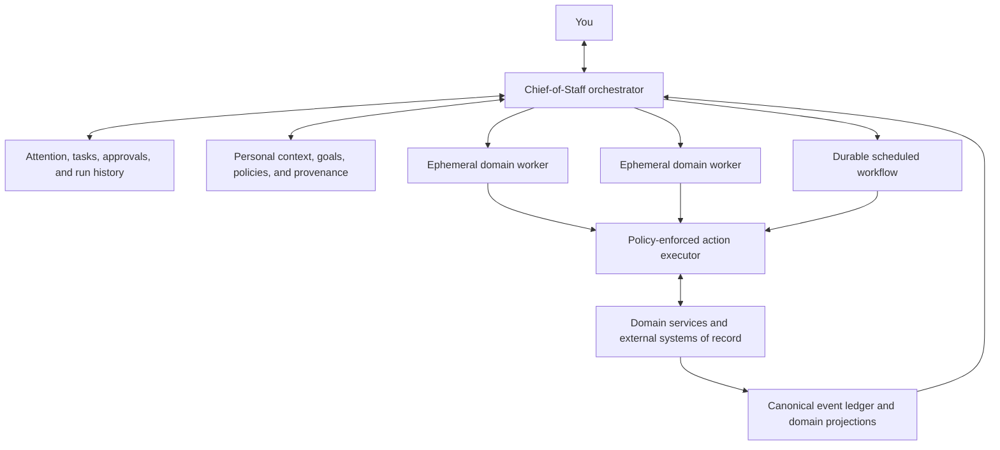

# Research: Architecture Patterns for an AI-First Personal Life OS

Research date: 2026-08-03  
Status: discovery input, not an implementation decision  
Source policy: primary sources only (official product pages, documentation, repositories, and first-party engineering posts)

## Executive synthesis

The strongest product shape is not “many trackers with a chatbot.” It is:

> One user-facing Chief-of-Staff orchestrator, a shared and inspectable personal context spine, durable task execution, and temporary specialist workers with narrowly scoped tools—plus structured domain views wherever the underlying data matters.

The sources point to several recurring principles:

1. **Meet the user in existing channels, but keep structured control surfaces.** Poke and Ollie use messaging as the everyday interface; Town adds Tasks, Suggestions, Routines, Approvals, and run history so asynchronous work remains understandable and controllable. [Poke](https://poke.com/) · [Ollie](https://ollie.ai/) · [Town Assistant](https://www.town.com/docs/using-town/assistant) · [Town web app](https://www.town.com/docs/using-town/web-app)
2. **Treat delegation as isolated work, not a chat-role gimmick.** Hermes gives subagents isolated contexts, toolsets, and terminal sessions and returns only their summaries. Its own docs warn that ordinary delegation is tied to the parent session and is not suitable for durable work. [Hermes delegation](https://hermes-agent.nousresearch.com/docs/guides/delegation-patterns/)
3. **Make long-running work durable and resumable.** LangGraph checkpoints state at each step to support interruption, approval, recovery, and replay. [LangGraph persistence](https://docs.langchain.com/oss/python/langgraph/persistence)
4. **Separate language-model judgment from deterministic side effects.** Stripe’s reliability patterns—idempotency keys, safe retries, backoff, and observability—are essential once an agent can send, book, buy, move, or update. [Stripe idempotency](https://stripe.com/blog/idempotency) · [Stripe Workflows](https://docs.stripe.com/workflows)
5. **Trust is a product state, not a blanket permission.** Ramp recommends explainable outcomes, cited source context, explicit “needs review” escape hatches, deterministic hard stops, and a progression from suggestions to limited actions to autonomy. [Ramp: How To Build Agents Users Can Trust](https://builders.ramp.com/post/how-to-build-agents-users-can-trust)
6. **Verification matters more than a plausible response.** Ramp’s Inspect verifies work using tests, telemetry, flags, screenshots, and previews; Stripe’s agent benchmark grades end-to-end outcomes using APIs and browser tests, not just generated text. [Ramp Inspect](https://engineering.ramp.com/post/why-we-built-our-background-agent) · [Stripe agent benchmark](https://stripe.com/blog/can-ai-agents-build-real-stripe-integrations)
7. **Memory must be bounded, editable, attributable, and distinct from source data.** Hermes deliberately separates a user profile from agent notes and constrains both; Town lets the user inspect and delete memories. [Hermes memory](https://hermes-agent.nousresearch.com/docs/user-guide/features/memory) · [Town context and memory](https://www.town.com/docs/features/context-and-memory)

### Harness engineering is the product architecture

Viv Trivedi's “The Anatomy of an Agent Harness” defines an agent as a model plus the surrounding harness: prompts, tools and skills, durable storage, execution environments, orchestration, context management, continuation, and deterministic verification hooks. Its most useful design method is to work backward from a desired agent behavior to the harness feature required to make that behavior reliable. [The Anatomy of an Agent Harness](https://x.com/Vtrivedy10/status/2031408954517971368)

For Life OS, this means the product is not primarily a chatbot, a collection of trackers, or even a fixed set of named agents. It is a personal-purpose harness that repeatedly assembles the right model, context, capabilities, constraints, workspace, and verifier for the work at hand.

The article suggests seven concrete Life OS primitives:

1. **Context compiler:** assemble only the relevant goals, preferences, sources, project state, permissions, and recent decisions for each run instead of placing the user's entire life into every context window.
2. **Durable project workspaces:** give each promoted project a filesystem-backed artifact surface and versioned history that humans, the Project Lead, and temporary specialists can share across fresh sessions.
3. **Capability packs:** provide tools, skills, integrations, model choice, credentials, and network access just in time for a task rather than loading one enormous universal toolset.
4. **Isolated execution:** run web-derived content, generated code, and risky tools in sandboxes separated from sensitive personal data and external-account authority.
5. **Continuation controller:** resume long-running work from durable objectives, plans, artifacts, and checkpoints; do not depend on an ever-growing conversation or let an agent's first attempt to stop define completion.
6. **Domain-specific verification hooks:** define observable evidence for “done” and automatically return failed work to the responsible agent with the failure context.
7. **Harness telemetry and improvement:** retain traces of context selection, delegation, tool use, user corrections, verification, cost, and outcomes so recurring failures can drive explicit harness changes.
8. **Governed self-improvement:** mine recurring, verifier-grounded failures; propose bounded changes to context selection, skills, tools, workflows, or subagent configuration; evaluate them against prior successes and held-out cases; then version and promote only qualified changes. Authorization, audit, verifier, secret, and resource-limit machinery stays outside the editable surface. [Harness Engineering for Self-Improvement](https://lilianweng.github.io/posts/2026-07-04-harness/)

Two adaptations are required because Life OS is broader and more sensitive than a coding agent:

- The filesystem is the collaboration and artifact surface, but it is not the canonical database for financial transactions, commitments, permissions, health records, or other structured life state.
- General-purpose code execution and continuation loops must remain bounded by isolation, budgets, stop conditions, approval policy, and deterministic external-action gates.

This also defines a first-class **contextual source handoff** flow. A handoff contains the source, the user's contextual note, the target goal or project, and the requested outcome. The system then preserves the source, associates it with the target, assesses whether it confirms, extends, or challenges current thinking, delegates bounded analysis when useful, proposes or applies permitted internal changes, and reports what changed. A bare source remains an untriaged knowledge item rather than silently becoming delegated work.

The long-term product advantage is therefore not just a better user-memory store. Life OS should separately learn **about the user** and **how to work for the user**. The former updates sourced personal context; the latter improves versioned harness behavior through evidence, evaluation, and controlled promotion.

## Product precedents

### Town: asynchronous work primitives

Town currently centers on a named assistant that works across connected email, calendar, files, and tools. Its reusable primitives include Tasks, Need-to-Know items, Suggestions, Routines, Skills, Memories, Approvals, and run history. It supports reactive requests, proactive suggestions, and scheduled/event-triggered routines. [Town getting started](https://www.town.com/docs/getting-started) · [Tasks](https://www.town.com/docs/features/tasks) · [Suggestions](https://www.town.com/docs/features/suggestions) · [Routines](https://www.town.com/docs/features/routines) · [Modes and approvals](https://www.town.com/docs/safety/modes-approvals)

Useful implication: Life OS should borrow Town’s separation between information worth seeing, proposed work, delegated work, recurring behavior, and permissioned action. Town is still largely work-oriented and connector-driven, while life domains will also require first-party structured records.

### Ollie: family context and proactive messaging

Ollie positions itself as a family “second brain” reached by text. It combines calendars, emails, reminders, school information, weather, meals, groceries, and family group-chat context; it proactively surfaces what matters and says it can take the next step. Its surface is intentionally low-friction: no dedicated app is required for normal interaction. [Ollie](https://ollie.ai/)

Useful implication: ambient usefulness depends less on opening a dashboard and more on reliable capture, proactive synthesis, and delivery into a channel already used throughout the day. Shared-family context also introduces identity, visibility, and permission questions that a single-user prototype can postpone but should not preclude.

### Poke: messaging-first extensibility

Poke lives in Apple Messages, Telegram, WhatsApp, and RCS, with email, calendar, reminders, web search, and connected integrations available from natural conversation. It can run scheduled/proactive work and uses “Recipes” to package onboarding context, initial behavior, and required MCP integrations. [Poke docs](https://poke.com/docs) · [Poke recipes](https://poke.com/docs/creating-recipes)

Poke exposes two notable extension seams:

- MCP servers add discoverable tools and data sources, with per-user identifiers available for data scoping and audit logs. [Poke MCP](https://poke.com/docs/mcp-servers)
- An inbound API turns external events into agent messages that can use the assistant’s connected tools. [Poke API](https://poke.com/docs/api)

On 2026-07-23, Cognition announced that it acquired Poke’s maker, describing both Poke and Devin as always-on cloud agents; Poke remains available. [Cognition announcement](https://cognition.com/blog/interaction)

Useful implication: a simple event-inbox API is powerful, but a Life OS should not let every event inherit the full authority of the Chief of Staff. Event sources need authenticated identity, scoped capabilities, deduplication, and explicit policy evaluation.

### Hermes Agent: learning loop, tools, and subagents

Hermes is a single-tenant personal agent with a platform-independent core, messaging gateway, tool registry, sessions, skills, memory, cron jobs, plugins, MCP, and subagent delegation. Its architecture explicitly separates entry points, the agent loop, session storage, and tool backends. [Hermes repository](https://github.com/NousResearch/hermes-agent) · [Hermes architecture](https://hermes-agent.nousresearch.com/docs/developer-guide/architecture)

Hermes’s strongest applicable patterns are:

- Child agents receive an explicit goal and context, work in isolation, and return a compressed result. [Delegation](https://hermes-agent.nousresearch.com/docs/guides/delegation-patterns/)
- Skills hold reusable procedural behavior; curated memory holds a small set of durable user/agent facts; full session history remains separately searchable. [Skills](https://hermes-agent.nousresearch.com/docs/user-guide/features/skills) · [Memory](https://hermes-agent.nousresearch.com/docs/user-guide/features/memory)
- Cron jobs create fresh agents, inject selected skills, run a prompt, deliver results, and update job state. [Architecture: cron flow](https://hermes-agent.nousresearch.com/docs/developer-guide/architecture)
- Delegation is appropriate for isolated reasoning and parallelism, while durable work requires a scheduler/background process. [Delegation constraints](https://hermes-agent.nousresearch.com/docs/guides/delegation-patterns/)
- The only load-bearing boundary against adversarial model behavior is OS-level isolation; in-process approval gates and scanners are useful heuristics, not containment. [Hermes security model](https://github.com/NousResearch/hermes-agent/security)

Useful implication: “domain agent” should usually mean a scoped worker invocation or durable workflow using domain skills and tools—not a permanently running personality with unrestricted access to the shared life database.

## Engineering lessons

### 1. Orchestration and ownership

LangGraph distinguishes an orchestrator/worker workflow from a generic supervisor chat pattern and supports subgraphs with different persistence lifetimes. For most independent specialist calls, its docs recommend per-invocation state: the child can pause/resume during the job without accumulating unrelated memory across jobs. [LangGraph subgraphs](https://docs.langchain.com/oss/python/langgraph/use-subgraphs)

Hermes reaches a similar operational shape: clean child context, restricted tools, concurrency bounds, and a summary returned to the parent. [Hermes delegation](https://hermes-agent.nousresearch.com/docs/guides/delegation-patterns/)

Life OS implication:

- The Chief of Staff owns user intent, priorities, cross-domain tradeoffs, delegation, approvals, and final synthesis.
- A specialist owns domain interpretation and a narrow tool vocabulary for one task.
- Deterministic services own canonical writes, invariants, authorization, and reconciliation.
- No agent “owns” a table merely because it talks about that product noun.

### 2. State should be split by purpose

A robust implementation should keep at least five kinds of state distinct:

1. **Canonical domain records:** workouts, sets, meals, weigh-ins, transactions, books, shows, restaurants, projects, and commitments.
2. **Personal context:** editable values, preferences, goals, people, constraints, and stable facts, each with provenance.
3. **Task/run state:** plan, worker assignments, checkpoints, approvals, attempts, outputs, and verification status.
4. **Conversation state:** user-facing threads and short-term context.
5. **Procedural knowledge:** skills, policies, routines, and deterministic rules.

Hermes separates sessions, memory, skills, context files, and cron state; Town separates profile/memory, tasks, routines, skills, documents, and approvals. [Hermes architecture](https://hermes-agent.nousresearch.com/docs/developer-guide/architecture) · [Town docs](https://www.town.com/docs)

Life OS implication: do not turn a vector store or a chat transcript into the system of record for someone’s finances, workout history, commitments, or permissions.

### 3. Durable agent work is a state machine

LangGraph’s checkpointing supports fault recovery, human interrupts, state inspection, replay, and resumption after failure. [LangGraph persistence](https://docs.langchain.com/oss/python/langgraph/persistence)

Stripe Workflows exposes the operational basics expected of durable automation: automatic retries, deduplication/idempotency, finite recursion, run status, exact step paths, parameters, and errors. [Stripe Workflows](https://docs.stripe.com/workflows)

Proposed Life OS task lifecycle:

`proposed → queued → running → waiting_for_input/approval → executing → verifying → completed`

with explicit `blocked`, `failed_retryable`, `failed_terminal`, `cancelled`, and `compensating` states.

### 4. Side effects need deterministic safety

Stripe’s idempotency design addresses ambiguous network outcomes by attaching one unique key to one logical mutation, so retries cannot repeat the side effect. Clients retry with exponential backoff and jitter, then verify convergence. [Stripe idempotency](https://stripe.com/blog/idempotency)

Life OS implication: every external write should have a stable action intent and idempotency key. “Send this email,” “book this table,” “create this event,” and “record this purchase” must not run twice because a worker timed out after the remote system succeeded.

A safe action path is:

`agent proposal → schema validation → policy check → optional approval → idempotent executor → outcome verification → append-only audit event`

The model can propose and explain; deterministic code must authorize and commit.

### 5. Autonomy should be policy-based and progressive

Ramp’s finance-agent lessons are unusually transferable:

- show the reason and source context for a decision;
- treat “needs review” as a valid outcome;
- avoid invented numeric confidence scores in favor of actionable categories;
- let the user edit the policy/context that drove a wrong decision;
- enforce deterministic limits and blocklists around model judgment;
- start with suggestions, then permit narrow action subsets, then broader autonomy after observed reliability. [Ramp trust](https://builders.ramp.com/post/how-to-build-agents-users-can-trust)

Life OS implication: autonomy belongs to `(action type, domain, context, counterparty, value/risk, policy)`, not to an agent as one global toggle.

### 6. Sandboxing and capability isolation are mandatory

Hermes’s security policy says approval gates, output redaction, pattern scanners, and in-process tool allowlists do not contain an adversarial model. Whole-process isolation is its supported posture when the agent reads untrusted web, email, shared channels, or MCP content. [Hermes security](https://github.com/NousResearch/hermes-agent/security)

LangChain’s authorization guidance distinguishes delegated user access from direct service access and recommends standard OAuth/OIDC patterns. [LangChain agent authorization](https://blog.langchain.com/agent-authorization-explainer/)

Life OS implication:

- run risky tools/workers in isolated environments;
- use short-lived, domain-scoped credentials;
- keep secrets outside prompts and worker filesystems;
- make untrusted content data, never authority;
- re-check authorization at the execution boundary;
- retain revocation, cancellation, and compensation paths.

### 7. Observability and evaluation must test outcomes

Ramp Research evaluates both final answers and intermediate behavior such as expected tool calls, table references, and query shape. It keeps domain documentation with domain owners rather than expecting generic retrieval to recover tacit knowledge. [Ramp Research](https://engineering.ramp.com/post/meet-ramp-research)

Stripe’s agent benchmark uses realistic repositories, test accounts, deterministic API checks, and browser tests; it reports that agents can appear productive while accepting invalid-data errors as success. [Stripe benchmark](https://stripe.com/blog/can-ai-agents-build-real-stripe-integrations)

LangSmith distinguishes offline regression datasets from online production evaluation and supports judging final outputs, individual steps, and tool trajectories. [LangSmith evaluation](https://docs.langchain.com/langsmith/evaluation) · [Agent evaluation approaches](https://docs.langchain.com/langsmith/evaluation-approaches)

Life OS implication:

- define “done” as a verified real-world state, not an agent’s claim;
- build golden scenarios for each domain and for cross-domain tradeoffs;
- turn corrections and failures into regression cases;
- trace source reads, model decisions, tool calls, approvals, writes, and verification;
- evaluate noisy/annoying proactive behavior as well as task correctness.

### 8. Interfaces should hide latency without hiding state

LangChain’s ambient-agent UX proposes background work plus an “agent inbox” where the human handles exceptions and supplies missing judgment. [LangChain ambient-agent UX](https://blog.langchain.com/ux-for-agents-part-2-ambient)

Ramp’s background agent works across web, Slack, browser extension, pull requests, and mobile while synchronizing one session; Town similarly combines a conversational front door with durable Tasks, Suggestions, Approvals, and run history. [Ramp Inspect](https://engineering.ramp.com/post/why-we-built-our-background-agent) · [Town web app](https://www.town.com/docs/using-town/web-app)

Life OS implication: chat/text/voice can be the command and capture layer, but the product still needs an attention feed, approval queue, task/run history, memory editor, integration/permission settings, and structured domain views.

## Provisional system shape

This diagram is a hypothesis to test in product discovery, not a selected stack.

## Decisions the interview still needs to resolve

1. What is the first end-to-end life situation the Chief of Staff must handle?
2. Is the orchestrator the only visible relationship, or can the user converse directly with specialists?
3. Which domain is the first canonical data owner, and which existing app remains its system of record?
4. What exact actions start in observe, suggest, draft, approve, and auto-execute modes?
5. What are the user’s ranked values/goals when domain agents disagree?
6. Which context may cross domain boundaries, and which must remain compartmentalized?
7. What must work locally/offline, and what may run in a hosted always-on environment?
8. What evidence is required before the system may say a task is complete?
9. Is this initially a private tool for one person, a household product, or a general product?

## Working design rules

Until the interview disproves them:

- One user-facing orchestrator; specialists are normally hidden implementation details.
- One shared context spine, but no universal unrestricted credential set.
- First-party event ledger for life data without a trustworthy external owner; federated reads/writes where a mature system of record already exists.
- Typed task and action contracts between orchestrator, workers, and executors.
- Durable workflow state for any task that can outlive a request.
- Progressive autonomy with explicit deterministic policies.
- Provenance and correction for every durable memory.
- End-to-end verification and regression evals before expanding autonomy.
- Model/provider portability above the agent runtime.
