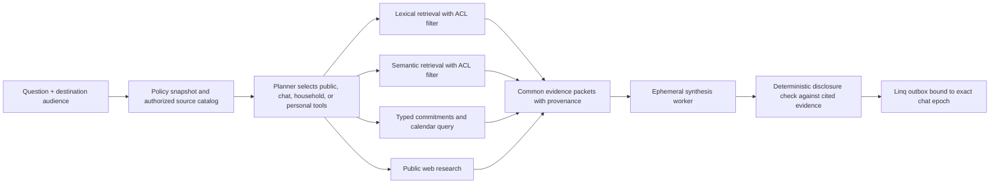

# Cerebras-style context ingestion and consent-aware group permissions for Florence

**Research date:** 2026-08-05  
**Scope:** first-party technical sources for heterogeneous context ingestion, retrieval, provenance, iMessage/Linq group behavior, Gmail data handling, WhatsApp privacy patterns, and multi-party authorization.

## Recommendation

The user thesis is coherent: Florence's wedge is not merely "an assistant for parents." It is a **general agent that can become a useful participant in an existing group conversation, accumulate the context authorized in that conversation, and close the logistical loops that emerge from it**.

That makes a group chat both a distribution surface and a security boundary. Florence should support an existing mom, school, sports, or family chat without requiring every participant to become a full customer. Every current participant must, however, give lightweight chat-local consent before Florence persists the conversation or speaks normally. A participant can consent from the chat or a private DM; connecting Gmail, calendars, a household, or other private sources remains a separate private action.

The central rule should be:

> Florence may retrieve or reveal a fact only when the destination's complete current audience is authorized for that fact, the requested use is permitted, and the effective chat policy permits the behavior.

"Use the most conservative person's settings" is a good group-policy rule, but it is not sufficient by itself. Florence needs two complementary controls:

1. **An effective channel policy**, computed as the most restrictive setting across every active participant, the channel, platform constraints, and Florence's system policy.
2. **Per-evidence authorization**, inherited from the source and checked against the exact audience at retrieval and again before sending.

Private Gmail or calendar data never becomes group data because the group is permissive. Its owner must separately authorize a specific disclosure or a bounded sharing rule. Conversely, a conservative participant may limit retention and proactivity for the group, but should not prevent Florence from answering a requested general-knowledge question using public sources.

## What Cerebras built, and what Florence should borrow

Cerebras Knowledge was designed around the observation that useful information stays in the tools where people naturally produce it. Instead of forcing one source of truth, it continuously extracts Slack threads, code, documents, and databases into a shared query surface. Its core combines collection/storage, querying, and an authentication/authorization/audit layer. Source connectors define what they emit, how they connect, and how often they refresh; normalized rows become queryable through one interface. [Cerebras, *How We Built Our Knowledge Base*](https://www.cerebras.ai/blog/how-we-built-our-knowledge-base)

The direct Florence translation is strong, with privacy-specific changes:

| Cerebras pattern | Florence adaptation |
|---|---|
| Meet data where it lives | Ingest from Linq chats, Gmail, calendars, forwarded files, and later sports/school systems without making parents reorganize their lives first. |
| One common embedding-row interface | Use one `knowledge_unit` query interface across sources, but preserve encrypted raw artifacts and typed household records separately. Every unit must carry provenance and authorization metadata. |
| Re-fetch a complete Slack thread on an event | Reconcile the relevant group-chat episode or reply chain, not just the latest isolated message. Preserve exact message citations. |
| Distill a thread into question, summary, resolution, and references | Extract topics, dates, commitments, people, decisions, unresolved questions, and source spans. Embed the normalized unit rather than the entire raw transcript. |
| "Burst" embeddings recover important details inside long threads | Index only high-signal message runs: dates, named activities, attachments, reactions, commitments, corrections, and sufficiently substantive consecutive messages. |
| Hybrid full-text, vector, rarity, and age scoring | Combine lexical search, semantic search, source authority, validity time, recency, and relationship relevance. A school name, uniform code, or exact date should not be blurred by embeddings. |
| Planner selects tools, executor fans out, synthesizer cites evidence | Give a planner a compact catalog of *authorized* sources, run narrow retrieval tools in parallel, normalize their evidence, then synthesize. The planner does not receive unauthorized content. |
| Projects scope search | Infer a context space from the destination and request: this group, household, one adult, one activity/team, or public knowledge. Do not make users constantly switch workspaces. |

Cerebras also demonstrates why vector search alone is the wrong abstraction. It uses lexical retrieval for exact strings, semantic retrieval for paraphrase, inverse-document-frequency-like signal for rare terms, time decay for stale discussions, reciprocal-rank fusion, a small reranker, deduplication, and neighboring context expansion. Florence should use the same shape, but replace generic age decay with domain validity wherever possible: a practice schedule has `valid_from`/`valid_to`, a cancelled event supersedes an earlier event, and a completed commitment should not merely fade with age. [Cerebras knowledge-base architecture](https://www.cerebras.ai/blog/how-we-built-our-knowledge-base)

Cerebras used [CocoIndex](https://github.com/cocoindex-io/cocoindex) for incremental code embeddings; CocoIndex's first-party repository emphasizes delta recomputation and lineage from derived outputs back to source bytes. Florence needs those properties, but not necessarily that dependency. The existing TypeScript/Postgres product can first implement deterministic source revisions, content hashes, derivation lineage, and invalidation. Adopt another ingestion engine only when operating scale makes it simpler than the current stack.

## The permission model: receive, inspect, retain, derive, retrieve, disclose, act

The product should stop using "access" as one undifferentiated permission. A connected messaging provider necessarily delivers a payload to Florence's service. The meaningful choices begin after receipt:

| Permission | Meaning | Safe initial default in an invited external group |
|---|---|---|
| **Receive** | Linq/provider delivers the event to Florence infrastructure. | Inherent while the Florence line is a participant; disclose this accurately. |
| **Inspect** | Florence parses message content. | Before unanimous consent, inspect only enough to recognize consent, help, stop, and membership-control commands; discard other content. |
| **Retain** | Store raw content after processing. | Off before unanimous consent; afterward, encrypted and chat-local under the group's shortest retention setting. |
| **Derive** | Create summaries, embeddings, facts, tasks, or preferences. | Off before consent; afterward, provenance-linked and no broader than the source policy. |
| **Retrieve/reuse** | Use retained or derived information in a later turn. | Same chat only by default. Household or cross-chat use needs a separate sharing grant. |
| **Disclose** | Put source-derived information into a message to an audience. | Only when every destination participant is authorized for the evidence. Private-source disclosure needs the source owner's grant. |
| **Act** | Create events, send external messages, make purchases, or mutate another system. | Separate deterministic policy and approval path; chat consent never implies action authority. |

This vocabulary also prevents misleading privacy copy. Florence should say that its service receives messages sent while it is in the chat and explain what it discards, stores, derives, and reuses. Apple documents that iMessage content and attachments are end-to-end encrypted between sender and recipients; adding a Florence-controlled line therefore adds Florence as a recipient and changes the audience. [Apple iMessage security](https://support.apple.com/guide/security/secd9764312f/web) [Apple Messages & Privacy](https://www.apple.com/legal/privacy/data/en/messages/)

Meta's first-party design principles for WhatsApp AI are useful even though Florence will not initially reproduce Meta's confidential-computing stack: AI use should be optional, transparent, controllable per sensitive chat, minimized to data needed for the request, and auditable. Meta's Private Processing design also separates stateless processing from durable retention and gives users a log of requests. [Meta, *Building Private Processing for AI tools on WhatsApp*](https://engineering.fb.com/2025/04/29/security/whatsapp-private-processing-ai-tools/)

## Effective group policy: a meet, not a vote

Each participant has a versioned chat-local grant. Missing consent is the most restrictive value. For ordered settings, the group takes the minimum; for booleans, every participant must allow it.

```text
effective_policy(chat_epoch) =
  meet(
    system_policy,
    platform_policy,
    channel_policy,
    every_active_participant_grant
  )
```

Suggested dimensions:

```text
inspection:       command_only < full
raw_retention:    none < 24_hours < 30_days < season_or_project < durable
derived_memory:   none < until_resolved < chat_lifetime
reuse_scope:      current_turn < current_chat < named_shared_space
response_mode:    mention_only < requested_questions < relevant_proactive
attachments:      off < metadata_only < content
sensitive_infer:  off (product-wide initial rule)
```

Example: Alice allows season-long memory and proactive suggestions; Ben allows 30-day memory and answers only when asked. The effective group setting is 30-day memory and requested answers. If Cara has not consented, Florence remains command-only, stores no ordinary messages, and sends only the consent/help disclosure. This is an intersection, not majority rule.

Do **not** require every participant to have a Florence account. That would destroy the viral group-invite loop and is unnecessary for chat-local consent. Represent noncustomers as `guest_principal`s bound to the handle and conversation. They receive no private or cross-chat capability. A verified Florence account becomes necessary only to connect private sources, carry personal settings across chats, join a household, or manage/export/delete data beyond the current chat.

WhatsApp itself uses explicit group-invite and admin controls rather than assuming one person can enroll everyone; its official product material emphasizes that users control who can add them and that admins control who joins. [WhatsApp group privacy settings](https://about.fb.com/news/2019/04/new-privacy-settings-for-groups/) [WhatsApp group admin controls](https://about.fb.com/news/2023/03/new-groups-features-on-whatsapp/)

## Membership epochs prevent accidental historical disclosure

A chat ID is not a stable audience. Every authoritative participant-set change creates an immutable `membership_epoch`:

```text
epoch_id
conversation_id
participant_set_digest
active_participant_principal_ids[]
started_at, ended_at
provider_snapshot_revision
effective_policy_snapshot_id
```

Every received artifact and derived unit is labeled with its originating epoch. The authorization test for an output should require the complete destination audience to be a subset of the evidence's authorized audience, plus any source-specific constraints:

```text
may_use(evidence, destination_epoch, purpose, now) =
  destination_epoch.participants ⊆ evidence.allowed_audience
  AND purpose IN evidence.allowed_purposes
  AND evidence.valid_at(now)
  AND evidence.not_revoked
  AND destination_epoch.effective_policy permits purpose
```

Operational behavior:

- **Florence is added:** send one plain-language disclosure. Until every current participant consents, only process consent/help/stop commands and discard other message bodies.
- **A participant is added:** pause ordinary processing immediately, fetch the authoritative chat, start a new epoch, and obtain the new person's consent. Old facts cannot be shown to the expanded audience by default because the new participant was not in their allowed audience.
- **A participant leaves/is removed:** refresh the authoritative chat and begin a new epoch. The remaining audience is a subset, so prior chat-local evidence can remain eligible unless its author revoked it or a retention rule expired it.
- **Florence leaves or is removed:** stop all receipt and sends. Preserve or delete already authorized data according to the active retention and deletion policies.
- **A handle changes identity or cannot be resolved:** fail closed and ask in private; never guess that two phone/email handles are the same person.

Linq V3 exposes full participant objects with `joined_at`, `left_at`, and active/left/removed status; it emits `participant.added` and `participant.removed` webhooks. Linq also says leaving a group ends message receipt and interaction access. These are the correct triggers for membership epochs, while an authoritative `GET /chats/{id}` is the reconciliation source. [Linq group chats](https://docs.linqapp.com/guides/chats/group-chats/) [Linq webhook events](https://docs.linqapp.com/guides/webhooks/events/) [Linq leave-chat behavior](https://docs.linqapp.com/api/typescript/resources/chats/methods/leave_chat/)

Linq does not support group read receipts or typing indicators. Florence therefore cannot infer consent because someone probably saw an introduction. Require an explicit message or reaction attributable to each handle. Linq's reaction and participant events make that possible. [Linq group-chat constraints](https://docs.linqapp.com/guides/chats/group-chats/)

## Private sources and group disclosure are separate grants

Private Gmail and calendar connections belong to one adult. Ingestion may identify a family-relevant item and propose a household object, but the original source remains personal. Moving information across boundaries is explicit:

```text
personal Gmail artifact
  -> personal extracted candidate
  -> owner-approved household fact or approved sharing rule
  -> optional disclosure grant to one exact external chat audience
```

No step inherits permission from the next destination. A household fact is not automatically safe for the soccer-team chat; an approved team-chat reminder is not permission to expose the email body; and one participant cannot authorize another participant's mailbox.

This is also consistent with Google's policy. Gmail body-reading scopes are restricted; server storage or transmission triggers additional verification/security requirements. Google requires clear disclosure, minimum necessary scopes, consent for permitted transfers, and user-facing Limited Use. [Gmail OAuth scopes](https://developers.google.com/workspace/gmail/api/auth/scopes) [Google API Services User Data Policy](https://developers.google.com/terms/api-services-user-data-policy)

For live ingestion, Gmail push is a change signal, not the source object. It supplies an account and `historyId`; Florence must fetch history changes, preserve Gmail message/thread IDs as provenance, renew each watch at least every seven days, and reconcile because notifications can be delayed or dropped. [Gmail push notifications](https://developers.google.com/workspace/gmail/api/guides/push)

## Provenance and policy inheritance

Florence needs a common evidence envelope rather than an untraceable memory blob. W3C PROV's minimal concepts—entity, activity, agent, and derivation—are enough vocabulary; Florence does not need to implement RDF to adopt the structure. [W3C PROV-O](https://www.w3.org/TR/prov-o/)

```text
knowledge_unit_id
tenant_id
origin_space_id                 # personal, household, conversation, activity
source_artifact_ids[]
source_spans[]                  # message part, attachment region, email section
provider, external_object_id, external_revision
author_principal_id
conversation_id, membership_epoch_id
kind                            # episode, fact, commitment, decision, preference
normalized_text, typed_payload
occurred_at, valid_from, valid_to, recorded_at, superseded_at
content_hash, extractor_version, embedding_version
allowed_audience_id
allowed_purposes[]
retention_policy_id, delete_after, revoked_at
sensitivity_class
```

Derived policy is never broader than its inputs:

```text
derived.allowed_audience = intersection(input.allowed_audience)
derived.allowed_purposes = intersection(input.allowed_purposes)
derived.delete_after     = earliest(input.delete_after)
```

Keep a derivation DAG so a source edit, deletion, consent revocation, identity correction, or policy change invalidates dependent summaries, embeddings, tasks, and cached answers. Raw artifacts may be deleted earlier than durable typed commitments, but the typed record must retain a non-content provenance receipt and an authorization basis.

This is also where the current two-value `personal | household` visibility model needs to grow. Do not overload `household` to mean every group Florence joins. Add named spaces and immutable audiences:

- `personal:{adult}`
- `household:{household}`
- `conversation:{provider}:{chat}`
- `activity:{team-or-school-scope}`
- `audience_epoch:{conversation}:{epoch}`

A Zanzibar-style relationship model is useful conceptually: permissions are relations among people, groups, and objects, and effective usersets can use intersection/exclusion. Google's Zanzibar paper also emphasizes that authorization changes and content reads need causally consistent snapshots. Florence can implement these semantics in Postgres and one central policy engine at current scale; it does not need a separate authorization service yet. [Google Research, *Zanzibar*](https://research.google/pubs/zanzibar-googles-consistent-global-authorization-system/)

## Authorization-aware retrieval and synthesis

Authorization belongs before model context, not in the prompt as an instruction to behave. A safe query path is:



Required properties:

1. The planner sees source descriptions and scopes, not forbidden content.
2. SQL/FTS/vector retrieval filters by tenant, permitted space, audience, purpose, validity, revocation, and retention before returning text.
3. Every evidence row includes a policy-snapshot ID and citation.
4. The worker receives only authorized evidence and no reusable credentials.
5. Before send, re-fetch/validate the exact live participant set, re-evaluate the policy, and bind the outbox item to the destination epoch.
6. A disclosure receipt records the output audience, evidence IDs, policy version, and model/run version without retaining unnecessary hidden reasoning.

The current Florence design already has the right start for verified household groups, personal Gmail, provenance-bearing memories, and pre-send group revalidation. The new product thesis requires a new **external conversation space** rather than weakening those household guarantees.

## General-agent behavior without family-data leakage

"Parents first" should control positioning, proactive relevance, and built-in workflows. It should not be a capability filter that refuses ordinary questions.

Use three context lanes:

1. **Public/general lane:** answer general questions with model knowledge or web research; no family context is needed.
2. **Conversation lane:** use facts authorized in the current chat to summarize, plan, remember, or answer.
3. **Connected-private lane:** use personal/household sources only when the requesting principal and destination audience are authorized; disclosure remains separately checked.

If a soccer group asks, "What's the offside rule?", Florence can answer from public knowledge even if the chat allows no long-term memory. If a parent asks, "When is our next game?", Florence can use the current chat's authorized schedule. If someone asks, "What did Hari's private email say?", Florence cannot retrieve it merely because Hari and the asker share a group.

Family relevance should determine what Florence proactively extracts, preserves, and surfaces—not what the general agent is allowed to know about the world.

## Connector-specific findings

### Linq / iMessage

- Linq V3 supports iMessage/RCS/SMS chats, group creation/participant controls, full incoming message content and attachments, reactions, participant-change webhooks, exact handles, and chat retrieval. Group management is currently iMessage-specific; groups have recipient-count and protocol constraints. [Linq V3](https://docs.linqapp.com/) [Linq group chats](https://docs.linqapp.com/guides/chats/group-chats/)
- Webhook delivery is at least once. Verify the raw-body signature, acknowledge quickly, deduplicate by stable `event_id`, and process asynchronously. Linq documents ten retry attempts over roughly 25 minutes. [Linq webhooks](https://docs.linqapp.com/guides/webhooks/)
- Pin the webhook payload version and treat `participant.added`, `participant.removed`, `message.edited`, reactions, and chat metadata changes as source revisions. Edits and deletions must invalidate downstream units.
- Linq can technically deliver what the Florence line receives; privacy enforcement is Florence's responsibility. Do not market transport receipt as consent.

### WhatsApp

- WhatsApp's product direction validates parent/community chats as a real surface; its 2026 group features explicitly cite parent groups and community associations. [WhatsApp group features](https://about.fb.com/news/2026/01/whatsapp-group-chats-member-tags-text-stickers-event-reminders/)
- The current official WhatsApp Business Platform collection reviewed documents messages to an individual recipient and customer-to-business webhooks; it does not establish that a business can be dropped into an existing consumer group with Linq-like history and participant events. Treat WhatsApp group ingestion as a separate feasibility and partnership track, not an interchangeable transport adapter. [Meta's official WhatsApp Business Platform collection](https://www.postman.com/meta/whatsapp-business-platform/overview)
- Preserve the same Florence permission contract if a future transport supports groups, but do not promise feature parity until official group APIs, consent mechanics, and E2EE implications are confirmed.

## Concrete product and architecture decisions

1. **Keep the existing household group as a high-trust mode.** It contains verified, consented household adults and may use explicitly promoted household facts.
2. **Add an external-group mode.** It is a chat-local collaboration space with guest principals, no implicit household membership, and no private-source access.
3. **Use unanimous lightweight consent, not unanimous signup.** Full accounts are optional until someone connects personal data or wants portable settings.
4. **Create membership epochs and bind every send to the live epoch.** New participant means pause, disclosure, and consent; old evidence is not visible to the expanded audience.
5. **Compile the most restrictive effective chat policy.** Retention, memory, attachments, and response agency are dimensions, not one privacy toggle.
6. **Represent source authorization on every artifact and derivation.** Policy inheritance is monotonic: an agent may narrow but never widen access.
7. **Build one authorization-aware evidence interface.** Normalize heterogeneous sources for retrieval while keeping raw encrypted artifacts and typed obligations distinct.
8. **Use hybrid retrieval over normalized units.** Lexical + semantic + source authority + validity/recency, fused and reranked, with exact provenance.
9. **Let Florence answer general questions.** Route them through the public lane; do not load private life context unnecessarily.
10. **Make proactive behavior a group setting.** Start mention/request-only in external groups; allow relevant proactive behavior only when the effective policy permits it and interruption budgets are respected.
11. **Make deletion and revocation transitive.** Invalidate derived facts, embeddings, caches, scheduled work, and future retrieval through provenance edges.
12. **Treat broad context coverage as a product goal, never an authorization rule.** Florence can feel omniscient because connectors are comprehensive and retrieval is good, while each run remains audience-scoped and purpose-scoped.

## Suggested first invited-group experience

Florence should introduce itself once, without exposing the inviter's household context:

> Hi—I'm Florence, an AI assistant Hari added to this chat. Messages sent while I'm here can reach Florence's service. I won't store or use ordinary chat messages until every current participant opts in. Reply “Florence yes” here or DM me; “Florence no” keeps me off. Once enabled, I stay chat-local by default and only answer when asked unless everyone enables proactive help.

The exact copy needs user research and legal review, but the mechanics should be fixed: visible inviter, accurate receipt disclosure, unanimous consent, private DM escape hatch, clear defaults, and easy stop/delete commands. No participant should need to understand agents, embeddings, or permission lattices.

## Open risks requiring separate work

- Legal review is required for multi-party consent, deletion rights, child-related data, recordings/wiretapping analogies across jurisdictions, and Google restricted-scope production verification. This note is an engineering recommendation, not legal advice.
- A Linq-backed service plus cloud model is not equivalent to Apple's or WhatsApp's native end-to-end encryption. Florence must disclose the processing boundary and evaluate provider retention/training terms.
- Automated sensitive-trait inference from group chats should remain off. Logistics extraction is the wedge; social profiling is not required.
- Existing-chat history availability must be tested against Linq's actual add-participant behavior. Florence should enforce `joined_at`/consent-time cutoffs even if an API later exposes earlier messages.
- WhatsApp consumer-group participation is not established by the official Business Platform material reviewed and may require a different product or platform relationship.

## Primary sources

- [Cerebras: How We Built Our Knowledge Base](https://www.cerebras.ai/blog/how-we-built-our-knowledge-base)
- [CocoIndex source repository](https://github.com/cocoindex-io/cocoindex)
- [Linq V3 documentation](https://docs.linqapp.com/), [group chats](https://docs.linqapp.com/guides/chats/group-chats/), [webhook events](https://docs.linqapp.com/guides/webhooks/events/), and [delivery guarantees](https://docs.linqapp.com/guides/webhooks/)
- [Apple Platform Security: iMessage](https://support.apple.com/guide/security/secd9764312f/web) and [Messages & Privacy](https://www.apple.com/legal/privacy/data/en/messages/)
- [Google API Services User Data Policy](https://developers.google.com/terms/api-services-user-data-policy), [Gmail scopes](https://developers.google.com/workspace/gmail/api/auth/scopes), and [Gmail push](https://developers.google.com/workspace/gmail/api/guides/push)
- [Meta: Building Private Processing for AI tools on WhatsApp](https://engineering.fb.com/2025/04/29/security/whatsapp-private-processing-ai-tools/), [WhatsApp group privacy](https://about.fb.com/news/2019/04/new-privacy-settings-for-groups/), and [official WhatsApp Business Platform collection](https://www.postman.com/meta/whatsapp-business-platform/overview)
- [Google Research: Zanzibar](https://research.google/pubs/zanzibar-googles-consistent-global-authorization-system/)
- [W3C PROV-O](https://www.w3.org/TR/prov-o/)
