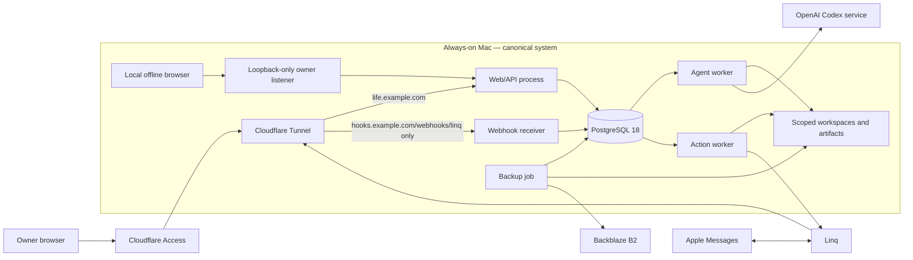

# Research: Runtime Architecture for a Local-First Life OS

Research date: 2026-08-04  
Status: recommended v1 architecture, with explicit validation gates  
Source policy: primary sources only (official documentation, repositories, and platform manuals)

## Executive decision

Build Life OS as a **native TypeScript modular monolith on one always-on Mac**:

- React and Vite for a responsive browser client;
- Fastify for the private API and a separately bound Linq webhook receiver;
- PostgreSQL 18 for canonical records, workflow state, audit history, and queue storage;
- Drizzle for PostgreSQL schema and migrations;
- pg-boss for durable jobs, retries, schedules, and dead letters;
- the local `@openai/codex-sdk` behind a Life OS-owned `AgentRuntime` adapter;
- an immutable, content-addressed local artifact store with PostgreSQL metadata;
- Cloudflare Tunnel plus Access for remote browser access and the public Linq callback;
- `launchd` for supervision and restic to Backblaze B2 for encrypted off-site backups.

This is deliberately one codebase, one database, and one machine, but not one process. Web serving, webhook ingestion, agent execution, and external-action execution have different trust and failure boundaries, so they run as separate entry points from the same release.

“Local-first” here means the Mac holds the canonical database and artifacts and the app remains usable from a loopback URL during an Internet outage. It does **not** mean an offline-first browser replica. Remote access, Linq, and subscription-backed Codex necessarily degrade when the Internet or their providers are unavailable. A service worker, CRDT layer, and client-side write queue would create a second consistency system without helping the first single-user prototype.

## Selected stack

| Concern | V1 choice | Why this choice |
|---|---|---|
| Runtime | TypeScript on Node.js 24 LTS; npm workspaces and lockfile | One language across UI, API, queue workers, Linq integration, and Codex SDK. Node 24 is the current LTS line; Node recommends production apps use an LTS release. [Node release status](https://nodejs.org/en/about/previous-releases) |
| Web client | React SPA built by Vite; TanStack Router and Query | There is no SEO or server-rendering requirement. Vite produces a static production bundle, which Fastify can serve from the same origin. [Vite production builds](https://vite.dev/guide/build) |
| HTTP | Fastify, JSON Schema route contracts, `@fastify/static`, secure headers | Small operational surface, native structured logging, and request/response validation at the boundary. Fastify recommends schema-based validation and serialization. [Fastify validation and serialization](https://fastify.dev/docs/latest/Reference/Validation-and-Serialization/) |
| Database | PostgreSQL 18, local only | One transactional home for domain state, task/run state, webhook inboxes, audits, and the queue; no Redis and no later SQLite-to-PostgreSQL migration. PostgreSQL 18 is the current supported major and has native macOS packages. [PostgreSQL macOS packages](https://www.postgresql.org/download/macosx/) |
| Database access | `node-postgres` plus Drizzle schema/migrations | Thin SQL-oriented access with checked-in migrations. Do not pretend the application is database-dialect portable. [Drizzle PostgreSQL guide](https://orm.drizzle.team/docs/get-started-postgresql) · [Drizzle migrations](https://orm.drizzle.team/docs/migrations) |
| Durable jobs | pg-boss in the application PostgreSQL database | Transactional enqueue, `SKIP LOCKED` workers, cron, backoff, concurrency controls, and dead letters without another stateful service. [pg-boss](https://pgboss.io/) |
| Agent runtime | `@openai/codex-sdk`, invoked by an isolated worker adapter | Official server-side TypeScript interface for starting and resuming local Codex threads. It fits the selected runtime, but is treated as replaceable because Codex is documented as coding-focused. [Codex SDK](https://learn.chatgpt.com/docs/codex-sdk) |
| Messaging | Linq v3 webhooks and Messages API | The required iMessage bridge. Life OS remains the local system of record. [Linq API](https://docs.linqapp.com/api/) |
| Remote ingress | Cloudflare Tunnel plus Access | Outbound-only origin connection, browser-based identity, two hostname/path routes, and no router port forwarding. [Cloudflare Tunnel](https://developers.cloudflare.com/cloudflare-one/networks/connectors/cloudflare-tunnel/) |
| Process manager | macOS `launchd` | Native boot-time supervision and restart policy, with fewer layers than PM2 or containers. Apple recommends `launchd` for daemons and agents. [Creating launchd jobs](https://developer.apple.com/library/archive/documentation/MacOSX/Conceptual/BPSystemStartup/Chapters/CreatingLaunchdJobs.html) |
| Artifact bytes | Local content-addressed filesystem; metadata in PostgreSQL | Simple, inspectable, cheap, and portable to a new host. No S3-compatible server is needed on one Mac. |
| Backup | `pg_dump -Fc` + files, encrypted by restic to B2's S3-compatible API | Consistent PostgreSQL snapshots, encrypted off-site copies, and architecture-independent restore. PostgreSQL documents `pg_dump` as internally consistent and reloadable across machine architectures. [PostgreSQL SQL dumps](https://www.postgresql.org/docs/current/backup-dump.html) |

Pin exact dependency versions in `package-lock.json`; pin Node and PostgreSQL major versions in the machine bootstrap. “Latest” should never be resolved during an unattended production restart.

## System topology



All application and database listeners bind to loopback or a Unix socket. The router has no port-forward, UPnP exposure, or database rule. Only `cloudflared` creates outbound connections. Cloudflare explicitly describes Tunnel as an outbound-only connection that does not expose a routable origin IP. [Cloudflare Tunnel architecture](https://developers.cloudflare.com/cloudflare-one/networks/connectors/cloudflare-tunnel/)

## Web and ingress design

### Private browser surface

Use one compiled React SPA and same-origin `/api` routes from Fastify. Avoid Next.js and server-side rendering in v1: this is an authenticated application, not an indexed content site, and a second rendering/runtime model adds little value. Use responsive CSS, semantic HTML, keyboard navigation, and Playwright coverage at phone, tablet, and desktop widths.

Use two logical listeners:

1. The tunnel-facing listener accepts requests only with a valid Cloudflare Access assertion.
2. A separate loopback-only listener supports offline owner access with a local credential and a short-lived, HTTP-only, same-site session. It is not a tunnel origin and is never bound to a LAN interface.

The second listener prevents a Cloudflare outage from making locally held data unusable. It also avoids ambiguous middleware such as “skip Access when source IP is localhost,” because every tunnel request also arrives from a local `cloudflared` process. A single strong local recovery password is enough for the prototype; store only its Argon2id hash, include rate limiting, and later replace or augment it with passkeys when household identity is built.

For the remote listener, create the Access application before publishing the tunnel route, use a default-deny policy that allows the owner's exact identity, require MFA, and validate the `Cf-Access-Jwt-Assertion` again inside Fastify. Validation must check signature against Cloudflare's rotating keys plus expected issuer and application audience—not merely trust the email header. [Cloudflare self-hosted applications](https://developers.cloudflare.com/cloudflare-one/access-controls/applications/http-apps/self-hosted-public-app/) · [Validating Access JWTs](https://developers.cloudflare.com/cloudflare-one/access-controls/applications/http-apps/authorization-cookie/validating-json/)

Map the validated stable subject and email to an `external_identities` row, then perform application authorization. Cloudflare authenticates a person; it must not decide which household, private record, project, or action that person may access.

### Isolate the public webhook path

One tunnel can route two hostnames, but they terminate in different processes:

- `life.example.com/*` → private web/API listener, protected by Access;
- `hooks.example.com/webhooks/linq` → webhook receiver, not protected by Access;
- every other route → a static `404` rule.

Cloudflare ingress rules are ordered and support hostname/path matching plus a final catch-all. [Tunnel ingress configuration](https://developers.cloudflare.com/cloudflare-one/networks/connectors/cloudflare-tunnel/do-more-with-tunnels/local-management/configuration-file/)

Do not place an unauthenticated `/webhooks/*` exception on the main application hostname. A typo or overly broad Access bypass should not expose the dashboard. The webhook process should ship no static assets, sessions, admin routes, or generic proxy behavior. Apply a small request-size limit and Cloudflare rate limit, but treat the Linq signature—not source IP—as the authentication control.

### Why Cloudflare rather than Tailscale by default

Tailscale Serve is the privacy-maximal alternative because the application remains inside the tailnet; however, each phone or household device needs a Tailscale client, while Linq still needs a public callback. [Tailscale Serve](https://tailscale.com/docs/features/tailscale-serve) Tailscale Funnel can expose a callback, but it is currently beta and has hostname, port, and bandwidth constraints. [Tailscale Funnel](https://tailscale.com/kb/1223/funnel)

Cloudflare is the v1 default because one installed connector provides clientless remote browser access and the Linq callback, and Access makes later household onboarding easier. The privacy tradeoff is real: Cloudflare terminates the remote HTTPS request and can observe application traffic. If minimizing third-party visibility outranks clientless access, use Tailscale Serve for the UI and retain a narrowly routed Cloudflare tunnel only for Linq webhooks. The rest of the architecture does not change.

## Linq integration: durable ingress, reconciliation, and safe egress

### Inbound flow

The receiver must do only this before returning `2xx`:

1. Read and retain the exact raw request bytes.
2. Verify the Standard Webhooks signature over `webhook-id.webhook-timestamp.body`.
3. Reject a timestamp older than five minutes and compare HMAC values in constant time.
4. Validate the pinned webhook payload version and event type.
5. In one PostgreSQL transaction, insert the raw envelope into `webhook_inbox` under a unique `(provider, event_id)` constraint and enqueue a normalization job.
6. Commit, then acknowledge.

These rules follow Linq's documented signing algorithm and its advice to respond quickly and process asynchronously. [Linq webhook events](https://docs.linqapp.com/api/resources/webhook_events/) A duplicate event returns success without creating duplicate work. A bad signature, oversized body, unknown required version, or malformed envelope is rejected or quarantined before any agent sees it.

The normalizer resolves the sender through `external_identities`. Phone numbers are stored in E.164 form; email handles are normalized conservatively. Unknown senders and unapproved group chats create a review item or are ignored—they do not become an authenticated owner merely because they can reach the Linq number. Message text, links, and attachments remain untrusted content even for a known sender; they convey intent, not authority to bypass approval or tool policy.

For media, acknowledge first, then let a bounded worker download only from Linq's documented `cdn.linqapp.com` host, with MIME sniffing, a local size ceiling, timeout, redirect limit, hash, and malware-aware handling. Store accepted bytes in the artifact store and preserve provider IDs and provenance. Linq documents persistent and ephemeral attachment behavior and explicitly says the integrating application must capture what it needs from webhooks. [Linq API and attachment lifecycle](https://docs.linqapp.com/api/)

### Webhook outage recovery

Linq retries failed deliveries up to ten times over approximately 25 minutes; `4xx` responses other than `429`, DNS failures, and invalid hostnames may not be retried. Its FAQ directs integrations to pull a known chat after an outage or request a manual replay. [Linq webhook FAQ](https://docs.linqapp.com/guides/resources/faq/)

Therefore, retries alone are not a durability guarantee. Implement a reconciliation job that:

- runs at startup, after tunnel recovery, and periodically;
- lists chats, then pages backward through each approved chat until it reaches the stored message watermark;
- inserts missing provider message IDs through the same inbox/deduplication path;
- records a visible gap alert when history cannot be reconciled;
- exposes a runbook for requesting Linq's manual replay.

The API exposes chat listing and per-chat message listing, so this can recover both known chats and a new chat whose first webhook was missed. [Linq API reference](https://docs.linqapp.com/api/) Do not enable Linq's 24-hour ephemeral tier until an outage test proves the selected recovery window; ephemeral mode makes long outages irrecoverable by design.

### Outbound flow

The model never calls Linq directly. It emits a typed proposal that becomes an `action_intent` with actor, source run, recipient, content hash, policy decision, approval state, and a stable UUID. Only the deterministic action worker may send it.

Pass the action UUID as Linq's `idempotency_key`; Linq documents that retrying the same key returns the original response. [Sending messages with Linq](https://docs.linqapp.com/guides/messaging/sending-messages/) Persist request intent before the call and response/provider message ID after it. On an ambiguous timeout, retry the same key. Never generate a new key for the same logical send.

## PostgreSQL and the durable control plane

### Why PostgreSQL, despite one user

SQLite is excellent for a single local process, but SQLite documents that there can be only one writer at a time even in WAL mode. [SQLite isolation](https://www.sqlite.org/isolation.html) Life OS has concurrent web requests, webhook ingestion, queue claims, agent checkpoints, action outcomes, and backups. SQLite would either serialize these through application code or require a separate queue service.

PostgreSQL is one extra daemon but removes an entire class of later work: it provides concurrent transactional sessions, the queue can live in the same database, and the household version does not require a database migration. PostgreSQL's MVCC lets reads and writes proceed without blocking each other in the normal case. [PostgreSQL MVCC](https://www.postgresql.org/docs/current/mvcc-intro.html)

Bind PostgreSQL only to a Unix socket or loopback. Use separate least-privilege roles for migrations, the web API, webhook ingestion, agent-worker coordination, action execution, and backups. A compromised webhook receiver should not be able to read life records or send messages; a Codex child must receive no database credential at all.

### App-owned state, queue-owned delivery

pg-boss supplies job delivery mechanics, not the product's canonical workflow model. Keep app-owned tables such as:

- `tasks`, `task_runs`, `run_steps`, and `run_checkpoints`;
- `approval_requests`;
- `action_intents` and `action_attempts`;
- `webhook_inbox` and provider message mappings;
- `artifacts` and artifact links;
- `audit_events`;
- `users`, `households`, `memberships`, and `external_identities`.

A task lifecycle should be explicit:

`proposed → queued → running → waiting_for_input/approval → executing → verifying → completed`

with `blocked`, `failed_retryable`, `failed_terminal`, `cancelled`, and `compensating` outcomes. The row is the user-visible truth; a pg-boss job merely advances it. Each payload contains IDs and a schema version, not a copy of sensitive context.

pg-boss advertises exactly-once **job delivery**, transactional enqueue, retry/backoff, scheduling, and dead-letter policies. [pg-boss features](https://pgboss.io/) This does not create exactly-once real-world effects. A worker can crash after Linq, calendar, or another provider committed but before PostgreSQL recorded success. Every external mutation therefore needs its own stable action ID, provider idempotency key where available, and reconciliation before retry where it is not.

Start with named queues and low concurrency:

- `ingress.normalize`;
- `task.plan` and `agent.run`;
- `action.execute` and `message.send`;
- `artifact.ingest`;
- `routine.fire`;
- `maintenance.reconcile`.

Set finite attempts, exponential backoff with jitter, timeouts, and a dead-letter state surfaced in the web app. Scheduled jobs should enqueue ordinary work rather than perform it in the scheduler callback. Handlers must be re-entrant and check the app-owned state before acting.

Temporal is a later escalation, not a v1 dependency. Its durable execution model is valuable for very long workflows and replay, but a self-hosted Temporal service has four independently scalable services plus production security, persistence, monitoring, and operations. [Temporal Server](https://docs.temporal.io/temporal-service/temporal-server) Reconsider it only when Life OS has many month-long workflows, cross-service compensation, multiple worker fleets, or app-owned state-machine code has become the dominant maintenance burden.

## Subscription-backed local Codex runtime

### Integration shape

Implement this boundary in Life OS-owned code:

```ts
interface AgentRuntime {
  start(input: AgentRunInput): Promise<AgentRunHandle>;
  resume(runId: string, input: AgentTurnInput): Promise<AgentRunHandle>;
  cancel(runId: string): Promise<void>;
}
```

The first adapter uses `@openai/codex-sdk`. The official TypeScript SDK starts, continues, and resumes local Codex threads and requires Node 18 or newer. [Codex SDK](https://learn.chatgpt.com/docs/codex-sdk) The SDK wraps the local CLI and allows the caller to provide a complete environment rather than inherit the Node process environment. [Codex TypeScript SDK README](https://github.com/openai/codex/blob/main/sdk/typescript/README.md)

For every run, the agent worker should:

1. Move the durable task row to `running` under a lease.
2. Materialize a new run workspace containing only selected context and artifacts.
3. Instantiate Codex with an explicit environment allowlist (`PATH`, `CODEX_HOME`, locale, and required runtime variables only).
4. Use `read-only` or `workspace-write` sandboxing; disable network unless the approved capability pack requires it.
5. Require a structured final envelope containing summary, proposed canonical changes, proposed external actions, artifacts, evidence, and unresolved questions.
6. Validate that envelope and persist a checkpoint before any other worker executes a proposal.
7. Destroy scratch files after promotion and record hashes/provenance for retained artifacts.

The Codex child receives no PostgreSQL URL, Linq key, Cloudflare token, restic credential, or backup path. It writes only inside its run workspace. Any future tool exposed to the model must be narrow, auditable, and authorization-checked at call time. External actions remain proposals to the deterministic action worker.

Codex threads and their local session files are useful for continuation, but they are not the durable project. Life OS must be able to start a fresh thread from its own task, decision, artifact, and checkpoint state after an SDK upgrade or corrupted session.

### ChatGPT subscription authentication

Codex officially supports “Sign in with ChatGPT” for subscription access as well as API-key access, and active sessions normally refresh tokens automatically. [OpenAI authentication](https://learn.chatgpt.com/docs/auth) Perform the one-time `codex login` as the dedicated service account and give the worker a fixed `CODEX_HOME`.

A boot daemon may not have an unlocked per-user login keychain, so the operationally predictable v1 setting is `cli_auth_credentials_store = "file"`. This stores `auth.json` under `CODEX_HOME`; OpenAI says to treat that file like a password. Keep the directory mode `0700`, the file mode `0600`, never include it in application artifacts or off-site backups, and document interactive reauthentication. [Credential storage](https://learn.chatgpt.com/docs/auth#credential-storage) FileVault protects it while the disk is locked, not while the machine and service account are running.

This requirement carries a material product risk. OpenAI describes the Codex SDK as coding-focused and says API keys are the normal default for unattended automation; ChatGPT-managed account auth is an advanced path for trusted runners. [Codex non-interactive mode](https://learn.chatgpt.com/docs/non-interactive-mode) Subscription limits, reauthentication, and product behavior may also change independently of Life OS. Therefore:

- pin the SDK and bundled CLI version;
- expose queue states such as `paused_auth`, `paused_rate_limit`, and `provider_unavailable`;
- never retry authentication or rate limits in a tight loop;
- build a startup smoke test and a visible “Codex runtime needs attention” alert;
- keep a second `AgentRuntime` adapter seam for a future API-backed or local-model runtime.

Do not build directly on `codex app-server` WebSockets. OpenAI marks that transport experimental and unsupported for production and recommends the SDK for automated jobs. [Codex app-server](https://learn.chatgpt.com/docs/app-server)

Before committing the product to this runtime, run a focused spike on the actual non-coding Life OS tasks. The official positioning does not guarantee that a coding-focused agent is the best general personal-assistant runtime.

## Artifact and workspace storage

Keep small structured values, status, provenance, and searchable text in PostgreSQL. Store large or binary bytes in a local content-addressed tree such as:

```text
/Library/Application Support/LifeOS/
  artifacts/sha256/ab/cd/<full-hash>
  workspaces/<project-id>/<run-id>/
  backup-staging/
  codex-home/
```

An `artifacts` row contains hash, byte length, detected MIME type, original name, creator/run, source URI/provider ID, retention class, and timestamps. Write to a same-filesystem temporary file, flush, verify the hash, atomically rename to the hash path, then link it in PostgreSQL. Immutable hashes make retries and backup comparison simple. A later orphan sweeper may remove bytes only after they are unreferenced and covered by at least two successful backup snapshots.

Project workspaces are mutable collaboration surfaces; artifacts are immutable records. A run may materialize approved artifacts into its workspace, but promoting output creates new artifact hashes rather than mutating history.

Define a small `ArtifactStore` interface (`put`, `open`, `stat`, `link`, `verify`) so a future dedicated machine, NAS, or S3 store does not leak path assumptions into domain code. Do not deploy MinIO or another object-storage service in v1—the filesystem already supplies the needed local primitive.

## Native macOS operation

### Service accounts and processes

Install releases under a root-owned path such as `/opt/lifeos/releases/<version>` with an atomic `/opt/lifeos/current` symlink. Run services as an unprivileged `lifeos` account; that account owns the data root but cannot modify release code or launchd definitions.

Use system LaunchDaemons so work starts at boot rather than waiting for an interactive login:

| Process | Credentials and access | Restart behavior |
|---|---|---|
| `com.lifeos.web` | Web DB role; Access verifier configuration; no Linq send key or Codex auth | `KeepAlive`; health check verifies DB and schema |
| `com.lifeos.webhooks` | Inbox-only DB role and Linq signing secret | `KeepAlive`; small memory/request limits |
| `com.lifeos.agent-worker` | Agent queue role, run workspaces, `CODEX_HOME`; no integration secrets passed to child | `KeepAlive`; leases make interrupted runs recoverable |
| `com.lifeos.action-worker` | Action queue role and narrowly scoped integration secrets | `KeepAlive`; idempotent recovery |
| `com.lifeos.cloudflared` | Tunnel credential and route config only | Cloudflare documents running `cloudflared` as a macOS service. [cloudflared on macOS](https://developers.cloudflare.com/cloudflare-one/networks/connectors/cloudflare-tunnel/do-more-with-tunnels/local-management/as-a-service/macos/) |
| `com.lifeos.backup` | Read-only backup DB role, artifact read access, restic/B2 credentials | `StartCalendarInterval`; alerts on failure rather than restart-looping |

Use absolute executable paths resolved at install time, an explicit working directory, explicit environment variables, `StandardOutPath`/`StandardErrorPath`, and restart throttling. `launchd` process liveness is not job durability; PostgreSQL state and leases provide recovery after a process dies.

Install PostgreSQL, Node, `cloudflared`, and restic from a committed bootstrap manifest. Homebrew's service command can register a root LaunchDaemon at boot and supports a service user; capture the actual prefix because Apple Silicon and Intel paths differ. [Homebrew services](https://docs.brew.sh/Manpage.html#services-subcommand)

### FileVault and unattended reboot reality

Enable FileVault and retain its recovery key offline. FileVault encrypts the startup volume, but after a complete power loss the volume may require an authorized user to unlock it before macOS and LaunchDaemons can start. [Apple FileVault deployment](https://support.apple.com/guide/deployment/intro-to-filevault-dep82064ec40/web)

An “always-on” Mac is therefore not automatically self-recovering from every outage. Use a UPS, enable supported automatic power-on behavior, test the exact hardware's reboot path, and document who can perform the FileVault unlock. Once the OS is up, launchd should restore services without a desktop login.

### Deployment and rollback

Use a small release script, not Docker Desktop:

1. Build and test from the pinned lockfile (`npm ci`, typecheck, unit/integration tests, Vite build).
2. Copy an immutable release directory and verify its manifest.
3. Run a pre-deploy backup.
4. Apply forward-compatible Drizzle and pg-boss migrations with the migration role.
5. Switch the `current` symlink and `launchctl kickstart` the processes.
6. Verify local health, authenticated remote health, webhook route isolation, queue claim, and a no-op Codex smoke test.

Keep the previous release for fast code rollback. Database rollback is not “switch the symlink”: migrations should be expand/contract and backward-compatible for one release, with restoration reserved for genuine data corruption.

Docker Desktop runs the Docker Engine inside a Linux VM on macOS, and Docker's own VMM has a 4 GB minimum memory allocation. [Docker VMM](https://docs.docker.com/desktop/features/vmm/) That VM, its storage, networking, daemon lifecycle, and backup semantics add more operational surface than they remove for one native Node/PostgreSQL application. Produce an OCI image only when the target becomes Linux or deployment must span multiple hosts.

## Backup, restore, and machine replacement

### Backup design

Protect the local disk with FileVault, then assume the Mac can still be lost, stolen while unlocked, corrupted, or destroyed. Every six hours:

1. Run `pg_dump -Fc` into a private staging directory and emit a manifest with schema/app versions and artifact high-water mark.
2. Back up that dump, artifact tree, durable project workspaces, and non-secret configuration with restic.
3. Send the repository to a dedicated Backblaze B2 bucket through its S3-compatible API; current restic documentation recommends that API over its native B2 backend because of error-handling issues. [restic B2 guidance](https://restic.readthedocs.io/en/stable/030_preparing_a_new_repo.html#backblaze-b2)
4. Apply retention after a successful new snapshot—for example 14 daily, 8 weekly, and 12 monthly snapshots.
5. Record the snapshot ID and result in local maintenance state and alert when two consecutive backups fail.

Do not copy a live PostgreSQL data directory as the database backup. `pg_dump` produces an internally consistent snapshot without blocking normal activity and its custom format supports selective `pg_restore`. [PostgreSQL backup documentation](https://www.postgresql.org/docs/current/backup-dump.html)

Restic repositories require a password and losing it makes the data unrecoverable. [Preparing a restic repository](https://restic.readthedocs.io/en/stable/030_preparing_a_new_repo.html) Store the automation copy in macOS Keychain or a root-readable password command, keep a separate offline recovery copy, and use a B2 application key restricted to one bucket and only required capabilities. [Apple Keychain protection](https://support.apple.com/guide/security/keychain-data-protection-secb0694df1a/web) · [B2 application-key capabilities](https://www.backblaze.com/docs/cloud-storage-application-key-capabilities)

Exclude `auth.json`, Linq secrets, tunnel credentials, B2 credentials, and the restic password from the repository; restore should require deliberate reauthentication or recovery-key use. Encrypting a backup does not make it undeletable. B2 Object Lock can prevent deletion until a retention date, but enabling it cannot be undone for the bucket and locked objects can conflict with lifecycle/prune behavior. [B2 Object Lock](https://www.backblaze.com/docs/cloud-storage-object-lock) Do not claim immutable backups until a separate restic/Object Lock compatibility test succeeds. In v1, retain the repository password offline and accept that compromise of the running host plus its B2 credential can damage remote backups.

### Verification and objectives

Set explicit initial objectives:

- recovery point objective: at most six hours of local-only changes;
- recovery time objective: four hours once replacement hardware is available;
- webhook recovery: automatic reconciliation after outages shorter than Linq's selected message-retention window;
- agent recovery: no duplicate external action after any single process crash.

Weekly, run `restic check` and restore a random artifact plus the latest dump. Monthly, restore into a disposable PostgreSQL database and run integrity queries and application smoke tests. Quarterly, exercise the complete bootstrap on another Mac or clean volume. A backup is not complete until restore has succeeded.

### Moving to a dedicated machine

The migration path is intentionally boring:

1. Bootstrap the new Mac from the package manifest and release artifact.
2. Restore the artifact/workspace tree and `pg_restore` the database.
3. Recreate local secrets, reauthenticate Codex, and rotate/reinstall the tunnel credential.
4. Stop writers on the old Mac, take and restore one final incremental snapshot, then start the new services.
5. Point the existing Cloudflare tunnel/DNS route at the new connector and run end-to-end checks.

No browser data migration, queue-vendor export, Redis transfer, or SQLite conversion is required.

## Household-ready seams without household scope

Create the identity spine on day one even though setup seeds one user and one household:

- `users`;
- `households`;
- `memberships`;
- `external_identities(provider, provider_subject, user_id)`;
- `household_id` and `created_by_user_id` on every owned record;
- `owner_user_id` or visibility classification for sensitive health, finance, journal, and communication records.

Every query and command goes through an authorization function that checks membership and record visibility. This catches missing-scope bugs while the test matrix is still one user. Cloudflare Access identities and Linq handles both map through `external_identities`; neither is used as a domain foreign key.

Do not yet build invitations, complex roles, row-level-security policy, household sharing UI, per-user encryption keys, or conflict-free offline sync. Add those when a second real user exists and the visibility rules have concrete product semantics.

The owner's ChatGPT subscription is also not a household backend. Keep `AgentRuntime` identity and quota fields so a later household release can use a service API account, per-user provider credentials, a local model, or another runtime without rewriting task state.

## Abstractions to create—and those to avoid

Create only seams around volatile or dangerous boundaries:

| Interface | Stable responsibility |
|---|---|
| `AgentRuntime` | Start/resume/cancel an ephemeral reasoning run and stream typed events |
| `MessageChannel` | Normalize inbound messages and execute idempotent outbound sends |
| `ArtifactStore` | Put/open/verify immutable bytes independent of physical storage |
| `PrincipalResolver` | Map validated Cloudflare/Linq identities to a local actor |
| `ActionExecutor` | Policy-check, approve, execute, reconcile, and audit an external mutation |

Keep job names and payload schemas versioned, but use pg-boss directly behind a small job registry. Keep SQL and PostgreSQL capabilities visible in repositories; a generic persistence layer would erase useful transactions and still fail to make the schema portable.

Do **not** build in v1:

- microservices, Kubernetes, Redis, BullMQ, Kafka, or event sourcing;
- Temporal before the upgrade thresholds are met;
- Docker Desktop on the Mac;
- a vector database or semantic “memory” as the system of record;
- a generic connector framework before the second integration;
- S3/MinIO for local artifact bytes;
- browser-offline mutation sync, CRDTs, or a PWA background queue;
- direct model credentials for Linq, backups, the database, or future financial actions;
- a remote Codex app-server endpoint.

## Required validation gates

Do not place irreplaceable life data or autonomous actions on this system until these pass:

1. **Codex runtime spike:** run representative research, planning, extraction, and artifact tasks; test structured output, cancellation, service restart, token refresh, forced logout, rate limiting, and a 24-hour queue. Record whether the coding-focused SDK is actually adequate.
2. **Linq outage drill:** disable the receiver for more than 25 minutes; verify chat discovery, paginated reconciliation, deduplication, attachments, and manual replay. Repeat with an entirely new inbound chat. Decide persistent versus ephemeral Linq retention from this evidence.
3. **Crash/idempotency matrix:** kill each process before and after transaction commit and before and after a Linq response. Prove one logical `action_intent` produces at most one message.
4. **Ingress audit:** from an external network, prove the main hostname always requires Access, the application rejects invalid issuer/audience tokens, the webhook hostname serves exactly one route, and no local or database port is reachable.
5. **Prompt-injection test:** feed adversarial messages, URLs, and documents; verify the Codex child environment has no application secrets and external actions remain proposals.
6. **Power-loss test:** remove power, document the FileVault unlock step, and verify PostgreSQL recovery, launchd restart, job lease recovery, tunnel return, and Linq reconciliation.
7. **Full restore:** rebuild into an empty database and data root using only the release/bootstrap materials, off-site repository, offline restic password, and deliberately recreated service credentials.

## Bottom line

The simplest robust Life OS is not SQLite plus assorted local scripts, and it is not a container cluster. It is a **PostgreSQL-backed native modular monolith** whose cognition is disposable, whose state and action intents are durable, whose public ingress is split by trust, and whose recovery has been exercised.

This shape is small enough for one always-on Mac today. Its few deliberate seams—agent runtime, message channel, artifact storage, identity mapping, and action execution—cover the credible changes ahead: a replacement machine, a different model/auth path, additional channels, remote artifact storage, and household users. Everything else should remain concrete until reality proves a second implementation is needed.
