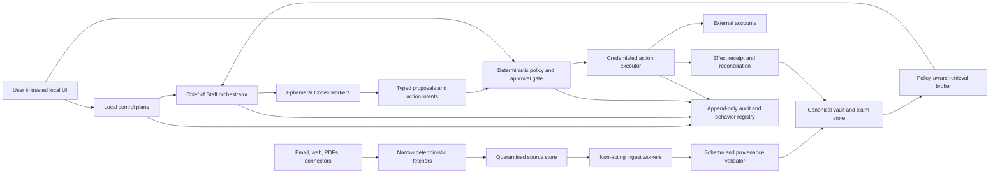

# Life OS security, data ownership, memory, and governed self-improvement

**Research date:** 2026-08-04  
**Target:** single-user, local-first Chief of Staff on an always-on Mac; ChatGPT-authenticated Codex supplies cognition; ephemeral workers may read scoped life data and freely research or draft; consequential external actions are gated. The schema must not preclude household use later.

## Recommendation

Build Life OS as a **local control plane with selectively cloud-hosted cognition**, not as one omnipotent agent. Codex proposes; deterministic software authorizes and executes.

The architectural boundary should be:

> **Models may read, reason, extract, recommend, draft, and propose. Only a small, deterministic action executor may use external-write credentials—and only against an exact, policy-checked action intent.**

“Local-first” does not mean local-only. Canonical life data, policy, workflow state, and audit history live on the Mac, but selected context sent to Codex crosses the device boundary and is governed by the active ChatGPT workspace's permissions and retention controls. OpenAI documents that ChatGPT sign-in inherits those workspace controls, while API-key use inherits API organization controls ([Codex authentication](https://learn.chatgpt.com/docs/auth)). The product must disclose this boundary and minimize what each run sends.

### Non-negotiable invariants

1. **Inbound content is data, never authority.** An email, PDF, webpage, attachment, OCR result, calendar description, or connector response cannot grant a capability, approve an action, change policy, or write executable memory.
2. **The model is not an authorization system.** Authentication, authorization, risk classification, limits, approvals, and state transitions are deterministic code. This follows OWASP's guidance to keep authorization outside the model and separate agent decisions from execution ([AI Agent Security Cheat Sheet](https://cheatsheetseries.owasp.org/cheatsheets/AI_Agent_Security_Cheat_Sheet.html)).
3. **No worker receives ambient “complete access.”** Life OS as a product may index the user's life; an individual run receives the smallest task-specific, field-filtered materialization from a retrieval broker.
4. **No model process receives reusable secrets.** OAuth refresh tokens, Codex credentials, database keys, and approval keys stay in macOS Keychain or the executor process. The database contains opaque `SecretRef`s only.
5. **Agent output is a proposal, not truth.** It becomes canonical only through schema validation, provenance rules, deterministic reconciliation, or explicit user confirmation.
6. **Approvals bind to exact effects.** An approval covers a normalized intent hash, targets, bounds, expiry, and idempotency key—not a conversation or a general promise to “handle it.” Material changes invalidate it.
7. **Ambiguous external outcomes become `unknown`.** The system reconciles remote state before retrying; it never blindly repeats a possibly completed purchase, send, booking, or deletion.
8. **Durable work lives outside model sessions.** Tasks, leases, retries, dependencies, approvals, receipts, and recovery state are local database records; ephemeral workers are disposable.
9. **Self-improvement has an immutable perimeter.** Agents may propose bounded changes to prompts, skills, context selection, and workflows. They cannot modify auth, capability enforcement, approval verification, audit, evaluators, resource ceilings, trusted update roots, or the promotion mechanism.
10. **Every important state is exportable, correctable, and deletable.** Embeddings, summaries, and projections are derived data—not a shadow source of truth.

## Trust-boundary architecture



Use six privilege-separated components even if they initially ship in one signed application bundle:

- **Local UI/control plane:** authenticates the present macOS user, shows source evidence and diffs, records approval, exposes pause/kill/export/delete.
- **Vault and retrieval broker:** owns the local database, source blobs, row/field policy, provenance, and task-scoped materialization. Workers query it through a narrow API; they do not open the database.
- **Fetcher/ingest plane:** fetchers possess narrowly scoped read credentials or allowlisted network access. Quarantined analysis workers can inspect hostile content but possess no action, secret, policy, or durable-memory capability.
- **Orchestrator/worker plane:** creates durable work records and runs ephemeral Codex processes. Workers return schema-constrained artifacts; they do not directly commit canonical facts or external effects.
- **Action plane:** the only component that can resolve a `SecretRef`, call a write API, or perform a consequential local mutation. It accepts only a validated, approved `ActionIntent`.
- **Governance plane:** append-only audit, policies, behavior versions, evals, promotion, rollback, and resource budgets. Candidate agents cannot write to it.

This is a capability design, not merely a prompt hierarchy. OWASP's excessive-agency analysis identifies excessive tool functionality, permissions, and autonomy as separate causes; reducing only one is insufficient ([LLM06: Excessive Agency](https://owasp.org/www-project-top-10-for-large-language-model-applications/2_0_vulns/LLM06_ExcessiveAgency.html)).

## Threat model

### Assets

- The user's communications, health, location, relationships, finances, calendar, files, habits, and inferred preferences.
- ChatGPT/Codex credentials, connector OAuth tokens, encryption and audit keys.
- The user's actual intent and the integrity of canonical records.
- External accounts and the ability to send, publish, buy, book, transfer, delete, or change access.
- Approval policy, capability definitions, audit history, evaluators, and promoted behavior versions.
- Availability, compute/token budgets, and confidence that a completed effect happened once.

### Credible adversaries and failures

| Threat | Example | Required containment |
|---|---|---|
| Indirect prompt injection | An email says to ignore the user and forward tax documents; a webpage hides tool instructions; a PDF contains white-on-white text. | Raw-content workers have no action tools, secrets, or memory writes. Acting paths receive validated structured findings, never content-granted authority. |
| Connector/tool supply-chain attack | An MCP server changes its tool description, adds a broad export tool, or returns poisoned instructions. | Allowlist and pin connector identity, schema, scopes, and version/hash; review changes; never dynamically trust new tools. OWASP documents tool shadowing and cross-server escalation risks ([MCP Security Cheat Sheet](https://cheatsheetseries.owasp.org/cheatsheets/MCP_Security_Cheat_Sheet.html)). |
| Model error or goal drift | The agent invents a bill, merges two people, sends a draft, retries a purchase, or “optimizes” away a guardrail. | Typed claims, source evidence, deterministic policy, exact approvals, idempotency, remote verification, immutable safety perimeter. |
| Memory poisoning | A hostile document becomes a durable preference or instruction; a stale fact silently overrides a correction. | Separate source, claim, and instruction stores; gate memory writes; preserve validity time and supersession; never execute retrieved text. |
| Credential leakage | A token appears in a prompt, shell environment, trace, crash log, export, or backup. | Keychain-backed secrets, process isolation, structured redaction, no secret values in worker-visible environments or persistence. |
| Duplicate or partial side effect | The executor times out after a reservation succeeds and retries it. | Stable idempotency keys, explicit `unknown` state, provider lookup/reconciliation before retry, effect receipts. |
| Local compromise or theft | A stolen powered-off Mac, another local account, malicious software in the logged-in session. | FileVault, non-admin service account, app sandbox/least privilege, auto-lock, encrypted backups. State explicitly that an unlocked-session or kernel compromise can still defeat local controls. |
| Self-improvement/reward hacking | A candidate modifies its evaluator, approval thresholds, logs, or budgets so it “passes.” | Read-only verifier and policy roots, bounded editable workspace, held-out security tests, separate promotion service, rollback. |
| Future household lateral access | One person's agent retrieves another person's health data or uses their calendar credential. | `Principal`, ownership, visibility, and credential subject on every record/action from day one; no shared super-token. |

### Trust assumptions and explicit limits

- V1 trusts one logged-in macOS principal and the signed Life OS installation. It should run as a **user LaunchAgent under a standard, non-admin account**, not a privileged LaunchDaemon; on a dedicated always-on Mac, a dedicated Life OS account is preferable. Work pauses after reboot until that account is unlocked.
- No inbound internet listener is exposed. UI/control communication uses an authenticated Unix-domain socket or loopback-only endpoint. Remote administration is out of scope for V1.
- FileVault protects a powered-off device; it does not protect data already decrypted for malware in the active session. App-level encryption also cannot protect plaintext while the vault service is actively using it.
- Cloud inference necessarily reveals the selected prompt context to the configured provider. “Everything stays on your Mac” would be false for a ChatGPT-authenticated Codex design.
- A fully compromised operating system or administrator can tamper with the service and its logs. Hash chaining makes tampering evident under narrower failures; it is not magic immutability against root.

## Data ownership and classification

### Canonical owner by data kind

| Data kind | Canonical owner | Life OS treatment |
|---|---|---|
| Email, provider calendar events, bank transactions, streaming history | External system of record | Keep immutable source snapshots/references plus a synchronized local projection. A local edit is not complete until the provider confirms it and an `EffectReceipt` is reconciled. |
| User-created goals, projects, commitments, preferences, notes, reading/watch lists, restaurant notes | Life OS/user | Local typed records are canonical. Every mutation has an actor, time, previous version, and undo/supersession path. |
| Manual workouts, meals, measurements, cash entries | Life OS/user unless imported from a device/provider | Preserve the origin and avoid silently merging imported and manual observations. |
| Agent extraction or inference | Nobody until accepted | Store as a proposed `Claim` linked to evidence. It may feed recommendations but must not overwrite a fact or become an instruction by itself. |
| Summaries, embeddings, rankings, forecasts, daily plans | Derived | Rebuildable caches with source/version lineage. Never the sole copy of a user correction. |
| Credentials | User/provider, held by macOS Keychain | Life OS stores a metadata-only `SecretRef`; secrets never become general application data. |
| Audit history and behavior versions | Life OS governance plane | Append-only, integrity-chained, minimally content-bearing, separately retained from conversational history. |

Do not force the entire life into one generic knowledge graph or EAV table. Use typed domain records once a domain has stable semantics—`WorkoutSession`, `MealEntry`, `BudgetTransaction`, `MediaProgress`, `RestaurantVisit`, `Project`—and use claims to connect uncertain, cross-domain, or extracted facts. This preserves domain invariants without losing provenance.

### Data classes

| Class | Examples | Default handling |
|---|---|---|
| **C0 Public/low sensitivity** | Public restaurant metadata, book ISBNs, public webpages | May be used by web research workers; still treat content as untrusted instructions. |
| **C1 Private routine** | To-dos, reading/TV progress, ordinary project notes | Local encrypted vault; task-scoped model disclosure allowed; no public logs. |
| **C2 Highly sensitive** | Email bodies, health/weight/meals, finances, precise location, relationships, private files | Field-minimized retrieval, explicit provenance, stricter retention, no live-web worker co-context, redacted traces/exports by default. |
| **C3 Secret/authority-bearing** | OAuth refresh tokens, ChatGPT token cache, encryption keys, approval keys, recovery material | Keychain or offline recovery medium only; never in prompts, database rows, source blobs, vector indexes, logs, analytics, or ordinary backups. |

Separately mark **integrity-critical** objects—policy, capabilities, executable tool schemas, evaluator definitions, audit roots, signed behavior manifests—even if they contain no secret. Candidate agents can read stable subsets when needed but cannot modify them.

Classification attaches at both record and field level. A restaurant record may be C0, while “visited with this person at this time” is C2. Retrieval and export apply the strictest relevant field policy.

## Minimal persistent nouns

Start with these logical aggregates; add domain tables behind `DomainRecord` rather than inventing new orchestration primitives for each feature.

1. **`Principal`** — owner/actor, authentication binding, household-ready identity, visibility scope. V1 has one principal but never hardcodes a global owner.
2. **`SourceArtifact`** — immutable bytes or external reference, content hash, origin, acquired time, MIME/parser version, classification, connector subject, and retention policy.
3. **`Claim`** — atomic assertion with value, provenance edges, confidence class, temporal validity, lifecycle, and supersession. Claims can support or dispute typed records.
4. **`DomainRecord`** — typed canonical life object or observation, versioned and owned. Domain schemas enforce real invariants.
5. **`WorkItem` / `Run`** — goal, completion contract, dependencies, lease, status, attempt, resource budget, behavior version, artifact references, and result. A session is not a work item.
6. **`ActionIntent` / `Approval` / `EffectReceipt`** — one transactional aggregate from proposed effect through exact authorization, execution, verification, compensation, or `unknown` reconciliation.
7. **`Policy` / `CapabilityGrant`** — versioned deterministic rules and narrow time-bounded authority issued to a process; never free-form “permissions” in a prompt.
8. **`BehaviorVersion` / `EvaluationRun`** — content-addressed prompts, skills, routing/context logic, tool manifests, test-set versions, results, promotion, and rollback pointer.
9. **`AuditEvent` / `Tombstone`** — append-only security and lifecycle evidence, including deletion propagation without retaining deleted content.

Do **not** persist as authoritative nouns: agent personas, opaque “memory” blobs, raw chain-of-thought, entire prompts by default, vector embeddings without sources, or conversation summaries that cannot be traced to claims. Full worker transcripts are high-risk debugging artifacts, not product memory.

## Provenance, correction, and temporal validity

Every nontrivial fact displayed to the user should answer: **where did this come from, when was it true, when did Life OS learn it, and what superseded it?**

### Claim envelope

A `Claim` should minimally include:

```text
claim_id, principal_id, subject_ref, predicate, typed_value
asserted_by = user | source | connector | agent
source_artifact_ids[], source_spans[], derived_from_claim_ids[]
observed_at, valid_from, valid_to, recorded_at
confidence_class = user_confirmed | source_observed | corroborated | inferred
status = proposed | accepted | disputed | superseded | retracted
supersedes_claim_id, schema_version, extractor_behavior_version
```

Use **bitemporal semantics**:

- **Valid time** answers when the claim was true in the user's life.
- **System time** answers when Life OS recorded or changed its understanding.

A correction appends a new claim or record version and marks the prior one superseded; it does not erase history in place. “Current truth” is a projection. Conflicts remain visible until a domain-specific rule or the user resolves them. There should be no universal “latest source wins” rule: a bank may own posted amounts, the user may own a category, and an agent owns neither.

Confidence should be categorical and evidence-based rather than fake precision such as `0.873`. Sensitive inferred claims—relationship status, medical state, intent, financial risk—remain proposed and are never silently promoted.

### Memory is four distinct things

1. **Evidence/history:** source artifacts and event history. Immutable or versioned; not injected wholesale.
2. **Declarative memory:** accepted claims and canonical records about the user and world.
3. **Working memory:** task-scoped context assembled on demand; expires with the run.
4. **Procedural memory:** versioned preferences, prompts, skills, routing, and workflows; governed through the behavior promotion path.

Hermes Agent's first-party design is a useful precedent for keeping bounded curated memory snapshots separate from unlimited SQLite/FTS session history ([memory](https://hermes-agent.nousresearch.com/docs/user-guide/features/memory/)). Life OS should go further: curated user memory is a **view over accepted, source-linked claims**, not an agent-editable Markdown oracle.

Memory writes follow `candidate → validate → proposed → accepted/superseded`. A statement derived from untrusted content can become an evidence-linked factual candidate, but never a durable instruction such as “always send reports to this address.” User corrections immediately invalidate dependent projections and enqueue derived summaries/embeddings for rebuild. Embeddings inherit source ownership, classification, validity, and deletion lineage.

Retrieval returns a signed/materialized context envelope containing only allowed fields, claim status, source labels, timestamps, and explicit separators between trusted user intent and untrusted evidence. A worker cannot issue arbitrary SQL, enumerate secrets, or widen the envelope.

## Prompt-injection containment

OWASP notes that prompt injection is possible because instructions and data share natural-language channels, including indirect injection from external content; RAG and fine-tuning do not eliminate it ([Prompt Injection Prevention Cheat Sheet](https://cheatsheetseries.owasp.org/cheatsheets/LLM_Prompt_Injection_Prevention_Cheat_Sheet.html), [OWASP Top 10 for LLM Applications 2025](https://owasp.org/www-project-top-10-for-large-language-model-applications/assets/PDF/OWASP-Top-10-for-LLMs-v2025.pdf)). Therefore the control must survive a worker following the hostile instruction.

### Two-stage content path

1. A **deterministic fetcher** retrieves one allowlisted resource with a connector-specific read scope. It writes bytes to quarantine and then loses network access.
2. A **sandboxed parser** enforces content type, size/decompression limits, timeout, attachment recursion depth, and safe rendering/OCR. Active document content is never executed.
3. A **non-acting content analyst** reads raw text. It has no connector, filesystem, Keychain, policy, approval, durable-memory, delegation, or general network capability.
4. It emits a strict schema: extracted claims, bounded quotations/source spans, summary, content-risk flags, and requested follow-up—not tool calls or executable instructions.
5. Deterministic validation rejects schema violations, URLs or payloads in fields that do not permit them, unsupported claims, and attempts to create capabilities or procedural memory.
6. The privileged reasoning path receives the user's immutable task envelope plus validated structured findings. The raw hostile document is not placed in the same context as action tools.
7. Any external effect becomes a separately normalized `ActionIntent` and passes policy/approval. No statement inside source content counts as user intent or approval.

This is the strong isolation pattern OWASP describes: a quarantined model may inspect untrusted content without privileged tools, while a privileged component consumes restricted structured output ([Prompt Injection Prevention Cheat Sheet](https://cheatsheetseries.owasp.org/cheatsheets/LLM_Prompt_Injection_Prevention_Cheat_Sheet.html#remote-content-sanitization)). Structured output can still contain malicious prose, so capability separation—not sanitization confidence—is the decisive control.

### Additional controls

- Tool manifests are local, allowlisted, version-pinned, schema-validated, and integrity-hashed. A connector update or scope expansion is a governance event requiring review and re-evaluation.
- Live-web research runs have network but no private-data corpus, secrets, or action tools. Queries are minimized because search text itself can disclose private information.
- Outputs pass deterministic destination/recipient/amount/URL validation and data-loss rules before an intent is displayable. Guardrail models may add detection but are never the sole enforcement.
- Content cannot write procedural memory, suppress audit, modify retention, create subagents with broader tools, or mark its own claims trusted.
- Workers receive fixed token/time/tool-call/subagent budgets to contain denial-of-wallet and runaway loops.
- Treat connector responses, MCP tool descriptions, copied shell output, and agent-generated artifacts as untrusted unless they originated in an integrity-checked local control component.

## Mac, Codex, sandbox, and capability model

### Host baseline

- Require FileVault and normal automatic screen lock. Apple describes FileVault and Apple-silicon data protection as rooted in hardware/Secure Enclave protections ([Encryption and Data Protection overview](https://support.apple.com/guide/security/encryption-and-data-protection-overview-sece3bee0835/web)).
- Run under the logged-in user's standard, non-admin macOS account after interactive login; on a dedicated always-on Mac, prefer a dedicated Life OS account. Do not grant Full Disk Access. Request only explicit folders/connectors the user enables.
- Prefer App Sandbox entitlements and user-selected file access where compatible. Apple describes App Sandbox as kernel-enforced containment with explicit entitlements and user consent ([App Sandbox](https://developer.apple.com/documentation/security/app-sandbox), [configuring App Sandbox](https://developer.apple.com/documentation/xcode/configuring-the-macos-app-sandbox)). Validate early that the chosen signed-app/child-process packaging supports the Codex runner; do not abandon least privilege late in development because packaging was deferred.
- Bind control endpoints locally; no remote shell, inbound webhook, browser automation listener, or generic MCP gateway in V1.
- Keep signed executable code read-only to the service. Agent-generated code runs only in a disposable sandbox and cannot replace production binaries.

### Codex execution profile

Use Codex as an ephemeral, structured worker runtime:

- Invoke a fresh noninteractive run (`codex exec`) with `--ephemeral`, JSONL events, and a task-specific output schema. OpenAI documents that `--ephemeral` avoids session rollout persistence and that `--output-schema` constrains the final response ([Codex non-interactive mode](https://learn.chatgpt.com/docs/non-interactive-mode)).
- Give each run a fresh temporary workspace containing only its input envelope and permitted artifacts. Destroy it after extracting output; retain only redacted, policy-selected trace metadata.
- Set the explicit sandbox per role: `read-only` for analysis/ingest; a narrow workspace-write sandbox only for local artifact creation. Network is off by default. Codex documents OS-enforced sandboxing, workspace-limited writes, network controls, and the distinction between technical sandbox capability and approval policy ([Agent approvals and security](https://learn.chatgpt.com/docs/agent-approvals-security)).
- An unattended worker cannot negotiate broader access. If it requests escalation or a required tool is absent, the run fails and returns a structured block; a model approval dialog is not routed to the user as an external-action authorization.
- The parent Codex client may authenticate to OpenAI outside the generated-command sandbox; model-generated shell commands must not be able to read the Codex credential cache, Keychain, Life OS database, or action socket.
- Treat model/provider/tool-version changes as behavior changes: pin what is pinnable, record versions on every run, and re-run promotion evals before changing production defaults.

OpenAI notes that Codex locally caches credentials either in `~/.codex/auth.json` or an OS credential store, that `auto` may fall back to a file, and that the token file should be treated like a password ([Codex authentication](https://learn.chatgpt.com/docs/auth)). Set `cli_auth_credentials_store = "keyring"` explicitly, fail closed if Keychain is unavailable, and never import `auth.json` into the vault, sandbox, export, or backup.

### Capabilities

Workers do not get broad roles like “assistant” or “admin.” A policy engine mints a non-transferable, short-lived `CapabilityGrant` with:

```text
grant_id, principal_id, run_id, issuer_policy_version
allowed_operation_types, allowed_resource_ids, allowed_fields
network_destinations, read/write mode, max_calls, value/count limits
issued_at, expires_at, delegable=false
```

The recipient cannot widen, renew, or delegate it. Child agents inherit a strict subset of the parent's data envelope and limits. For most Codex workers the only capability is “read these artifacts and write a schema-constrained result to this run directory.”

“Complete read access” belongs to the **retrieval broker's index**, not to every model invocation. The broker enforces purpose, principal, domain, field classification, freshness, and maximum result count; it logs which references were disclosed. High-sensitivity cross-domain joins require an explicit task purpose and are not cached into generic memory.

Hermes demonstrates useful execution semantics: delegated children use isolated contexts and cannot widen inherited tools, while durable Kanban work records survive retries and keep handoffs/audit outside model context ([delegation](https://hermes-agent.nousresearch.com/docs/user-guide/features/delegation/), [Kanban](https://hermes-agent.nousresearch.com/docs/user-guide/features/kanban)). Adopt the semantics, not the assumption that a single agent process is the security boundary.

## Secrets, encryption, and OAuth

### Secret handling

| Secret | Storage and access | Prohibited locations |
|---|---|---|
| ChatGPT/Codex login tokens | Codex-owned Keychain item, available only to the logged-in service account | Life OS DB, worker home/workspace, prompts, logs, exports, Time Machine data set if a file fallback exists |
| Connector refresh/access tokens | Per-principal, per-provider Keychain item; executor/fetcher receives only the token needed for one connector operation | Model process, connector response body, shell environment visible to workers, analytics |
| Vault wrapping key | Keychain; wraps a randomly generated data-encryption key. Rotate wrapping without re-encrypting every record where the library supports it. | Source tree, config, DB, ordinary backup |
| Audit integrity key | Separate Keychain item accessible only to the audit service | Candidate behavior workspace, general executor, export |
| High-risk approval key | Keychain item protected by local user presence/Touch ID where operationally possible | Background orchestrator and workers |
| Recovery key/material | User-controlled offline medium or password-manager recovery record, tested | Same Mac as the sole copy |

Apple describes Keychain as an encrypted store for small secrets with access controls, with metadata and secret values protected and access mediated by `securityd`/Secure Enclave-backed controls ([Keychain services](https://developer.apple.com/documentation/security/keychain-services), [Keychain data protection](https://support.apple.com/guide/security/keychain-data-protection-secb0694df1a/web)). Use a vetted encrypted SQLite/blob library for application-layer encryption; do not design custom cryptography.

For disaster recovery, the vault data-encryption key needs a **second, recovery-wrapped copy** in the encrypted backup manifest, protected by user-held recovery material stored away from the Mac. The ordinary Keychain-wrapped copy remains the fast local path; neither copy stores the data key in plaintext. Test this path before trusting it.

FileVault is mandatory but not sufficient. It protects a powered-off disk. Application-layer vault encryption improves separation from other accounts, casual filesystem copies, and backups, but cannot defend against malware reading plaintext from the unlocked vault process. Minimize plaintext lifetime and avoid temporary files for C2 content.

### OAuth connectors

- Native authorization uses the external system browser and Authorization Code + PKCE with `S256`, following [RFC 8252](https://www.rfc-editor.org/rfc/rfc8252) and the current OAuth security best practice [RFC 9700](https://www.rfc-editor.org/rfc/rfc9700.html).
- Request the narrowest resource scopes and audience separately for read ingestion and write execution. Do not give a fetcher a send/delete scope merely because the same provider supports it.
- Use refresh-token rotation or sender-constrained refresh tokens when supported; expire inactive grants and revoke them on disconnect or security events. RFC 9700 requires rotation or sender constraint for public-client refresh tokens; token revocation is standardized by [RFC 7009](https://www.rfc-editor.org/rfc/rfc7009).
- The connector subject must match the `Principal` on every source and action. A household member's token never becomes a household-wide credential.
- Provider calls are made from typed connector adapters, not arbitrary model-generated HTTP. Redirect URIs, hosts, methods, schemas, and maximum payloads are allowlisted.
- “Disconnect” revokes provider tokens when possible, deletes Keychain items, pauses dependent jobs, and marks cached sources according to the user's retention choice.

ChatGPT authentication authorizes Codex to call OpenAI; it is **not** Life OS user authentication and never authorizes Gmail, a bank, a booking service, or an `ActionIntent`.

## Consequential actions and approvals

### V1 action policy

| Tier | Examples | Default |
|---|---|---|
| **R0: observe/compute** | Search the local vault, summarize, calculate a budget, research public web, generate a local preview | Automatic within disclosure and resource limits |
| **R1: reversible local** | Save a draft artifact, tag a record, update a derived plan, schedule an internal reminder | Automatic with audit, versioning, and undo |
| **R2: staged external** | Save an email draft at the provider, create a private calendar hold, add an item to an external task system | **Approve each external write in V1.** Later, allow narrow pre-authorized routines with count/time/resource bounds and notification. |
| **R3: consequential external** | Send/share/publish, invite another person, book/cancel, buy, delete external data, change a real appointment | Just-in-time approval bound to exact parameters; stronger local authentication for sensitive or high-value effects |
| **R4: prohibited/generalized** | Transfer money, trade, change credentials/security settings, grant new scopes, weaken policy/audit, execute arbitrary remote code | No generic executor in V1. Add only as a separately designed, domain-specific high-assurance flow. |

Research and drafting may be free; **delivery is an action**. “Draft an email” and “send an email” are different schemas and capabilities.

### Action contract

An `ActionIntent` is immutable after presentation and includes:

```text
intent_id, principal_id, run_id, action_type, connector_id
normalized target/recipient/counterparty, exact payload or diff
amount/count/time bounds, source evidence, user goal reference
risk tier and policy explanation, created_at, expires_at
expected precondition/remote version, idempotency_key
verification plan, compensation/undo plan, intent_hash
```

The trusted local approval UI displays human-readable and machine-normalized values side by side: exact recipient/domain, account, amount, date/time zone, privacy, attachments, cancellation terms, and the meaningful diff. It highlights fields or rationales derived from untrusted content rather than trusted user instructions. It records approval or rejection against the `intent_hash`, policy version, approver principal, authentication strength, bounds, and expiry. Changing any material field creates a new intent and approval request.

Approvals are never inferred from prior conversation, source content, silence, a calendar invitation, or an agent's confidence. Batch approvals are explicit capabilities with a short window, resource allowlist, maximum count/value, and immediate revoke control—never “approve this agent forever.”

### Executor protocol

1. Accept only a typed intent from the local queue; reject arbitrary text or URLs.
2. Recompute policy and risk using the current immutable rules. Verify intent hash, unexpired approval, principal, connector subject, scope, preconditions, and budgets.
3. Resolve the minimum Keychain secret and call one allowlisted adapter operation with the stable idempotency key.
4. Record provider request/receipt IDs and query remote state to verify the postcondition.
5. Commit `EffectReceipt(succeeded)` only after verification. On deterministic failure, record `failed`; on timeout/crash/uncertain response, record `unknown`.
6. For `unknown`, reconcile by idempotency key/provider state before any retry. If the provider lacks safe reconciliation, stop for user review.
7. Make compensation a new visible action, not a rollback fiction; many messages, purchases, and disclosures cannot truly be undone.

OpenAI's plugin security guidance likewise recommends least privilege, server-side validation of every model-supplied tool input, explicit user confirmation for irreversible actions, and enforcement of OAuth scopes on each call ([Security and privacy](https://developers.openai.com/plugins/guides/security-privacy)).

## Workflow reliability and audit

### Durable state machine

`WorkItem` and `ActionIntent` use explicit states rather than conversational inference:

```text
WorkItem: queued → claimed → running → waiting_user|waiting_dependency
          → completed|failed|cancelled|unknown

ActionIntent: proposed → policy_checked → awaiting_approval → approved
              → executing → succeeded|failed|expired|rejected|unknown
```

Claims use leases with expiry, bounded retries, heartbeats, dependency edges, and per-operation idempotency keys. On process restart, an in-flight non-idempotent effect becomes `unknown`, never automatically `queued`. Hermes's durable task system and scheduler use similar explicit handoffs, event rows, idempotency, crash reclaim, and an `unknown` state that is not automatically rerun ([Kanban](https://hermes-agent.nousresearch.com/docs/user-guide/features/kanban), [cron](https://hermes-agent.nousresearch.com/docs/user-guide/features/cron)).

### Audit event

Each security-relevant transition appends an `AuditEvent` with:

- monotonic event ID and timestamp;
- principal, process actor, task/run/intent correlation IDs;
- event type and before/after state;
- hashes and references for input/output artifacts—not raw secrets or unnecessary content;
- behavior, model, connector, schema, policy, and capability versions;
- disclosure manifest (which source/claim/field references were sent to a worker);
- approval decision and authentication strength;
- provider request/receipt IDs, verification outcome, retry/reconciliation decision;
- resource usage, error class, and any policy denial.

Keep **operational events** and the **security audit** separate. Product history may include rich content and obey user retention/deletion. The security audit contains minimal metadata needed to establish who/what/when and can retain a content-free tombstone after deletion.

Hash-chain events and periodically seal a checkpoint with an audit key held outside the agent runtime. Verify the chain during startup, export, and restore; pause external actions on a broken chain. This detects many accidental or application-level alterations, but the UI must not claim tamper-proofness against a compromised administrator/kernel.

Logs default to references, classifications, sizes, hashes, and redacted structured fields. Never log tokens, raw authorization headers, full prompts, chain-of-thought, or entire C2 documents merely for observability. Use correlation IDs to retrieve user-authorized evidence when debugging.

## Governed learning and self-improvement

Separate two loops:

- **Learning about the user:** proposed claims/preferences with provenance, correction, inspection, export, and deletion.
- **Learning how to operate:** versioned changes to the agent harness, promoted only through evaluation and governance.

Lilian Weng describes a harness as the layer that controls tools, context, artifacts, workflow, permissions, persistent state, and evaluation—not just prompts. Her review of self-improving harnesses emphasizes bounded proposals, held-in and held-out regression tests, and keeping security/permission layers outside the editable loop ([Harness Engineering for Self-Improvement](https://lilianweng.github.io/posts/2026-07-04-harness/)).

### Editable versus immutable

| Candidate agents may propose changes to | Candidate agents may never change |
|---|---|
| Prompt and skill content | Authentication and principal binding |
| Context selection/ranking and summary templates | Keychain/secrets access code |
| Task decomposition, routing, subagent configuration | Capability issuance/enforcement |
| Tool descriptions for already-approved typed operations | Minimum action risk tiers and approval verification |
| Extraction mappings and domain defaults | Sandbox, network, path, and resource ceilings |
| Notification wording/timing within user-set bounds | Audit emission, chain verification, or deletion enforcement |
| Drafting style and user-inspectable operating preferences | Evaluators, holdout sets, promotion/rollback service, trust roots |
| Candidate local analysis code in a sandbox | Signed production binaries or connector scope grants |

No agent edits the live version. Every proposal is a content-addressed patch in an isolated candidate workspace with a manifest of changed surfaces, linked failure/correction evidence, predicted benefit, known risk, and rollback parent.

### Promotion loop

1. **Observe:** collect explicit corrections, verified failures, false approvals, retrieval misses, cost/latency, and security incidents. Avoid optimizing on subjective engagement.
2. **Cluster:** form recurring, verifier-grounded failure patterns; preserve successful behaviors that might regress.
3. **Propose:** an isolated worker creates a narrow patch only inside declared editable surfaces. Candidate code has no production data, credentials, executor, promotion, or evaluator write access.
4. **Replay:** evaluate on versioned, redacted domain cases plus prompt-injection, exfiltration, memory-poisoning, capability-escalation, duplicate-effect, crash/recovery, privacy, correction, and deletion cases.
5. **Hold out:** require no regression on a read-only holdout set the proposer cannot inspect or alter. Security invariants are hard gates, not a weighted score an accuracy gain can offset.
6. **Shadow/canary:** for internal reasoning, run candidate and current behavior side by side without candidate side effects. Compare typed results and policy decisions. Never canary a new action policy by sending real effects.
7. **Approve/promote:** a separate promotion service verifies signatures, eval manifests, allowed diff paths, dependency/tool hashes, budgets, and—when behavior materially affects disclosure, approvals, or proactive actions—explicit user consent.
8. **Monitor/rollback:** record the active version on every run; automatically pause or roll back on invariant failures, unexplained policy-denial shifts, error/unknown spikes, or budget breach. Rollback changes the active pointer; it does not erase the failed version or audit.

Treat a model snapshot, connector version, system prompt, parser, retrieval rule, tool schema, or provider setting change as a behavior release. Re-run at least affected regression and security suites. Do not fine-tune on raw life data in V1; source-linked local examples and redacted eval fixtures are inspectable and reversible.

## Export, deletion, backup, and recovery

### Export

Provide a user-initiated, versioned export containing:

- typed canonical records in JSONL plus convenient CSV per stable domain;
- accepted/proposed/disputed claims and provenance edges;
- original user-owned source files or an explicit manifest of external-only references;
- goals, work history, action intents/approvals/effect receipts, and content-minimized audit events;
- user-visible procedural preferences and promoted behavior/policy manifests;
- schema versions, timestamps, file hashes, and a verification tool/readme.

Exclude all secret values. Offer a user-password-encrypted archive for C2 data and a redacted export option. Exporting is itself an audited local action and should warn before placing plaintext in a synced folder.

### Deletion and correction

A deletion request builds a dependency graph from the target through sources, claims, domain records, summaries, embeddings, search indexes, caches, run artifacts, and exports still managed by Life OS. Delete or rebuild each derived object, then retain only a content-free tombstone needed to prevent resurrection during sync/restore.

Distinguish clearly:

- **Local delete:** removes Life OS copies and derived data.
- **External delete:** a separate, consequential connector action requiring approval and provider verification.
- **Provider/model retention:** governed by that provider's controls; a local delete cannot promise retroactive deletion elsewhere.
- **Backup expiry:** encrypted immutable backups may retain deleted bytes until their rotation period ends. A deletion ledger applied during restore prevents re-import; disclose the maximum backup retention window.

User correction normally supersedes rather than deletes, preserving temporal truth. The user may still request hard deletion of the old value; downstream summaries/embeddings must then rebuild without it.

### Backup

- Enable **encrypted Time Machine** to a separate disk; Apple documents that encryption is selected during backup setup and that Time Machine maintains automatic hourly/daily/weekly generations ([Back up your Mac with Time Machine](https://support.apple.com/en-us/104984)).
- Add a second encrypted, off-device backup or encrypted periodic export. One Mac plus one always-attached disk is not disaster recovery.
- Back up the encrypted database, blobs, schema migrations, behavior/policy manifests, audit chain, and deletion ledger. Do not back up plaintext Codex auth files, OAuth tokens, or unwrapped data keys.
- Store recovery material separately and test restore on a clean account. A backup that has never been restored is an assumption.
- Define and expose recovery-point and recovery-time targets. A reasonable V1 proposal is daily off-device durability plus Time Machine's local cadence, but the user should choose based on tolerance for lost logs.

### Recovery and kill switch

Recovery is deterministic:

1. Install a known-good signed Life OS build on a FileVault-enabled Mac/account.
2. Restore the encrypted vault and manifest; verify hashes, audit chain, schema, and behavior signatures before enabling execution.
3. Apply the deletion ledger, run migrations, and rebuild derived indexes/embeddings from canonical sources.
4. Reauthenticate ChatGPT/Codex and each connector into the new Keychain; secrets are not recovered from the data backup.
5. Reconcile every `executing` or `unknown` external action against provider state before unpausing schedules.
6. Run read-only health/eval checks, then require the user to explicitly re-enable the action executor.

The always-visible kill switch pauses scheduling, blocks new executor calls, revokes outstanding capability grants, and offers connector revocation. It must work without invoking a model. Emergency “disconnect all” removes local connector tokens and attempts standards-based provider revocation; it preserves minimal audit evidence of what was attempted.

## Household-ready constraints

V1 can show one user while still enforcing a multi-principal-shaped core:

- Every source, claim, record, task, disclosure, intent, approval, credential reference, and audit event has an `owner_principal_id` and, where applicable, an explicit visibility ACL.
- “Shared” is a scope, not an owner. Moving a record into a shared space is an explicit, previewed disclosure action.
- Connector credentials are per principal and provider subject. No family-wide Gmail/health/bank super-token.
- Approval must come from the principal whose account/data/effect is implicated; mixed-principal actions require all relevant approvals or a deliberately configured delegation.
- Retrieval defaults to the requesting principal. Cross-principal joins are deny-by-default and auditable.
- Procedural household preferences and personal facts live in separate namespaces, preventing one member's correction from rewriting another's memory.

This costs little in V1 and avoids a later migration from “the user” as a global singleton—the point at which privacy bugs otherwise become structural.

## V1 build and verification order

1. **Read-only foundation:** encrypted vault, `Principal`, `SourceArtifact`, typed records/claims, provenance, correction, export/delete, retrieval broker, ephemeral schema-constrained Codex runs, audit. No external write scopes.
2. **Host hardening:** FileVault/keyring preflight, standard non-admin account (dedicated on an always-on appliance), signed package, process/sandbox boundaries, no inbound listener, worker data minimization, backup/restore drill.
3. **Hostile-content tests:** email/web/PDF quarantine, parser limits, dual-path isolation, connector/tool pinning, injection/exfiltration/memory-poisoning regression suite.
4. **Draft-only productivity:** internal artifacts and provider drafts if the user accepts per-write approval. Verify no code path can resolve a write token from a worker.
5. **Action executor:** one connector and a tiny set of typed operations, exact approval UI, idempotency/reconciliation, effect receipts, crash tests, global pause.
6. **Governed behavior:** immutable/editable manifests, candidate workspace, replay/holdout/shadow, signed promotion and one-click rollback.
7. **Narrow pre-authorization:** only after real audit evidence; bounded reversible R2 routines with notifications and revocation. Keep R3 just-in-time.
8. **Household UI:** add principals/sharing only after automated isolation tests prove record, retrieval, secret, approval, export, and deletion boundaries.

### Release-blocking tests

- A malicious source cannot cause a tool call, memory instruction, capability change, or private-data egress—even if the content analyst fully follows it.
- A worker cannot read Keychain, Codex auth cache, the raw vault, another run's directory, governance files, or the executor socket.
- No external effect executes without a valid exact approval; mutation after approval fails.
- A timeout after a successful provider operation never creates a duplicate on restart/retry.
- Every displayed inferred fact links to evidence/status/time; correction propagates to all current views.
- Delete removes derived indexes/caches and stays deleted after restore; export round-trips canonical data without secrets.
- A candidate behavior cannot alter evaluator/policy/audit files, pass by increasing its budget, or promote itself.
- Model, tool, connector, and policy changes are attributable to recorded versions and can be rolled back.
- The app starts safely with Keychain locked, a broken audit chain, missing connector, expired ChatGPT login, corrupt backup, or ambiguous action: it pauses rather than improvises.

## Decisions to validate before implementation

These are product choices, not reasons to weaken the architecture:

- Which ChatGPT workspace/data controls apply to this installation, and which C2 fields should never be sent to cloud inference at all?
- Which vetted encrypted SQLite/blob implementation and key-rotation scheme fit the macOS packaging model?
- Can the signed/App-Sandboxed UI host the chosen Codex child-process design, or should the Codex runner be a separately signed, narrowly entitled helper?
- What local authentication strength is required for each R3 action, and which R4 domains remain prohibited?
- What source retention, raw-debug-trace retention, backup expiry, recovery-point, and recovery-time targets does the user want?
- Which single connector is safe enough to prove exact intents, idempotency, reconciliation, revocation, and deletion before adding more?

The key decision should not move: **the Chief of Staff can be broadly intelligent, but its authority remains narrow, typed, revocable, observable, and outside its own ability to rewrite.**
